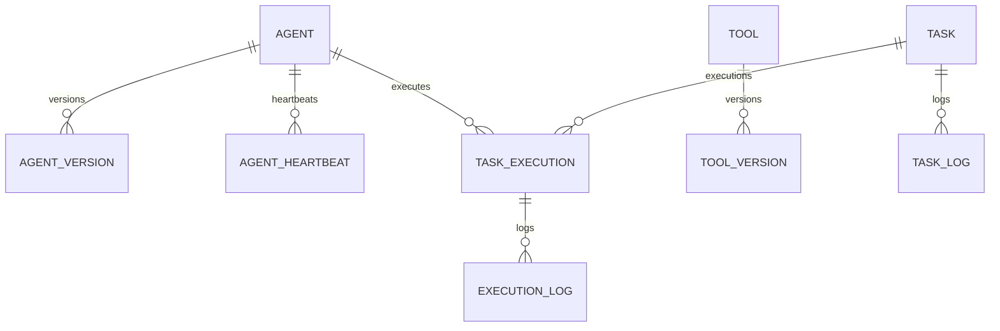

# Phase 1 Development Report

## 1. Acceptance Checklist

| 验收项 | 状态 | 说明 |
| --- | --- | --- |
| Agent Registry 注册/查询/更新/删除 | ✅ | 新增 `/registry/agents`，保留 Phase 0 `/agents` 兼容别名 |
| Agent Version / Status | ✅ | 稳定 Agent 身份 + `AgentVersion` 历史；ONLINE/OFFLINE/STARTING/STOPPING/ERROR |
| Tool Registry 注册/查询/禁用/版本 | ✅ | Tool 稳定身份、版本历史、禁用 API |
| Agent SDK v1 | ✅ | BaseAgent、AgentContext、AgentResult、TaskRequest/Response、HealthCheck |
| Tool Adapter 接口 | ✅ | initialize/validate/execute/shutdown 抽象接口 |
| Orchestrator v1 | ✅ | Task Dispatcher 按 ONLINE、目标 Agent 和权限选择 Agent并创建执行记录 |
| Task 生命周期 | ✅ | CREATED/QUEUED/RUNNING/SUCCESS/FAILED/CANCELLED；日志与执行时间模型 |
| Heartbeat | ✅ | `/heartbeat` 更新健康状态、时间和 Agent 当前状态 |
| Health API | ✅ | `/health`、`/registry/status`、`/agents/{id}/health` |
| Event Bus | ✅ | 接口 + InMemory 实现；七类事件定义 |
| 统一异常 | ✅ | 六类指定异常 + 统一 HTTP 错误信封和 TraceID |
| 结构化日志 | ✅ | TraceID/TaskID/AgentID/Timestamp/Level/Message 格式 |
| YAML 配置 | ✅ | registry/orchestrator/logging 三份配置 |
| 新增数据库表 | ✅ | AgentVersion、AgentHeartbeat、ToolVersion、TaskLog、ExecutionLog |
| 测试 | ✅ | 12 项自动化测试全部通过 |
| 具体安全能力未接入 | ✅ | 未实现任何 Playwright/Scrapy/Nuclei/ZAP/Suricata/Zeek/OCR |
| Docker 实际启动验证 | ⚠️ | Compose 配置通过；本机 Docker daemon 未运行，未做容器实启 |

## 2. Phase 信息

- **Phase 名称：** Phase 1：Agent Registry 与 Orchestrator 基础能力
- **开发目标：** 建立可动态扩展、接口优先、安全默认的 Agent/Tool Registry、SDK、任务调度、心跳、事件、异常、日志和配置底座。
- **完成时间：** 2026-07-29
- **完成状态：** ⚠️ 部分完成（代码、迁移和自动测试完成；容器实际启动受本机 Docker daemon 未运行阻塞）
- **阶段边界：** 仅平台底层，不包含具体网络安全 Agent 或 Tool。

## 3. 本阶段完成内容

1. 将 Agent 扩展为稳定身份、当前版本、作者、权限、工具引用、Runtime、网络/资源/审批策略、生命周期和健康快照。
2. 使用 `AgentVersion` 和 `ToolVersion` 追加保存 Manifest 历史；提交同名新版本时更新主表当前版本。
3. 建立 Tool Registry，支持注册、列表、禁用和版本历史。
4. 建立 Agent SDK v1 与 Tool Adapter 抽象接口，不包含具体实现。
5. 实现 `TaskDispatcher`：查询 Registry、过滤 ONLINE Agent、校验权限、创建 TaskExecution/日志并返回 QUEUED 状态。
6. 定义完整 Task 生命周期和 Dispatcher 的 `mark_running` / `mark_finished` 过渡能力。
7. 实现 Heartbeat 快照和追加历史。
8. 建立可替换 EventBus 协议与进程内默认实现。
9. 建立统一平台异常、TraceID 错误响应、结构化日志格式和配置文件。
10. 扩展 AuditLog 以记录用户、Agent、Task、Tool、时间、结果和错误关联字段；注册与建任务已接入审计写入。

## 4. 项目目录结构

```text
cyber-agent-platform/
├── backend/
│   ├── config/
│   │   ├── registry.yaml
│   │   ├── orchestrator.yaml
│   │   └── logging.yaml
│   ├── alembic/versions/
│   │   ├── 20260729_0001_initial_schema.py
│   │   └── 20260729_0002_registry_orchestrator.py
│   ├── app/
│   │   ├── api/
│   │   │   ├── errors.py
│   │   │   └── routes/{agents,health,heartbeat,registry,tasks}.py
│   │   ├── core/{enums,protocols}.py
│   │   ├── events/{bus,contracts}.py
│   │   ├── exceptions/base.py
│   │   ├── logging/{context,setup}.py
│   │   ├── models/{agent,audit_log,task,task_execution,tool}.py
│   │   ├── orchestrator/dispatcher.py
│   │   ├── repositories/{agent,audit,base,task,tool}.py
│   │   ├── schemas/{agent,common,registry,task}.py
│   │   ├── sdk/{base_agent,contracts,tool_adapter}.py
│   │   └── services/{audit,registry,task}.py
│   └── tests/
│       ├── test_agents.py
│       ├── test_health.py
│       ├── test_heartbeat.py
│       ├── test_orchestrator.py
│       ├── test_registry.py
│       ├── test_sdk.py
│       └── test_tasks.py
├── sdk/python/cap_agent_sdk/__init__.py
└── docs/
    ├── architecture/
    │   ├── agent-lifecycle.md
    │   ├── registry-design.md
    │   ├── task-lifecycle.md
    │   └── phase-1-sequence.md
    ├── database-er.md
    ├── phase-1-migration.sql
    └── Phase 1 Development Report.md
```

## 5. 架构变化

- 从 Phase 0 的基础 CRUD 演进为 Registry / SDK / Dispatcher / Event / Audit 五个明确边界。
- `Agent.name` 与 `Tool.name` 成为稳定身份；当前版本保存在主表，历史 Manifest 进入 Version 表。
- API 不直接访问 ORM；Router → Service → Repository 保持 Clean Architecture。
- Dispatcher 不按 Agent 类型写分支，仅依赖 Registry 查询结果、状态和权限集合。
- EventBus、AgentRuntime、WorkflowExecutor、MemoryProvider、ApprovalProvider 均先定义协议；Phase 1 只提供 InMemory EventBus 默认实现。
- 影响模块：backend/app/models、schemas、repositories、services、api、orchestrator、dependencies、tests、alembic、config、docs、sdk。

## 6. 技术实现说明

- **Platform First：** 调度器面向 Registry 元数据，不嵌入任何安全工具。
- **Plugin First：** Agent 和 Tool 通过 Manifest 注册，新类型无需改 Dispatcher 分支。
- **Interface First：** SDK、Adapter、EventBus 和未来 Provider 使用 ABC/Protocol。
- **Dependency Injection：** FastAPI dependency factory 注入 Session、Repository、Service 和 EventBus。
- **Security by Default：** 新 Agent 默认 OFFLINE；只选择 ONLINE 且权限覆盖任务要求的 Agent；无候选时 403/409 安全失败。
- **Audit Everything：** AuditLog 增加 trace/agent/task/tool/result/error；Agent 注册与 Task 创建纳入同事务审计。
- **Configuration First：** Registry、Dispatcher、安全策略和日志由 YAML 承载；环境连接参数继续使用 env。

## 7. 数据库设计（ER 图）

新增表：

- `agent_versions(id, agent_id, version, manifest, is_active, created_at, updated_at)`
- `agent_heartbeats(id, agent_id, health_status, details, timestamp)`
- `tool_versions(id, tool_id, version, manifest, is_active, created_at, updated_at)`
- `task_logs(id, task_id, level, message, trace_id)`
- `execution_logs(id, execution_id, level, message, timestamp)`

主表变更：Agent 增加 author/runtime/network_policy/resource_limit/approval_policy/health；Tool 增加 tool_type/required_permissions/config_schema/runtime_requirements/status/timestamps；Task 增加 permissions/target Agent；Execution 增加 trace_id；AuditLog 增加关联与结果字段。



完整字段 ER 图见 `docs/database-er.md`；迁移 SQL 见 `docs/phase-1-migration.sql`。

## 8. API 设计

| 方法 | 路径 | 说明 |
| --- | --- | --- |
| GET | `/registry/agents` | Agent 列表 |
| POST | `/registry/agents` | 注册或提交新版本 Agent |
| PUT | `/registry/agents/{id}` | 更新状态与策略 |
| DELETE | `/registry/agents/{id}` | 删除未被执行记录引用的 Agent |
| GET | `/registry/tools` | Tool 列表 |
| POST | `/registry/tools` | 注册或提交新版本 Tool |
| POST | `/registry/tools/{id}/disable` | 禁用 Tool |
| GET | `/tasks/{id}` | 查询 Task |
| POST | `/tasks` | 创建并调度 Task |
| POST | `/heartbeat` | 上报 Agent 健康 |
| GET | `/health` | API liveness |
| GET | `/registry/status` | Registry 聚合状态 |
| GET | `/agents/{id}/health` | Agent 当前健康快照 |

Agent 注册请求：

```json
{"name":"agent-a","version":"1.0.0","author":"cap-team","permissions":["task:execute"],"runtime":{"entrypoint":"pkg:Agent"},"network_policy":{},"resource_limit":{},"approval_policy":{}}
```

响应示例：

```json
{"id":"uuid","name":"agent-a","version":"1.0.0","status":"OFFLINE","health_status":"UNKNOWN","heartbeat_time":null}
```

Task 请求：

```json
{"name":"job","task_type":"platform.example","required_permissions":["task:execute"],"target_agent_id":"uuid","input":{}}
```

成功响应为 `201` 且 `status=QUEUED`；无可用 Agent 时统一响应：

```json
{"error":{"code":"REGISTRY_ERROR","message":"No eligible ONLINE Agent found for task","details":{},"trace_id":"..."}}
```

## 9. Agent SDK 设计

- `BaseAgent.initialize(context)`：初始化资源。
- `BaseAgent.execute(request, context)`：执行统一请求并返回 `AgentResult`。
- `BaseAgent.health_check()`：返回 `HealthCheck`。
- `BaseAgent.shutdown()`：释放资源。
- `AgentContext` 注入 trace/task/agent/actor/approved_actions。
- `TaskRequest` 描述 task_type、input、required_permissions。
- `TaskResponse` 描述接收状态；`AgentResult` 统一结果和时序。

`backend/app/sdk` 是 Phase 1 规范实现，`sdk/python/cap_agent_sdk` 是未来独立发行边界的 facade；尚未发布 PyPI 包。

## 10. Tool Adapter 设计

`BaseToolAdapter` 定义 `initialize(config)`、`validate(payload)`、`execute(payload)`、`shutdown()`。配置与输入均为结构化字典，具体 Adapter 必须继承接口并在执行前完成无副作用校验。Phase 1 未实现任何具体 Tool Adapter。

## 11. Orchestrator 设计

TaskService 创建 CREATED Task 后调用 TaskDispatcher。Dispatcher 查询 ONLINE Agent，按 `target_agent_id` 和权限子集过滤；选择首个合格候选，创建 QUEUED TaskExecution、TaskLog、ExecutionLog 并发布 TaskCreated。`mark_running` 与 `mark_finished` 已定义状态转换，但 Phase 1 不调用 Agent Runtime，因此 API 只自动推进到 QUEUED。

## 12. Event Bus 设计

- 接口：`EventBus.publish()` / `subscribe()`。
- 默认实现：`InMemoryEventBus`，进程内同步 await handler。
- 事件：AgentRegistered、AgentStarted、AgentStopped、TaskCreated、TaskStarted、TaskFinished、TaskFailed。
- 事件信封：event id/type/occurred_at/trace_id/aggregate_id/payload。
- 后续可通过 DI 替换 Redis Pub/Sub 或持久消息总线，无需改 Service。

## 13. 核心代码说明

关键调度逻辑只依赖状态和权限，不识别具体 Agent：

```python
candidates = await agent_repository.list_eligible(
    set(task.required_permissions), target_agent_id=task.target_agent_id
)
if not candidates:
    raise RegistryError("No eligible ONLINE Agent found for task")
execution = TaskExecution(task_id=task.id, agent_id=candidates[0].id, status="QUEUED")
```

接口优先的 Tool 扩展点：

```python
class BaseToolAdapter(ABC):
    async def initialize(self, config): ...
    async def validate(self, payload): ...
    async def execute(self, payload): ...
    async def shutdown(self): ...
```

## 14. Docker / 部署变化

- 服务拓扑未新增，仍为 backend/frontend/postgres/redis/可选 pgAdmin。
- Backend Docker 构建会包含新增 `config/` 目录前需要 Dockerfile COPY 调整；当前容器实际构建未完成，因此列为 Known Issue。
- 启动仍为：`cp .env.example .env && docker compose up --build`。
- 数据库升级：`cd backend && alembic upgrade head`。

## 15. 测试情况

- **单元测试：** SDK / Tool Adapter 契约、Registry Service 间接覆盖。
- **接口测试：** Agent CRUD、Tool 注册/禁用、Task 创建/查询、Heartbeat、Registry status、统一异常。
- **手工验证：** FastAPI 编译导入、Alembic 离线 PostgreSQL DDL、Compose 配置解析。
- **结果：** Pytest 12/12 通过；Ruff 全部通过；Black 77 文件无变更；compileall 通过；Alembic 0001→0002 SQL 生成成功；Compose config 通过。
- **容器验证：** 未完成，Docker Desktop daemon 未运行。

## 16. 已知问题（Known Issues）

1. Dockerfile 尚未 COPY `backend/config/`，容器内加载 YAML 前需修正并实构建验证。
2. YAML 已建立，但 Registry/Dispatcher 尚未通过强类型 Configuration Provider 实际加载这些值；当前默认值仍在模型/实现中。
3. InMemory EventBus 不持久化且只适用于单进程。
4. Heartbeat 没有后台 stale 扫描，过期 Agent 不会自动 OFFLINE。
5. Task 创建在无候选时已提交 CREATED Task 后返回错误，保留失败前状态但尚未自动标记 FAILED。
6. 版本提交 API 复用注册端点，尚无单独的版本列表 API。
7. Audit 已覆盖注册和 Task 创建，但 Update/Delete/Heartbeat/Tool 禁用及调度失败尚未全量写审计。
8. `target_agent_id` 暂无数据库外键，依赖 Service 校验。
9. 未实现真实 Agent Runtime 调用、取消 API、分页元数据和认证授权。

## 17. 风险分析

- **高：** 配置文件未真正注入运行逻辑，违反 Configuration First 的完整目标；需在 Architect Review 后优先修复。
- **高：** Audit Everything 尚未覆盖所有写操作和失败路径。
- **中：** InMemory EventBus 多实例事件丢失。
- **中：** 任务无候选时的事务语义需要 Architect 决定是保存 FAILED Task 还是整体回滚。
- **中：** Agent/Tool 稳定身份迁移要求 Phase 0 数据不存在同名多版本行，否则唯一约束升级失败。
- **低：** Phase 0 `/agents` 兼容路由保留，但响应字段增加。

## 18. Technical Debt

- 建立强类型 YAML Configuration Provider 并注入 Service/Dispatcher。
- 建立 Outbox 或持久事件总线，保证数据库提交与事件一致性。
- 为 AuditService 增加事务装饰器或领域事件订阅，覆盖所有成功/失败路径。
- 增加 heartbeat stale worker 和并发/幂等测试。
- 独立打包 Agent SDK，去除 facade 对 backend `app` 包的运行时依赖。
- 使用状态机统一校验 Agent/Task 转换，避免任意 PUT 状态。

## 19. Breaking Changes

- Agent/Tool 名称从 `(name, version)` 联合身份调整为稳定唯一 `name`，版本历史移入 Version 表。
- Tool 字段 `type` 改为 `tool_type`，`config` 改为 `config_schema`。
- Task 状态由小写 `pending/queued` 改为大写统一生命周期值。
- Agent Phase 0 字段 `runtime_image` 被结构化 `runtime` 替代。
- Agent 注册新增 `author`（有 `system` 默认值以保持旧客户端可用）。
- `/agents` 保留兼容别名；规范路径为 `/registry/agents`。

## 20. 配置变更

新增：

- `backend/config/registry.yaml`：heartbeat stale 阈值、注册默认状态和唯一策略。
- `backend/config/orchestrator.yaml`：可调度状态、无候选失败策略、高风险默认拒绝。
- `backend/config/logging.yaml`：结构化字段格式和 console handler。
- `pyproject.toml`：新增 PyYAML 依赖。

当前 YAML 尚未注入业务逻辑，属于必须评审的未完成项。

## 21. 交付物清单

主要新增/修改文件：

- `backend/app/sdk/*`
- `backend/app/core/enums.py`、`protocols.py`
- `backend/app/events/*`
- `backend/app/exceptions/*`
- `backend/app/logging/*`
- `backend/app/models/{agent,tool,task,task_execution,audit_log}.py`
- `backend/app/repositories/{agent,tool,task,audit}.py`
- `backend/app/services/{registry,task,audit}.py`
- `backend/app/orchestrator/dispatcher.py`
- `backend/app/api/routes/{registry,heartbeat,health,tasks,agents}.py`
- `backend/alembic/versions/20260729_0002_registry_orchestrator.py`
- `backend/config/*.yaml`
- `backend/tests/test_{registry,sdk,orchestrator,heartbeat}.py` 及既有测试更新
- `sdk/python/cap_agent_sdk/__init__.py`
- `docs/architecture/*`、`docs/database-er.md`、`docs/phase-1-migration.sql`

## 22. 下一阶段建议

本报告提交后停止开发，不进入 Phase 2。只有 Architect 明确判定 `✅ Phase Passed` 后才接收下一阶段 Prompt。若 Review 判定未通过，应优先按以下顺序修复：

1. 强类型加载并注入 YAML 配置。
2. 完整 Audit Everything 覆盖与失败事务语义。
3. Dockerfile/config 构建及实际 Compose 验证。
4. Heartbeat stale worker。
5. 版本查询 API 和状态机约束。

## 23. Architect Review 准备说明

请 Architect 重点裁决：

1. Agent/Tool 使用稳定唯一 `name` + Version 历史是否通过。
2. 无候选 Task 应保存为 FAILED，还是完全回滚创建事务。
3. EventBus Phase 1 是否允许 InMemory，Phase 2 前是否必须升级到 Redis/NATS/RabbitMQ + Outbox。
4. `target_agent_id` 是否应建立数据库外键，还是保留未来 Agent Pool 逻辑引用。
5. YAML 未注入和审计覆盖不完整是否判为 Critical/Major，并给出修复 Prompt。
6. SDK 独立包边界和版本策略。
7. 状态字段是否在数据库增加 CHECK/Enum，Service 使用显式状态机。
8. Docker 未实启是否允许 Phase 1 通过。

**Engineer 当前结论：Phase 1 功能主体完成，但 Configuration First、Audit Everything 和容器实启仍有明确缺口，因此不自判 `✅ Phase Passed`。提交本报告后立即停止开发，等待 Architect Review。**
