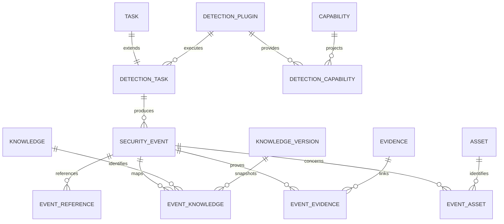

# Phase 11 Development Report

## 1. Phase 信息

- 项目：Cyber Agent Platform（CAP）
- 阶段：Phase 11 — Suricata Detection Plugin（首个真实 Detection Tool）
- 角色：Engineer 实现与验证完成，等待 Architect Review
- 本阶段结论：Suricata 8.0.6 已通过受控 EVE JSONL Fixture 接入现有 Detection Framework；未修改 Detection Framework 核心；不进入 Phase 12。
- 阶段门禁：报告提交后立即停止开发，等待 Architect 明确 `✅ Phase Passed`。
- 合规边界：只处理受控或明确授权数据；不主动扫描、不绕过认证/WAF/验证码/付费墙、不访问任意系统日志路径、不启动真实网络抓包。

## 2. 本阶段完成内容与验收清单

- [x] 分析 Suricata 官方 EVE JSON、Alert、Flow、Stats、DNS、HTTP、TLS、Fileinfo、SID/GID/Rev 与 Rule Metadata。
- [x] 对照 Sigma Metadata/Severity/Tags、TheHive Alert/Observable/Case、Wazuh Decoder/Correlation 的职责边界。
- [x] 新增 Suricata Adapter、Plugin、Normalizer、Sandbox Profile、Typed Configuration、Manifest、API 与 Fixture。
- [x] 保持 Detection Runtime、Detection Service、Planner、Registry、通用 Normalizer、SecurityEvent ORM 与 Correlation Engine 不变。
- [x] 实现 `initialize()`、`collect()`、`parse()`、`detect()`、`normalize()`、`shutdown()` 六阶段生命周期。
- [x] 实现 EVE JSONL → DetectionResult → SecurityEvent → RuleBasedCorrelationEngine → IncidentCandidate 验证链路。
- [x] 实现 Alert、Severity、Category、Signature、SID、GID、Rev、Flow、Protocol、Source/Destination、Evidence/Reference、ATT&CK/CAPEC/CVE 映射。
- [x] 客户端任意 `path`/`log_path` 输入被 `extra="forbid"` 拒绝；仅允许 `data_source_id`。
- [x] Plugin 不访问数据库、文件 API、JSON 解析器、Repository、IncidentService，不创建 Incident。
- [x] 完成 Security Boundary、Tool Integration、Operational Readiness、Architecture Trade-off Analysis。
- [x] 新增 ADR-0024、ADR-0025。
- [x] Phase 11 专项测试 10 passed；Phase 0–11 全量 164 passed。
- [x] Ruff、Black、compileall、Alembic、精确覆盖率门禁通过。

## 3. 项目 Tree 结构

```text
cyber-agent-platform/
├── backend/
│   ├── app/
│   │   ├── api/routes/suricata.py
│   │   ├── config/models.py
│   │   ├── dependencies/__init__.py
│   │   ├── dependencies/services.py
│   │   ├── plugins/
│   │   │   └── suricata/
│   │   │       ├── __init__.py
│   │   │       ├── normalizer.py
│   │   │       └── plugin.py
│   │   ├── schemas/suricata.py
│   │   └── tools/
│   │       └── suricata/
│   │           ├── __init__.py
│   │           ├── adapter.py
│   │           └── contracts.py
│   ├── config/detection.yaml
│   └── tests/
│       ├── fixtures/suricata/eve.jsonl
│       └── test_phase_11_suricata.py
├── plugins/suricata/manifest.yaml
├── tools/suricata/manifest.yaml
└── docs/
    ├── adr/ADR-0024-suricata-first-detection-plugin.md
    ├── adr/ADR-0025-suricata-eve-json-input.md
    ├── phase-11-suricata-detection-plugin.md
    └── Phase 11 Development Report.md
```

平台检测核心未修改：

```text
backend/app/detection/runtime.py
backend/app/detection/service.py
backend/app/detection/planner.py
backend/app/detection/registry.py
backend/app/detection/normalizer.py
backend/app/models/detection.py
backend/app/schemas/detection.py
```

## 4. 架构变化、影响模块与 Breaking Change

### 架构变化

新增 Suricata Anti-Corruption Layer：

```text
POST /detection/suricata
  -> SuricataDetectionCreate
  -> existing DetectionService
  -> existing DetectionPlanner
  -> existing DetectionRuntime
  -> SuricataDetectionPlugin
  -> SuricataAdapter
  -> allowlisted EVE JSONL
  -> SuricataResultNormalizer
  -> DetectionResult
  -> existing platform Normalizer
  -> SecurityEvent
  -> RuleBasedCorrelationEngine
  -> IncidentCorrelation candidate
```

Suricata 不是新的平台 Detection Framework；它只是通过既有 Plugin SDK 接入的第一个真实 Detection Tool。Incident Candidate 由独立 IncidentCorrelation 产生，Suricata Plugin 不拥有 Incident 生命周期。

### 影响模块

- API Router：增加 Suricata 专用路由。
- Configuration：增加 Suricata 数据源、版本和 Sandbox 配置。
- DI：增加 Adapter 工厂并向 DetectionService 注册 Suricata Plugin。
- Detection Plugin/Tool：增加真实工具边界实现。
- Tests：增加真实工具形态的 synthetic EVE Fixture 测试。
- Documentation/ADR：增加首个真实 Detection Plugin 与 EVE 输入边界决策。

### Breaking Change

无。Phase 11 仅新增路由、配置、实现、Manifest、Fixture 和文档；没有修改既有 Detection API 契约、数据库表结构或现有插件生命周期。

## 5. GitHub Reference Analysis

Suricata 的 EVE JSON 设计提供统一 Envelope 和多种事件族。Phase 11 使用：

- 公共字段：`timestamp`、`event_type`、`flow_id`、协议和端点字段；
- Alert：action、signature、`signature_id`、gid、rev、category、severity；
- telemetry：flow、stats、dns、http、tls、fileinfo；
- rule metadata：ATT&CK、CAPEC、CVE 和外部 URL。

Sigma 证明 metadata、severity、tags 和 references 应保持为规则上下文，不应污染 CAP Detection Framework。TheHive 对 Alert、Observable、Case 的分层证明检测信号、调查对象和 Case 生命周期应分离。Wazuh decoder/rule/frequency/timeframe 证明解析、规则和多事件关联应分离。

Phase 11 没有接入 Zeek、Elastic、Splunk、Wazuh、Sigma runtime、TheHive API 或其他 Detection Tool；这些仅作为边界参考。

## 6. Tool Integration Analysis

`SuricataAdapter` 独占：

- source ID 解析和 allowlist；
- 文件存在性与 `.json`/`.jsonl` 扩展名检查；
- bounded read；
- JSONL 解析；
- JSON object 和 EVE Envelope 校验；
- event type allowlist；
- Alert metadata 校验；
- 健康状态输出。

`SuricataDetectionPlugin` 只负责编排生命周期和身份校验：

- `initialize()` 读取 `data_source_id`，不读取路径；
- `collect()` 只调用 Adapter；
- `parse()` 只验证 Adapter 返回的 record 形状；
- `detect()` 调用 Suricata Normalizer；
- `normalize()` 校验 Plugin/Tool 身份；
- `shutdown()` 清理内存状态。

`SuricataResultNormalizer` 将 tool-native records 转成现有 `DetectionResult`，而不是创建新的 DetectionResult 版本或新的 SecurityEvent 表。

## 7. Security Boundary Analysis

### 输入和文件边界

客户端请求模型为：

```python
class SuricataDetectionCreate(BaseModel):
    model_config = ConfigDict(extra="forbid")
    name: str
    asset_id: UUID
    data_source_id: str
    execute: bool = True
```

客户端不能传 `path` 或 `log_path`。Adapter 仅从平台配置解析 source ID；source 路径不通过 API 返回。未知 source、空 source、路径字符串伪装 source、非法扩展名和不存在文件均 fail closed。

### 资源边界

默认 Sandbox Profile：

- CPU：0.5；
- Memory：256 MB；
- Timeout：30 秒；
- 最大输入：5 MB；
- 最大记录：1000；
- 文件系统：`configured-read-only-sources`；
- 网络：`none`；
- Adapter 权限：`eve.read`。

Detection Runtime 继续执行平台级权限、超时、最大事件、单事件大小、metadata 大小、sampling 和 rate limit。

### 权限和领域边界

Detection Registry 允许 Plugin 权限仍为 `detection.execute` 和 `evidence.read`，禁止数据库、Workflow、Assessment、Report、Incident、Shell 和 filesystem write 等权限。Plugin Context 为 frozen/slots 最小权限 DTO，不含 AsyncSession、Repository 或 IncidentService。

只有 DetectionService 负责 SecurityEvent 持久化、Asset/Evidence/KnowledgeVersion 验证、Correlation 和 Audit。IncidentCorrelation 仅生成 Candidate；IncidentService 才能创建和转移 Incident。

### 数据最小化

Normalizer 只保留显式 allowlisted scalar/list 属性。原始嵌套 `alert`、`flow`、`dns`、`http`、`tls`、`fileinfo` Payload 不进入最终 SecurityEvent。若未来需要保存完整原始 EVE，应进入独立受治理 Evidence/object storage，不得扩张 SecurityEvent.attributes。

## 8. EVE JSON → DetectionResult → SecurityEvent 映射

| Suricata 字段 | CAP 映射 |
|---|---|
| `event_type` | `RawSecurityEvent.event_type = network.<type>` |
| `timestamp` | UTC `timestamp` |
| `alert.signature` | `attributes.signature` |
| `alert.signature_id` | `attributes.sid` |
| `alert.gid` | `attributes.gid` |
| `alert.rev` | `attributes.rev` |
| `alert.category` | `attributes.category` |
| `alert.severity` | FindingSeverity：1 CRITICAL、2 HIGH、3 MEDIUM、4 LOW |
| `alert.action` | `attributes.action`；blocked/drop 提升 confidence |
| GID/SID/Rev | `rule = gid:sid:rev` |
| `flow_id` | `attributes.flow_id`、stable tool identity 输入 |
| `proto`/`app_proto` | `attributes.protocol`/`app_protocol` |
| `src_ip`/`src_port` | `source_ip`/`source_port`、IOC |
| `dest_ip`/`dest_port` | `destination_ip`/`destination_port`、IOC |
| flow/dns/http/tls/fileinfo/stats | allowlisted bounded event-specific attributes |
| ATT&CK/CAPEC/CVE metadata | `knowledge_references` 和标准 external references |
| metadata references | URL references，经 HTTPS/HTTP allowlist 过滤 |

平台通用 Normalizer 继续负责 event/source 规范化、属性清理、IOC/Reference 去重和 SHA-256 fingerprint。

## 9. Database Design

### 本阶段数据库结论

Phase 11 不新增数据库表、不修改数据库模型、不新增 Alembic migration。复用 Phase 9 的 Detection 表和关系表保存 Suricata 结果：

- `detection_plugins`：Suricata Plugin identity/permissions/configuration；
- `detection_capabilities`：Plugin 与 Capability 关系；
- `detection_tasks`：检测执行和结果摘要；
- `security_events`：统一 SecurityEvent；
- `event_references`：标准 references；
- `event_knowledge`：Knowledge 和 exact KnowledgeVersion 关系；
- `event_evidence`：Evidence 关系；
- `event_assets`：Asset 关系。

### 关键字段

| 表 | 关键字段 | Phase 11 用途 |
|---|---|---|
| DetectionPlugin | name/version/enabled/permissions/configuration | 注册 `suricata-detection` |
| DetectionCapability | plugin_id/capability_id/configuration | 注册六个 Suricata capabilities |
| DetectionTask | task_id/plugin_id/status/policy/plan/result_summary | 保存执行状态 |
| SecurityEvent | detection_task_id/fingerprint/event_type/source/severity/confidence/timestamp/plugin/tool/rule/status/attributes | 保存规范化事件 |
| EventReference | event_id/url | 保存规则与标准知识引用 |
| EventKnowledge | event_id/knowledge_id/knowledge_version_id | 受平台验证的知识快照关系 |
| EventEvidence | event_id/evidence_id | 受平台验证的证据关系 |
| EventAsset | event_id/asset_id | 事件和主 Asset 关联 |



Alembic 当前唯一 head：`20260731_0012`。Phase 11 没有新增 migration。

## 10. API Design

### 10.1 `POST /detection/suricata`

请求：

```json
{
  "name": "Controlled Suricata EVE ingestion",
  "asset_id": "11111111-1111-1111-1111-111111111111",
  "data_source_id": "phase11-fixture",
  "execute": true
}
```

服务端转换为既有 `DetectionTaskCreate`：

```json
{
  "name": "Controlled Suricata EVE ingestion",
  "asset_id": "11111111-1111-1111-1111-111111111111",
  "capabilities": [
    "network.detect",
    "ids.detect",
    "traffic.detect",
    "event.detect",
    "ioc.detect",
    "rule.detect"
  ],
  "log_source": "suricata-eve",
  "parser": "eve-jsonl",
  "plugin_name": "suricata-detection",
  "input": {"data_source_id": "phase11-fixture"},
  "execute": true
}
```

成功响应摘要：

```json
{
  "status": "SUCCESS",
  "requested_capabilities": [
    "network.detect",
    "ids.detect",
    "traffic.detect",
    "event.detect",
    "ioc.detect",
    "rule.detect"
  ],
  "result_summary": {
    "success": true,
    "events": 8,
    "correlation_groups": 15,
    "records_collected": 8
  }
}
```

### 10.2 `GET /detection/suricata/status`

示例：

```json
{
  "healthy": true,
  "tool": "suricata",
  "version": "8.0.6",
  "input_format": "eve-jsonl",
  "sources": [
    {"source_id": "phase11-fixture", "available": true, "fixture": true}
  ],
  "sandbox": {
    "cpu_limit": 0.5,
    "memory_limit_mb": 256,
    "timeout_seconds": 30,
    "max_input_bytes": 5000000,
    "max_records": 1000,
    "filesystem_policy": "configured-read-only-sources",
    "network_policy": "none",
    "permissions": ["eve.read"]
  }
}
```

响应不包含实际 filesystem path。

### 10.3 `GET /detection/events/{id}`

复用现有 Detection API，返回平台 `SecurityEventRead`，包含 `plugin=suricata-detection`、`tool=suricata`、rule、severity、attributes、references、assets、knowledge 和 evidence links。未找到事件返回 `SECURITY_EVENT_NOT_FOUND`。

### 10.4 错误契约

- 未注册 `data_source_id`：HTTP 403，`DETECTION_POLICY_VIOLATION`；
- 任意 `path`/`log_path`：HTTP 422，Pydantic extra field rejection；
- 非法 EVE JSONL：`DETECTION_EXECUTION_ERROR`；
- 不允许 event type：`DETECTION_POLICY_VIOLATION`；
- 未知 Asset：既有 `ASSET_NOT_FOUND`。

## 11. 核心代码说明

### Adapter：受控 source 和 bounded JSONL

```python
def collect(self, source_id: str) -> SuricataCollectionResult:
    source = self.require_source(source_id)
    data = self._read_bounded(source.path)
    records = tuple(self.parse_jsonl(data.decode("utf-8")))
    if len(records) > self._profile.max_records:
        raise DetectionPolicyViolation(...)
    return SuricataCollectionResult(...)
```

### Plugin：生命周期不跨域

```python
async def initialize(self, context: DetectionPluginContext) -> None:
    if context.granted_permissions != self.permissions:
        raise DetectionValidationError(...)
    source_id = context.input.get("data_source_id")
    if not isinstance(source_id, str):
        raise DetectionValidationError(...)
    self._adapter.require_source(source_id)
```

### Normalizer：规则身份和统一结果

```python
rule_identity = f"{gid or 1}:{sid}:{rev or 0}"
return RawSecurityEvent(
    event_type=f"network.{event_type}",
    source=f"suricata:{source_id}",
    severity=self._severity(alert.get("severity"), event_type),
    tool="suricata",
    rule=rule_identity or None,
    ...,
)
```

### 平台边界

```text
Plugin -> DetectionResult only
DetectionService -> SecurityEvent persistence/correlation/audit
IncidentCorrelation -> IncidentCandidate only
IncidentService -> Incident lifecycle
```

## 12. Docker / 部署 / Operational Readiness

### 部署

Phase 11 不新增容器和端口。Suricata 作为独立、受控的 telemetry producer 部署；CAP 仅以只读方式挂载配置的数据源。不得挂载宿主根目录、任意日志目录或凭据目录。

### 资源

默认 Adapter Profile 为 0.5 CPU、256 MB、30 秒、5 MB、1000 records。DetectionPolicy 默认保留 60 秒执行超时和 1000 events 上限。生产环境应依据事件量和容量评估调整，并经过 Architect Review。

### 日志轮转和保留

Suricata EVE 轮转由 producer 或专用 staging 进程负责。CAP 不删除和轮转 producer-owned 文件。规范化 SecurityEvent 受 DetectionPolicy retention 约束；原始 EVE 若要留存，应使用独立 Evidence/object-storage retention policy。

### 健康检查和审计

`GET /detection/suricata/status` 提供 source availability、version、format 和 Sandbox profile。审计至少包含：

- `DetectionTaskCreated`；
- `DetectionExecutionStarted`；
- `DetectionResultNormalized`；
- `SecurityEventCreated`；
- `SecurityEventsCorrelated`。

日志使用 request/trace ID，不输出真实 source path 和原始 EVE payload。

### 版本固定、升级和回滚

Manifest 与 typed configuration 固定 Suricata `8.0.6`。升级前运行 Fixture、专项和全量兼容测试；回滚恢复上一版本的 producer 与 Adapter/Normalizer。SecurityEvent 是稳定回滚边界。

## 13. 测试情况

### 13.1 Phase 11 专项

命令：

```text
PYTHONPATH=backend python -m pytest backend/tests/test_phase_11_suricata.py -q --basetemp=pytest-phase11-rerun
```

结果：

```text
10 passed in 4.37s
```

覆盖内容：

- allowlisted source、source normalization、空/未知 source；
- 非法扩展名、不存在文件；
- 超大输入、超大 records；
- 非法 JSONL、非对象、缺 event_type、缺 timestamp、非法 event_type、缺 alert block；
- status healthy/unhealthy 且不泄漏 path；
- Plugin 六阶段生命周期和未初始化 fail closed；
- 权限、source、foreign tool、identity mismatch；
- SID/GID/Rev、severity/action/category/signature、flow/protocol/IP；
- DNS/HTTP/TLS/Fileinfo/Stats bounded attributes；
- ATT&CK/CAPEC/CVE/Reference；
- 非法 severity/timestamp；
- API、任意 path 422、未知 source 403；
- SecurityEvent 落库、审计、RuleBasedCorrelation；
- IncidentCorrelation 生成 Candidate 且 `Incident` 数量保持 0；
- 平台 Normalizer 丢弃嵌套 payload。

### 13.2 全量回归

命令：

```text
PYTHONPATH=backend python -m pytest backend/tests -q -p no:cacheprovider --basetemp=pytest-phase11-full
```

结果：

```text
164 passed in 51.37s
```

### 13.3 静态质量门禁

- Ruff：All checks passed；
- Black：192 files unchanged；
- compileall：通过；
- Alembic：唯一 head `20260731_0012`；
- Docker Engine：本阶段未执行真实容器在线迁移验证，沿用环境限制，仅验证 SQLite 测试和 Alembic head/offline 结论。

### 13.4 精确覆盖率

使用 `coverage run --concurrency=greenlet` 处理异步 SQLAlchemy/greenlet 路径：

```text
coverage report --precision=4 --fail-under=95
```

结果：

```text
TOTAL: 7273 / 7652 lines = 95.0470%
```

严格 `fail-under=95` 通过。Phase 11 相关 8 个文件：316 / 326 = 96.9325%。其中：

- Suricata API：100%；
- Suricata Plugin：100%；
- Suricata Schema：100%；
- Suricata contracts：100%；
- Suricata package exports：100%；
- Suricata Normalizer：96.1832%；
- Suricata Adapter：92.9577%。

## 14. Audit / Security / Correlation 验证结论

端到端验证确认：

```text
Suricata EVE JSONL
  -> SuricataAdapter
  -> SuricataDetectionPlugin
  -> DetectionResult
  -> SecurityEvent x8
  -> RuleBasedCorrelationEngine groups=15
  -> IncidentCorrelation candidates
  -> Incident rows=0
```

审计集合包含：

```text
DetectionTaskCreated
DetectionExecutionStarted
DetectionResultNormalized
SecurityEventCreated
SecurityEventsCorrelated
```

Suricata Plugin 没有调用 IncidentService。IncidentCandidate 由测试显式调用 IncidentCorrelation 生成，未绕过 IncidentService 创建 Incident。

## 15. Known Issues / Technical Debt

1. Phase 11 使用受控 EVE Fixture，不启动真实 Suricata 进程、不接入 live interface、不执行 packet capture；生产 producer/collector 编排需要单独评审。
2. Adapter 的 read-only policy 是代码和配置层约束；真正的 OS/container mount enforcement 仍需部署环境落实。
3. 当前接口采用批量 bounded file ingestion，不是流式 checkpoint/backpressure；大规模 EVE ingestion 需要后续专门设计。
4. 当前 RuleBasedCorrelationGroup 不独立持久化；Correlation 结果仍为平台 DTO/审计 projection。
5. 原始完整 EVE payload 未进入 SecurityEvent；若要保留，必须通过 Evidence/object storage 和 retention policy 实现。
6. Knowledge Mapping 当前产生标准 identifier/reference；Knowledge 的持久化、版本匹配和跨域验证仍由既有 DetectionService 负责，Plugin 不查询数据库。
7. 生产部署必须补充日志轮转、文件锁/一致性读取、分区/归档、容量告警、版本兼容矩阵和真实 container sandbox 验证。
8. 真实版本升级需要重新验证 EVE Schema、Rule Metadata 和 Fixture Compatibility，不得仅修改版本字符串。

## 16. 后续建议

以下仅供 Architect Review 裁决，不表示进入 Phase 12：

- 评审真实 Detection Tool Worker/Sandbox Provider 标准；
- 评审流式 EVE ingestion、checkpoint、backpressure、partition 和 retention worker；
- 评审 Suricata EVE 原始 Evidence 的受控存储与 lineage；
- 评审持久化 CorrelationGroup 与 IncidentCandidate queue；
- 评审从 Candidate 到 Incident 的人工审批、策略和去重边界；
- 评审 Suricata 版本升级和 EVE compatibility contract；
- 评审 producer health、file rotation、一致性读取和多实例并发策略。

不得在 Architect 明确 `✅ Phase Passed` 前进入 Phase 12 或新增 Zeek/Elastic/Splunk/Wazuh 等 Detection Tool。

## 17. 交付物清单与 Architect Review 准备说明

### 交付物

- `backend/app/tools/suricata/contracts.py`
- `backend/app/tools/suricata/adapter.py`
- `backend/app/tools/suricata/__init__.py`
- `backend/app/plugins/suricata/plugin.py`
- `backend/app/plugins/suricata/normalizer.py`
- `backend/app/plugins/suricata/__init__.py`
- `backend/app/schemas/suricata.py`
- `backend/app/api/routes/suricata.py`
- `backend/app/config/models.py`
- `backend/config/detection.yaml`
- `backend/app/dependencies/services.py`
- `backend/app/dependencies/__init__.py`
- `backend/app/schemas/__init__.py`
- `backend/app/api/router.py`
- `backend/tests/fixtures/suricata/eve.jsonl`
- `backend/tests/test_phase_11_suricata.py`
- `plugins/suricata/manifest.yaml`
- `tools/suricata/manifest.yaml`
- `docs/adr/ADR-0024-suricata-first-detection-plugin.md`
- `docs/adr/ADR-0025-suricata-eve-json-input.md`
- `docs/phase-11-suricata-detection-plugin.md`
- `docs/Phase 11 Development Report.md`
- `backend/coverage-phase11-final.json`

### Architect Review 重点

1. Suricata 是否正确作为第一个真实 Detection Plugin，而不是导致 Framework 被工具 schema 污染。
2. Adapter 是否完整独占文件读取、JSONL 解析、Envelope 校验、大小/数量边界。
3. Client `data_source_id` 边界是否足以阻断任意路径输入。
4. Plugin Context、Permission、No DB、No Incident、No Shell、No Network 边界是否满足 Security by Default。
5. EVE JSON → DetectionResult → SecurityEvent 映射是否稳定，GID/SID/Rev 与 severity/action 语义是否正确。
6. ATT&CK/CAPEC/CVE/Reference 是否保持标准 identifier/reference，未引入 Plugin DB 查询。
7. SecurityEvent 是否完成持久化、Asset 关联、Audit 和 RuleBasedCorrelation。
8. IncidentCandidate 是否只能由 IncidentCorrelation 产生且未自动创建 Incident。
9. Sandbox Profile、部署、日志轮转、版本固定、升级/回滚和 Known Issues 是否足以支持 Operational Readiness。
10. 精确覆盖率是否满足 `>=95%`，以及是否接受 `--concurrency=greenlet` 的覆盖率采集方式。

## 18. 阶段停止声明

Phase 11 已完成实现、测试、质量门禁、文档与报告交付。Engineer 现在停止开发，不进入 Phase 12，等待 Architect Review Report、修复意见以及明确的 `✅ Phase Passed` 结论。
