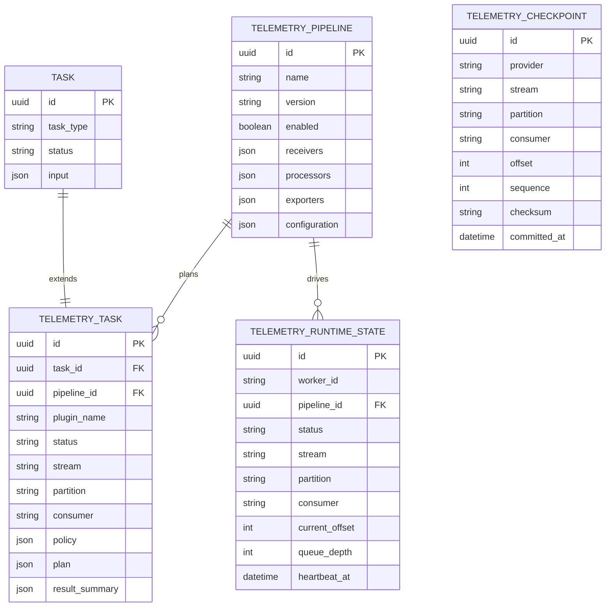

# Phase 12 Development Report

## 1. Phase 信息

- 项目：Cyber Agent Platform（CAP）
- 阶段：Phase 12 — Telemetry & Stream Framework（统一遥测与流处理框架）
- 角色：Engineer 实现与验证完成，等待 Architect Review
- 本阶段结论：统一 Telemetry 平台层、六阶段 Plugin SDK、Broker-neutral StreamRuntime、Checkpoint/Replay/Ack/Batch/Window/Backpressure、ORM、Migration、API 与 Audit 已完成。
- 阶段门禁：报告提交后立即停止开发；等待 Architect 明确 `✅ Phase Passed`；不得进入 Phase 13。
- 合规边界：仅处理请求内受控 synthetic 数据；未接入 Zeek、Kafka、Redpanda、Fluent Bit、Windows Event、CloudTrail、Elastic 或真实遥测来源；未修改 SecurityEvent、Finding、Incident。

## 2. 本阶段完成内容

- [x] 建立 `TelemetryService`、`TelemetryRegistry`、`TelemetryPlanner`、`TelemetryRuntime`、`TelemetryPolicy`、`TelemetryPlugin`。
- [x] 建立 `initialize → receive → parse → transform → publish → shutdown` 六阶段生命周期。
- [x] 建立 Receiver、Parser、Transformer、Publisher 与稳定 `TelemetryRecord` 边界。
- [x] 建立独立 Detection 边界；Telemetry Plugin 不能创建 SecurityEvent，不能访问 DetectionService。
- [x] 建立 broker-neutral `StreamRuntime`，支持 Batch、Window、Ack、Replay。
- [x] 建立 Memory 与 SQLAlchemy Checkpoint Provider；后者适配 SQLite/PostgreSQL AsyncSession。
- [x] Checkpoint 按 `(stream, partition, consumer)` 管理，Offset/Sequence 单调推进。
- [x] Replay 不提交 Checkpoint。
- [x] 建立 Drop、Retry、Pause、Reject 四类有界 Backpressure 策略与审计路径。
- [x] 建立四张 ORM 表和 Alembic Revision `20260801_0013`。
- [x] 建立 Telemetry Task、Runtime、Checkpoint、Replay API。
- [x] 建立 Synthetic Framework Validation Plugin，不读文件、不访问网络、不执行 Shell。
- [x] 建立 ADR-0026、ADR-0027 和 Phase 12 架构文档。
- [x] Phase 12 专项测试 10 passed；Phase 0–12 全量测试 174 passed。
- [x] 全应用覆盖率 95.36697789859355%，达到 ≥95% 门禁。
- [x] Ruff、Black、compileall、Alembic heads、PostgreSQL Offline Migration SQL 验证通过。

## 3. 项目 Tree 结构

```text
cyber-agent-platform/
├── backend/
│   ├── app/
│   │   ├── api/routes/telemetry.py
│   │   ├── config/models.py
│   │   ├── dependencies/services.py
│   │   ├── models/telemetry.py
│   │   ├── repositories/telemetry.py
│   │   ├── schemas/telemetry.py
│   │   └── telemetry/
│   │       ├── __init__.py
│   │       ├── backpressure.py
│   │       ├── checkpoint.py
│   │       ├── contracts.py
│   │       ├── fake_plugin.py
│   │       ├── planner.py
│   │       ├── registry.py
│   │       ├── runtime.py
│   │       ├── service.py
│   │       └── stream.py
│   ├── alembic/versions/
│   │   └── 20260801_0013_telemetry_stream_framework.py
│   ├── config/telemetry.yaml
│   ├── tests/test_phase_12_telemetry.py
│   ├── coverage-phase12-acceptance-20260731.json
│   ├── phase12-upgrade-final-20260731.sql
│   └── phase12-downgrade-final-20260731.sql
└── docs/
    ├── adr/ADR-0026-telemetry-platform-layer.md
    ├── adr/ADR-0027-stream-runtime-detection-separation.md
    ├── phase-12-telemetry-stream-framework.md
    └── Phase 12 Development Report.md
```

明确未修改的领域模型：

```text
backend/app/models/detection.py   # SecurityEvent
backend/app/models/assessment.py  # Finding
backend/app/models/incident.py    # Incident
```

## 4. 技术实现说明

### 4.1 总体调用链

```text
POST /telemetry/tasks
  -> TelemetryTaskCreate(extra="forbid")
  -> TelemetryService
  -> TelemetryRegistry
  -> TelemetryPlanner
  -> TelemetryRuntime
  -> TelemetryPlugin lifecycle
  -> TelemetryRecord
  -> TelemetryJournal
  -> StreamRuntime.ack
  -> CheckpointProvider
  -> Platform Event / AuditSubscriber
```

### 4.2 Plugin SDK

`TelemetryPluginContext` 是 frozen、slots 的最小权限 DTO，仅包含任务身份、Trace、Stream/Partition/Consumer、Policy、不可变 Input 与 granted permissions。它不含 AsyncSession、Repository、DetectionService、IncidentService 或 EvidenceService。

生命周期：

1. `initialize()`：校验上下文和权限身份；
2. `receive()`：获取来源 Envelope；
3. `parse()`：验证 Envelope；
4. `transform()`：输出来源中立 `TelemetryRecord`；
5. `publish()`：返回 `TelemetryExecutionResult`；
6. `shutdown()`：成功初始化后无论成功、失败或超时均执行。

### 4.3 Runtime 完整性校验

- Plugin permission identity；
- 执行超时；
- 最大记录数；
- 单条记录大小；
- Payload SHA-256 Checksum；
- Plugin name/version identity；
- `published_count == len(records)`；
- `finally` shutdown。

### 4.4 Stream Runtime

`StreamRuntime` 不依赖 Kafka、Redpanda、Redis Streams 或其他 Broker Client。核心语义：

- Batch：按 batch size 保序切片；
- Window：按 timestamp 排序形成时间窗口；
- Ack：提交最后处理的 offset/sequence/checksum；
- Replay：按 offset 区间和可选时间窗口读取；
- Ordering：保证单 Partition 内的稳定顺序，不承诺全局顺序；
- Delivery：兼容 at-least-once，不声明 exactly-once。

### 4.5 Checkpoint Provider

- `MemoryCheckpointProvider`：进程内开发/测试实现；
- `SQLAlchemyCheckpointProvider`：复用当前 AsyncSession，可运行在 SQLite/PostgreSQL SQLAlchemy Dialect；
- API 使用 Provider-neutral Read Model，不泄露 ORM id/created_at/updated_at；
- Offset 和 Sequence 不能倒退；
- Replay 不改变 Checkpoint。

### 4.6 Backpressure

- Drop：丢弃溢出记录并审计；
- Retry：有限次数重试，耗尽后失败；
- Pause：有界暂停，队列仍满则失败；
- Reject：立即 fail closed。

任何策略都不会无限循环。非 ACCEPT 决策发布 `TELEMETRY_BACKPRESSURE_APPLIED`，包含 decision、queue depth、capacity 与 attempts。

## 5. 数据库设计

### 5.1 表与关键字段

| 表 | 关键字段 | 作用 |
|---|---|---|
| `telemetry_pipelines` | id, name, version, enabled, receivers, processors, exporters, configuration | 保存 Pipeline 快照 |
| `telemetry_tasks` | task_id, pipeline_id, plugin_name, status, stream, partition, consumer, policy, plan, result_summary, started_at, finished_at, error | 保存 Telemetry 执行状态 |
| `telemetry_checkpoints` | provider, stream, partition, consumer, offset, sequence, checksum, metadata, committed_at | 保存 Consumer Cursor |
| `telemetry_runtime_states` | worker_id, pipeline_id, status, stream, partition, consumer, current_offset, lag, queue_depth, backpressure_action, metadata, heartbeat_at | 保存 Worker 运行状态 |

约束：

- Pipeline `(name, version)` 唯一；
- TelemetryTask 与 Task 一对一；
- Checkpoint `(provider, stream, partition, consumer)` 唯一；
- Offset、Sequence、Lag、Queue Depth 非负；
- Runtime State `worker_id` 唯一；
- Status 使用数据库 Check Constraint。

### 5.2 Mermaid ER 图



### 5.3 Migration

- Revision：`20260801_0013`
- Down Revision：`20260731_0012`
- Alembic Head：`20260801_0013 (head)`
- PostgreSQL Offline Upgrade SQL：5622 bytes，包含 4 个 `CREATE TABLE telemetry_*`；
- PostgreSQL Offline Downgrade SQL：330 bytes，包含 4 个 `DROP TABLE telemetry_*`。

历史 Migration 链包含 PostgreSQL 风格 `server_default=now()`，导致从 Phase 0 开始的完整 SQLite Alembic upgrade 在旧 Revision 处失败。Phase 12 ORM/Repository 已在 SQLite 测试数据库验证；生产 Migration 验收以 PostgreSQL Offline DDL 为准。未回改历史 Migration，避免破坏已发布 Revision 校验和。

## 6. API 设计

### 6.1 创建并执行 Telemetry Task

```http
POST /telemetry/tasks
Content-Type: application/json
```

```json
{
  "name": "Synthetic framework validation",
  "plugin_name": "synthetic-telemetry",
  "stream": "synthetic",
  "partition": "0",
  "consumer": "cap-default",
  "records": [
    {"message": "first", "offset": 0},
    {"message": "second", "offset": 1}
  ],
  "execute": true
}
```

```json
{
  "plugin_name": "synthetic-telemetry",
  "status": "SUCCESS",
  "stream": "synthetic",
  "partition": "0",
  "consumer": "cap-default",
  "result_summary": {
    "received": 2,
    "published": 2,
    "records": 2,
    "security_events_created": 0
  }
}
```

任意 `path`、`endpoint` 或未声明字段返回 HTTP 422。

### 6.2 查询任务

```http
GET /telemetry/tasks?page=1&page_size=100
```

返回统一 PageResponse。

### 6.3 查询 Runtime

```http
GET /telemetry/runtime
```

```json
{
  "workers": [],
  "queue_capacity": 1000,
  "checkpoint_provider": "memory",
  "plugin_count": 1,
  "capabilities": ["telemetry.receive", "telemetry.synthetic"]
}
```

### 6.4 查询 Checkpoint

```http
GET /telemetry/checkpoints
```

Provider-neutral Response：

```json
[
  {
    "provider": "memory",
    "stream": "synthetic",
    "partition": "0",
    "consumer": "cap-default",
    "offset": 1,
    "sequence": 1,
    "checksum": "<sha256>",
    "metadata": {},
    "committed_at": "2026-07-31T20:00:00Z"
  }
]
```

### 6.5 Replay

```http
POST /telemetry/replay
Content-Type: application/json
```

```json
{
  "stream": "synthetic",
  "partition": "0",
  "consumer": "cap-default",
  "from_offset": 1,
  "to_offset": 10,
  "window_seconds": 60
}
```

Response 始终包含：

```json
{"checkpoint_unchanged": true}
```

## 7. 核心代码说明

### TelemetryRecord 不是 SecurityEvent

```python
class TelemetryRecord(BaseModel):
    source: str
    timestamp: datetime
    stream: str
    offset: int
    sequence: int
    payload: dict[str, Any]
    metadata: dict[str, Any]
    checksum: str
```

### 最小权限 Registry

```python
ALLOWED_TELEMETRY_PERMISSIONS = frozenset(
    {"telemetry.receive", "telemetry.publish"}
)
```

禁止权限包括 database、detection、security event create、incident create、shell、filesystem write、unrestricted network。

### Monotonic Checkpoint

```python
if checkpoint.offset < row.offset or checkpoint.sequence < row.sequence:
    raise TelemetryConflict("Telemetry checkpoint cannot move backwards")
```

### Replay 不提交

`StreamRuntime.replay()` 只过滤 Journal Record；不调用 `CheckpointProvider.commit()`。

### SecurityEvent 边界

```python
telemetry.result_summary = {
    "received": result.received_count,
    "published": result.published_count,
    "records": len(result.records),
    "security_events_created": 0,
}
```

专项测试同时查询数据库，确认 `SecurityEvent` 数量为 0。

## 8. Docker / 部署

Phase 12 不新增 Kafka、Redpanda、Zeek 或其他容器，不改变现有 Docker Compose 服务拓扑。

配置入口：

```yaml
telemetry:
  allowed_plugins: [synthetic-telemetry]
  allowed_streams: [synthetic]
  timeout_seconds: 30
  max_records: 1000
  max_record_size_bytes: 262144
  batch_size: 100
  window_seconds: 60
  queue_capacity: 1000
  backpressure_action: REJECT
  retry_attempts: 3
  pause_seconds: 0.05
  checkpoint_provider: memory
```

生产建议：

- 使用 PostgreSQL Checkpoint Provider；
- 将 Journal 外部化为持久化 Broker/Object Store；
- 将 Stream Worker 与 HTTP API 解耦；
- 每个 Consumer Group 使用独立 Checkpoint；
- 监控 Lag、Queue Depth、Retry、Pause、Drop 和 Replay；
- 不把任意路径或 Broker 凭据暴露给 Plugin Context。

## 9. 测试情况

### 9.1 Phase 12 专项测试

```text
10 passed in 2.07s
```

覆盖：Registry、重复注册、空名称、权限/Capability/Allowlist、Planner、六阶段生命周期、Shutdown、Envelope、Checksum、Record Size、Result Identity、Publish Count、Timeout、Batch、Window、Ack、Replay、Replay 不提交、Memory/SQLAlchemy Checkpoint、Checkpoint 回退、Drop/Retry/Pause/Reject、Retry Exhaustion、Runtime State、Backpressure Audit、API、Path Reject、SecurityEvent 边界。

### 9.2 Phase 0–12 全量测试

```text
174 passed in 101.64s
```

### 9.3 覆盖率

```text
8461 statements
8069 covered
392 missed
95.36697789859355%
```

门禁：`--fail-under=95` 通过。

### 9.4 静态质量

```text
Ruff: All checks passed!
Black: 250 files would be left unchanged.
compileall: passed
```

### 9.5 Migration

```text
Alembic heads: 20260801_0013 (head)
PostgreSQL upgrade offline SQL: passed, 4 CREATE TABLE
PostgreSQL downgrade offline SQL: passed, 4 DROP TABLE
```

## 10. Security Boundary Analysis

1. Plugin Context 不包含数据库或领域 Service。
2. Registry 使用 permission allowlist 和 forbidden permission 集合。
3. API `extra="forbid"`，拒绝任意 path/endpoint。
4. Synthetic Plugin 只消费请求内内存 Payload。
5. 所有计数、大小、队列、超时、重试、暂停均有界。
6. Checksum 验证跨阶段 Payload 完整性。
7. Runtime 校验 Plugin Identity 和 Result Count。
8. Plugin 不能创建 SecurityEvent、Finding、Incident。
9. Replay 不隐式 Ack。
10. 所有非 ACCEPT Backpressure 决策进入 Audit。

## 11. Scalability、Interoperability 与 Trade-off

### Scalability

当前 Memory Journal/Checkpoint 为单进程验证实现。生产多实例需要：外部 Broker、持久化 Journal、共享 Checkpoint、Partition Lease/Rebalance、Consumer Group、幂等 Consumer、Lag/Dead-letter 可观测性与独立 Replay Worker。

### Interoperability

- Workflow 可通过 Service/API 提交 Telemetry Task，但 StreamRuntime 不是 Workflow Engine；
- Detection 未来通过下游 Adapter 消费 TelemetryRecord，Telemetry 不直接写 SecurityEvent；
- 原始大 Payload 应进入受治理 Evidence/Object Storage；
- Knowledge/Asset enrichment 由平台层完成，不能注入 Plugin 的数据库权限；
- Incident 仍由 IncidentService 独占生命周期；
- Zeek 未来作为 Telemetry Plugin + Tool Adapter；
- Kafka/Redpanda 未来作为 Broker/Journal/Checkpoint Adapter。

### Trade-off

- 独立 Telemetry 层增加接口和表，但隔离了传输与 Detection 领域；
- Broker-neutral core 提升可替换性，但将 Rebalance 等生产语义留给 Adapter；
- Provider-neutral Checkpoint View 支持多 Provider，但只暴露最小共同字段；
- Process-local Journal 易于确定性测试，但不可水平扩展；
- 同步 HTTP 执行易验收，但生产 Stream Worker 必须异步解耦。

## 12. Known Issues、风险与 Technical Debt

### Known Issues

1. Memory Journal 和 Memory Checkpoint 为进程级共享状态，不具备多进程持久性。
2. 多 App Instance 的显式隔离与测试 Reset Hook 尚未产品化。
3. 当前 Backpressure Queue 在同步请求内验证策略；尚未实现真实 Producer/Consumer 并发排空。
4. Consumer Group Rebalance、Partition Lease、Dead-letter Queue 未实现。
5. 不声明 exactly-once；下游必须使用 stable checksum/fingerprint 实现幂等。
6. 历史 Alembic Revision 的 PostgreSQL `now()` 默认值阻止完整 SQLite Migration Chain；未修改历史 Revision。

### 风险分析

- 若错误地在生产中使用 Memory Journal，多实例 Replay 会丢失或分裂；
- 若下游 Detection Consumer 不幂等，at-least-once 重放可能重复生成事件；
- 若真实 Broker Adapter 绕过 Registry/Planner/Policy，会破坏最小权限与审计边界；
- 若把原始大 Payload 放入 Metadata，会造成内存、数据库和隐私风险。

### Technical Debt

- Durable Journal Provider；
- Broker Adapter SDK；
- Consumer Group Coordinator；
- Partition Lease/Heartbeat；
- Dead-letter/Poison Record Policy；
- Process State Reset/Lifecycle Hook；
- Backpressure Producer/Consumer 并发模型；
- PostgreSQL 实例上的真实 upgrade/downgrade 往返 CI。

## 13. 配置、数据库与 Breaking Change

### 配置变更

新增 `backend/config/telemetry.yaml` 与 typed Telemetry settings。

### 数据库变更

新增四张表和 Revision `20260801_0013`。

### Breaking Change

无既有 API/领域模型 Breaking Change。只新增 Telemetry API、Schema、Configuration、ORM、Migration 和 EventType。SecurityEvent、Finding、Incident 不变。

## 14. 交付物清单

- Telemetry SDK、Registry、Planner、Runtime、Service；
- Broker-neutral StreamRuntime；
- Memory/SQLAlchemy Checkpoint Provider；
- Memory Telemetry Journal；
- Drop/Retry/Pause/Reject Backpressure；
- Synthetic Telemetry Plugin；
- Telemetry ORM/Repository/API/DI/Configuration/Audit；
- Alembic Revision `20260801_0013`；
- Phase 12 专项测试；
- 覆盖率验收 JSON；
- PostgreSQL Upgrade/Downgrade Offline SQL；
- ADR-0026；
- ADR-0027；
- Phase 12 Architecture 文档；
- 本 Development Report。

## 15. 后续建议

仅供 Architect Review 后决策，不代表开始 Phase 13：

1. 优先裁决 Durable Journal 和 Broker Adapter 的接口边界；
2. 明确 Consumer Group、Partition Lease 与 Rebalance 所属模块；
3. 设计幂等下游 Detection Consumer；
4. 在真实 PostgreSQL CI 中执行 upgrade/downgrade 往返；
5. 对 Backpressure Queue 的生产者/消费者并发模型进行专项架构评审；
6. 为 Memory State 增加 App Lifecycle Reset 和测试隔离策略。

## 16. Architect Review 准备说明

请 Architect 重点 Review：

- Telemetry 与 Detection 的职责分离是否满足平台边界；
- `TelemetryRecord` 是否足够稳定且未污染 SecurityEvent；
- Plugin Context、Permission Allowlist 和 Audit 是否满足最小权限；
- Checkpoint 单调性与 Replay 不提交语义是否正确；
- Memory/SQLAlchemy Provider 抽象是否足以承载未来 PostgreSQL/Broker Provider；
- Backpressure Queue 当前同步批处理语义是否需要在下一阶段前调整；
- Memory Journal 的生命周期和多实例风险是否可接受；
- PostgreSQL Offline Migration 验证是否足以通过 Phase 12，或是否要求真实 PostgreSQL 往返环境。

## 17. Phase 结论与停止声明

Phase 12 实现、文档与质量门禁已完成：

```text
Phase 12 specialized tests: 10 passed
Phase 0–12 full tests: 174 passed
Application coverage: 95.36697789859355%
Ruff: passed
Black: passed
compileall: passed
Alembic head: 20260801_0013
PostgreSQL offline migration: passed
```

Engineer 现按阶段门禁立即停止开发，等待 Architect Review。未经 Architect 明确输出 `✅ Phase Passed` 和下一阶段 Prompt，不进入 Phase 13。
