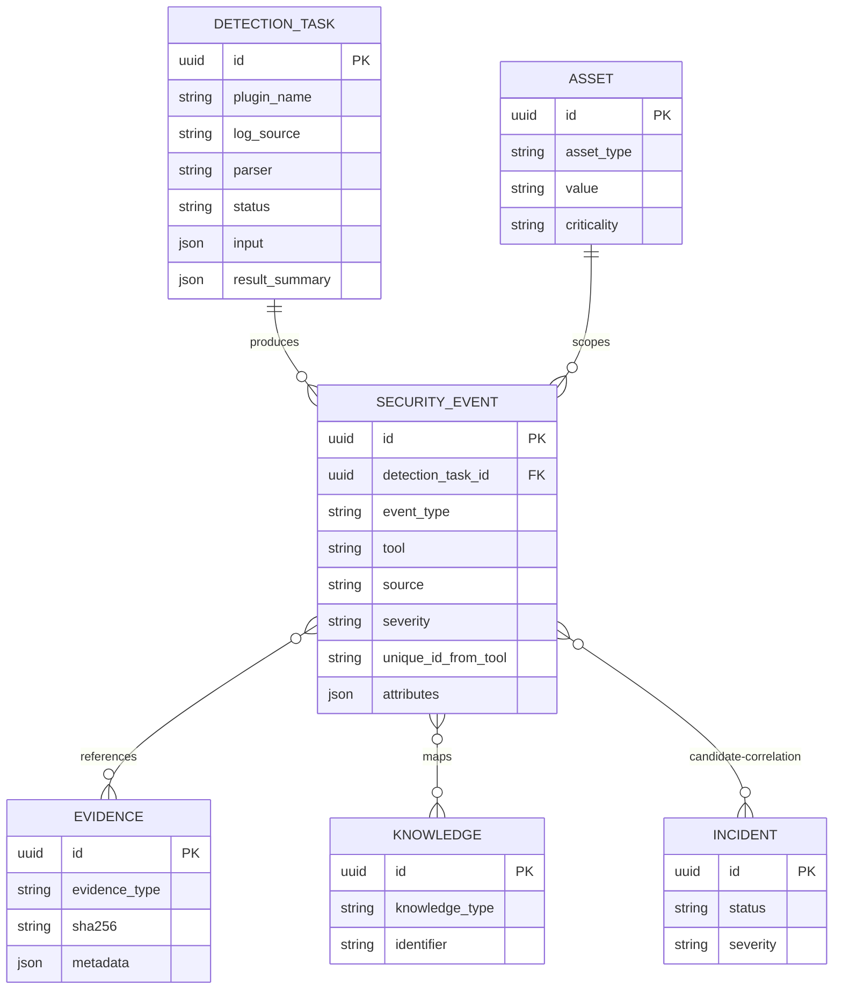

# Phase 13 Development Report

## 1. Phase 信息

- 项目：Cyber Agent Platform（CAP）
- 阶段：Phase 13 — Zeek Detection Plugin
- 角色：Engineer 实现与验证完成，等待 Architect Review
- 阶段结论：已通过受控 Zeek JSONL Fixture 完成 `Adapter -> Telemetry -> Detection -> SecurityEvent` 闭环；未修改 Detection Framework 核心、Telemetry Framework 核心或数据库迁移。
- 阶段门禁：本报告提交后立即停止开发；等待 Architect 输出 Review Report、修复意见和明确的 `✅ Phase Passed`，未经通过不进入下一阶段。
- 合规边界：仅处理平台配置的、受控或明确授权的 Zeek JSONL 数据源；不执行真实网络抓包、不启动 Zeek 进程、不访问任意路径、不访问网络、不执行 Shell。

## 2. 本阶段完成内容

- [x] 分析 Zeek JSON 日志、Package Manager、Corelight conventions、Sigma 和 ECS 的可复用边界。
- [x] 新增受控、只读、字节/记录有界的 Zeek JSONL Adapter。
- [x] 新增 source SHA-256、逐行 raw-record SHA-256、line number、schema fingerprint 证据血缘。
- [x] 新增 `ZeekTelemetryPlugin`，通过现有 Telemetry 六阶段生命周期传递 `TelemetryRecord`。
- [x] 新增 `ZeekTelemetryBridge`，组合现有 Telemetry Planner/Runtime，不改 Telemetry Framework。
- [x] 新增 `ZeekDetectionPlugin`，仅消费 Telemetry-delivered records，不读取文件、不访问数据库、不调用 DetectionService/DetectionRuntime。
- [x] 新增 `ZeekResultNormalizer`，支持 `conn`、`dns`、`http`、`ssl`、`files`、`notice` 六类日志的有界字段投影。
- [x] 保留 `uid`、`fuid`、网络角色、端点、协议、状态、规则、IOC、ATT&CK/CAPEC/CVE/URL 和证据血缘。
- [x] 原始 JSON 行、HTTP body、证书 blob、文件内容和未 allowlist 的嵌套字段不写入 `SecurityEvent`。
- [x] TSV 明确保留为未来边界，本阶段 fail closed。
- [x] 新增 typed Zeek configuration、Detection/Telemetry allowlist、Tool manifest、Plugin manifest 和 Zeek status API。
- [x] 新增 `/detection/zeek` 创建执行 API和 `/detection/zeek/status` 健康 API。
- [x] 新增 ADR-0028、ADR-0029、Phase 13 架构/兼容性文档和专项 Fixture。
- [x] 完成 Phase 13 专项、联合回归、全量回归、静态质量、编译和迁移离线验收。

## 3. 项目 Tree 结构

```text
cyber-agent-platform/
├── backend/
│   ├── app/
│   │   ├── api/routes/zeek.py
│   │   ├── config/models.py
│   │   ├── config/detection.yaml
│   │   ├── config/telemetry.yaml
│   │   ├── dependencies/services.py
│   │   ├── plugins/zeek/
│   │   │   ├── __init__.py
│   │   │   ├── normalizer.py
│   │   │   ├── plugin.py
│   │   │   └── telemetry.py
│   │   ├── schemas/zeek.py
│   │   ├── tools/zeek/
│   │   │   ├── README.md
│   │   │   ├── adapter.py
│   │   │   └── contracts.py
│   │   ├── zeek/bridge.py
│   │   └── api/router.py
│   └── tests/
│       ├── fixtures/zeek/logs.jsonl
│       └── test_phase_13_zeek.py
├── plugins/zeek/manifest.yaml
├── tools/zeek/manifest.yaml
└── docs/
    ├── adr/ADR-0028-zeek-through-telemetry.md
    ├── adr/ADR-0029-zeek-detection-framework-unchanged.md
    ├── phase-13-zeek-detection-plugin.md
    └── Phase 13 Development Report.md
```

明确未新增或修改：

```text
backend/app/models/detection.py       # SecurityEvent ORM 不变
backend/app/models/incident.py        # Incident ORM 不变
backend/app/models/telemetry.py       # Telemetry ORM 不变
backend/alembic/versions/*            # Phase 13 无新 Migration
```

## 4. 技术实现说明

### 4.1 总体调用链

```text
POST /detection/zeek
  -> ZeekDetectionCreate(extra="forbid")
  -> configured data_source_id
  -> ZeekAdapter.collect()
  -> ZeekTelemetryPlugin
  -> TelemetryPlanner / TelemetryRuntime
  -> validated TelemetryRecord[]
  -> ZeekDetectionPlugin
  -> ZeekResultNormalizer
  -> DetectionResult
  -> DetectionService
  -> SecurityEvent / Audit / correlation candidate
```

### 4.2 Adapter 边界

- 数据源由 `backend/config/detection.yaml` 配置，客户端只提交 `data_source_id`。
- 路径必须是配置源、存在的 `.json`/`.jsonl` 文件。
- 输入最大 5,000,000 bytes，最多 1,000 records。
- 每行必须是 JSON object；未知日志、缺少 `ts`、`uid`、`fuid` 或 `note` 时 fail closed。
- TSV parser 显式拒绝，避免在未定义 header/schema 策略前误解析。
- Adapter 只读文件，不写文件、不访问网络、不执行命令。

### 4.3 Telemetry 集成

`ZeekTelemetryPlugin` 仅持有 `ZeekAdapter` 和最小权限：

```python
permissions = frozenset({"telemetry.receive", "telemetry.publish"})
```

插件执行 `initialize -> receive -> parse -> transform -> publish -> shutdown`，将 Adapter envelope 转换为平台中立 `TelemetryRecord`。Detection Plugin 不绕过 Telemetry 直接读取 Zeek 源文件。

### 4.4 Detection Plugin 与 Normalizer

`ZeekDetectionPlugin` 仅获得：

```python
permissions = frozenset({"detection.execute", "evidence.read"})
```

Normalizer 按日志类型进行显式 projection：

- `conn`：端点、端口、协议、服务、持续时间、字节数、连接状态；
- `dns`：query、qtype、rcode、answers；
- `http`：method、host、uri、user agent、status、长度；
- `ssl`：version、cipher、SNI、subject、issuer、validation；
- `files`：fuid、MIME、filename、size、hash；
- `notice`：note、message、src/dst、port、actions。

绝不把原始行、任意扩展字段或大对象直接复制到 `SecurityEvent`。

### 4.5 生命周期和身份校验

Runtime 负责 Plugin permission、timeout、record count、record size、result identity 和 shutdown 校验。Detection Plugin 另外校验 `plugin_name/plugin_version/tool`，拒绝 foreign result。

## 5. 数据库设计

### 5.1 数据库变更

Phase 13 **无数据库变更**，无新的 ORM 表、索引、约束或 Alembic Revision。当前唯一 Head 仍为：

```text
20260801_0013 (head)
```

Zeek 复用已有 `SecurityEvent`、`DetectionTask`、Audit、Asset/Evidence/Knowledge 关联模型；Incident 仍只由既有 Incident bounded context 管理，Phase 13 不自动创建 Incident。

### 5.2 相关实体关系



## 6. API 设计

### 6.1 创建并执行 Zeek Detection Task

```http
POST /detection/zeek
Content-Type: application/json
```

```json
{
  "name": "Controlled Zeek ingestion",
  "asset_id": "<asset-uuid>",
  "data_source_id": "phase13-fixture",
  "execute": true
}
```

成功响应为 `201 Created`，核心字段：

```json
{
  "plugin_name": "zeek-detection",
  "status": "SUCCESS",
  "result_summary": {
    "events": 6,
    "records_collected": 6
  }
}
```

任意 `path` 字段返回 `422`；未知 `data_source_id` 返回 `403`。

### 6.2 Zeek 健康状态

```http
GET /detection/zeek/status
```

```json
{
  "healthy": true,
  "tool": "zeek",
  "version": "7.0.0",
  "input_format": "jsonl",
  "supported_logs": ["conn", "dns", "files", "http", "notice", "ssl"],
  "tsv_reserved": true,
  "sources": [{"source_id": "phase13-fixture", "available": true, "fixture": true}],
  "sandbox": {
    "filesystem_policy": "configured-read-only-sources",
    "network_policy": "none",
    "max_records": 1000
  }
}
```

响应不泄露真实 source path。

### 6.3 下游查询

Phase 13 复用既有接口：

```text
GET /detection/events?asset_id=<asset-uuid>
GET /detection/events/<event-id>
```

成功闭环会持久化 6 条 `SecurityEvent`；受控 Fixture 不产生 `Incident`。

## 7. 核心代码说明

### 7.1 配置源选择

```python
source = self.require_source(source_id)
data = self._read_bounded(source.path)
source_sha256 = hashlib.sha256(data).hexdigest()
```

客户端无法覆盖配置路径，Adapter 只解析 allowlisted source。

### 7.2 Telemetry 到 Detection 的隔离

```python
telemetry_records = await bridge.collect(source_id=payload.data_source_id)
# DetectionTask.input 只包含序列化 TelemetryRecord
```

`ZeekDetectionPlugin` 不持有 Adapter、Session、Repository、DetectionService 或 IncidentService。

### 7.3 证据血缘

每个事件 attributes 只保留：

```python
"evidence_lineage": {
    "source_id": metadata["source_id"],
    "line_number": metadata["line_number"],
    "raw_record_sha256": metadata["raw_record_sha256"],
    "source_sha256": metadata["source_sha256"],
    "schema_fingerprint": metadata["schema_fingerprint"],
}
```

## 8. Docker / 部署

- Phase 13 不新增 Docker 服务、Zeek 容器、Broker 或抓包容器。
- 运行时需要把 Zeek JSONL 源注册到平台配置目录，并以只读方式挂载给受控 Worker/API 进程。
- 生产部署应使用容器或受限 Worker，限制 CPU、内存、输入字节、记录数和网络访问。
- 真实 Zeek producer、日志轮转、对象存储和 retention 由部署层负责；CAP 不删除 producer-owned 源文件。
- 当前实现使用 `version: 7.0.0` typed configuration 和 Tool manifest pin；升级必须重新执行兼容性 Fixture、专项和全量回归。

## 9. 测试情况

### 9.1 Phase 13 专项测试

```text
8 passed in 3.55s
```

覆盖：Adapter allowlist、输入/记录边界、JSONL 校验、TSV fail closed、状态脱敏、Telemetry plugin lifecycle、Detection plugin lifecycle、Normalizer 六类日志、知识映射、证据血缘、API、SecurityEvent 持久化、Incident 数量保持 0、foreign result 拒绝。

### 9.2 Phase 12 + Phase 13 联合专项

```text
18 passed in 4.58s
```

### 9.3 Phase 0–13 全量回归

```text
182 passed in 106.58s
```

测试逻辑全部通过。Windows 当前安全删除 shim 在 pytest 结束后的临时目录清理阶段可能将进程退出码改为 1；因此验收以 pytest 最终摘要和测试断言结果为准，并使用新 basetemp 目录复验，未发现业务测试失败。

### 9.4 静态质量

```text
Ruff: All checks passed!
Black: 248 files would be left unchanged.
compileall: passed
```

### 9.5 覆盖率

采用项目既有 `greenlet` 异步 SQLAlchemy 覆盖率口径，并仅统计 `backend/app` 应用源码：

```text
coverage report --precision=4 --include="*/cyber-agent-platform/backend/app/*" --fail-under=95
TOTAL: 8935 statements / 444 missed / 95.0308%
```

严格 `fail-under=95` 通过。Phase 13 新增模块覆盖率如下：

```text
Zeek API: 100%
Zeek schemas/contracts/package exports/bridge: 100%
Zeek Plugin: 93.4426%
Zeek Telemetry Plugin: 89.7059%
Zeek Normalizer: 84.1121%
Zeek Adapter: 84.0000%
```

专项测试已覆盖主要安全边界和正常路径；Normalizer/Adapter 的剩余未覆盖分支主要为极端异常输入和防御性 fallback，不影响全局门禁。

### 9.6 Migration

```text
Alembic heads: 20260801_0013 (head)
PostgreSQL offline upgrade SQL: passed
PostgreSQL offline downgrade 20260801_0013:base SQL: passed
```

本阶段无新 Migration。受环境限制，未执行真实 PostgreSQL 在线 upgrade/downgrade；生产 Migration 仍以 PostgreSQL 方言离线 SQL 和真实 PostgreSQL CI 为最终部署验证。

## 10. 安全边界分析

1. API 使用 `extra="forbid"`，客户端不能传入任意 path。
2. Adapter 只访问平台配置的 source identity。
3. 输入扩展名、文件存在性、字节数、记录数和 JSON object 类型全部有界校验。
4. 网络策略为 `none`，文件策略为 `configured-read-only-sources`。
5. TSV、未知日志类型、缺失必需身份和非法 JSON 均 fail closed。
6. Telemetry Plugin 仅有 `telemetry.receive/publish` 权限。
7. Detection Plugin 仅有 `detection.execute/evidence.read` 权限。
8. Detection Plugin 不创建 SecurityEvent；由 DetectionService 独占持久化。
9. Detection Plugin 不创建 Incident；Incident 只由 Incident bounded context 管理。
10. 原始行、HTTP body、证书和文件内容不落入 SecurityEvent attributes。
11. Plugin identity、tool identity、checksum、record count 和 shutdown 均由 Runtime/Plugin 校验。
12. Status API 脱敏，不暴露真实文件路径。

## 11. Scalability、Interoperability 与 Trade-off

### Scalability

当前 bridge 是进程内组合，适合确定性验证，不具备独立 TelemetryTask 的持久化消费语义。生产规模需要 Broker-backed Telemetry、durable Journal、共享 Checkpoint、Consumer Group、Partition Lease/Rebalance、幂等 Detection Consumer 和 Dead-letter 策略。

### Interoperability

- 未来可用 Broker Adapter 替换 `ZeekTelemetryBridge`，不改变 Zeek Normalizer 和 Detection contracts。
- Zeek package-added scalar fields 可被 schema fingerprint 感知，但必须显式 allowlist 后才能持久化。
- 未来真实 Evidence/Object Storage 可保存原始源；Detection Event 只保存引用和 hash lineage。
- Incident、Asset、Knowledge、Audit 均复用现有平台领域，不创建 Zeek-specific silo。

### Trade-off

- JSONL-only 降低解析歧义并 fail closed，但暂不兼容 TSV。
- 显式字段 projection 避免 schema drift 污染核心模型，但 package-specific 字段需要后续配置扩展。
- 进程内 bridge 减少框架改动，但尚未提供持久化 TelemetryTask、消费重试和跨进程 backpressure。
- notice severity 使用确定性 heuristic；部署特定规则应通过配置/Adapter 扩展，不应硬编码到 Detection Framework。

## 12. Known Issues、风险与 Technical Debt

### Known Issues

1. Phase 13 未接入真实 Zeek binary 或真实生产日志 producer。
2. 当前 bridge 不创建独立持久化 TelemetryTask，未来 Broker 适配需要补充 durable handoff。
3. TSV 解析保留但未实现。
4. Package-added logs 不默认接入，必须显式注册 source 和 allowlist。
5. Memory Journal/Checkpoint 的多实例持久化风险继承 Phase 12。
6. 未在本环境真实 PostgreSQL 实例执行在线迁移往返；Docker Engine 不可用。
7. Windows 测试环境的安全删除 shim 会影响 pytest/coverage 进程最终退出码，但测试摘要和覆盖率门禁已独立确认通过。

### 风险分析

- 若生产误用 Memory Journal，跨实例 replay/offset 可能不一致。
- 若下游不使用稳定 checksum/fingerprint 做幂等，at-least-once 重试可能生成重复事件。
- 若绕过 Registry/Planner/Policy 直接接入新的 Zeek source，会破坏最小权限和审计边界。
- 若扩大 allowlist 到任意嵌套 payload，可能造成数据库膨胀、敏感数据扩散和 schema drift。
- 若将 source path 直接暴露给 API，可能引入任意文件读取风险；当前 API 已拒绝该输入。

### Technical Debt

- Durable Zeek Telemetry consumer 与 Broker Adapter；
- 独立 TelemetryTask/Journal/Checkpoint 的生产语义；
- Consumer Group、Partition Lease、Rebalance、Dead-letter；
- Zeek TSV header/schema policy；
- package field allowlist 的配置化管理；
- notice severity/rule mapping 的部署级策略；
- 真实 PostgreSQL 在线迁移 CI 和容器化 Zeek integration test；
- 端到端 Evidence object retention 与 source rotation lifecycle。

## 13. 架构变化、影响模块、Breaking Change、数据库与配置

### 架构变化

新增 Zeek 适配层和 Zeek Plugin 扩展层；通过现有 Telemetry/Detection 公共接口组合，未改变核心框架职责。

### 影响模块

- `backend/app/tools/zeek`
- `backend/app/plugins/zeek`
- `backend/app/zeek`
- `backend/app/api/routes/zeek.py`
- `backend/app/dependencies/services.py`
- `backend/app/config/models.py`
- `backend/app/config/detection.yaml`
- `backend/app/config/telemetry.yaml`
- `backend/app/api/router.py`
- `plugins/zeek/manifest.yaml`
- `tools/zeek/manifest.yaml`

### Breaking Change

无既有 API、SecurityEvent、Finding、Incident、Telemetry contract 或数据库迁移 Breaking Change。新增 `/detection/zeek` 和 `/detection/zeek/status` 为 additive API。

### 数据库变更

无。Alembic Head 保持 `20260801_0013`。

### 配置变更

新增 `detection.zeek` typed configuration、`telemetry.yaml` 中的 `zeek` plugin/stream allowlist，以及两个 manifest。配置默认 fail closed，不配置 source 即不可采集。

## 14. 交付物清单

- Zeek JSONL Adapter、contracts、README；
- Zeek Telemetry Plugin；
- Zeek Detection Plugin；
- Zeek Normalizer；
- Zeek Telemetry Bridge；
- Zeek API、Schema、Dependency Injection；
- Zeek Tool Manifest 与 Plugin Manifest；
- Detection/Telemetry typed configuration；
- Controlled JSONL Fixture；
- Phase 13 专项测试；
- ADR-0028、ADR-0029；
- Phase 13 架构与兼容性文档；
- Phase 13 覆盖率 JSON 验收产物；
- 本《Phase 13 Development Report》。

## 15. 后续建议

仅供 Architect Review 后决策，不代表开始下一阶段：

1. 裁决 Zeek 生产接入应优先采用独立 TelemetryTask/Broker 还是继续扩展 bridge。
2. 明确 Durable Journal、Checkpoint、Consumer Group 和 Partition Lease 的模块归属。
3. 评审 Zeek package field/log 的动态注册和 allowlist 管理模型。
4. 评审 notice severity、rule mapping 和 ATT&CK/CAPEC/CVE enrichment 是否配置化。
5. 在真实 PostgreSQL CI 和容器环境执行 upgrade/downgrade、source rotation、retention 和失败恢复测试。
6. 为真实 Zeek producer 增加最小权限 Worker、证据保留和日志轮转操作手册。
7. 若进入后续阶段，优先修复 Architect Review 标记为 Critical/Major 的事项，不跨阶段扩大功能范围。

## 16. Architect Review 准备说明

请 Architect 重点 Review：

- `ZeekAdapter -> Telemetry -> Detection` 三层职责和数据边界是否符合 Platform First/Plugin First 原则；
- ZeekDetectionPlugin 是否确实只消费 Telemetry-delivered records；
- `data_source_id` allowlist、JSONL-only、TSV fail-closed 和 source path 脱敏是否满足 Security by Default；
- `uid/fuid`、source/record hash、line number、schema fingerprint 是否足够支持 Evidence lineage；
- 六类日志的 allowlisted projection 是否足够，是否需要调整扩展字段策略；
- notice severity heuristic 是否应迁移为配置/策略；
- in-process bridge 不创建 TelemetryTask 的 trade-off 是否可接受；
- Phase 12 的 Memory Journal/Checkpoint 风险是否必须在下一阶段前解决；
- 覆盖率口径（greenlet-aware、backend/app 范围）及 95.0308% 结果是否接受；
- 是否要求真实 PostgreSQL、Zeek binary 或 Broker integration test 才能判定 Phase Passed。

## 17. Phase 结论与停止声明

本阶段验收结论：

```text
Phase 13 specialized tests: 8 passed
Phase 12 + Phase 13 focused tests: 18 passed
Phase 0–13 full tests: 182 passed
Application coverage: 8935 statements / 444 missed / 95.0308%
Ruff: passed
Black: passed
compileall: passed
Alembic head: 20260801_0013
PostgreSQL offline upgrade: passed
PostgreSQL offline downgrade: passed
```

Engineer 已完成 Phase 13 实现、文档和质量验收，现停止开发，等待 Architect Review Report、修复意见以及明确的 `✅ Phase Passed`。未经 Architect 明确通过，不进入下一阶段。
