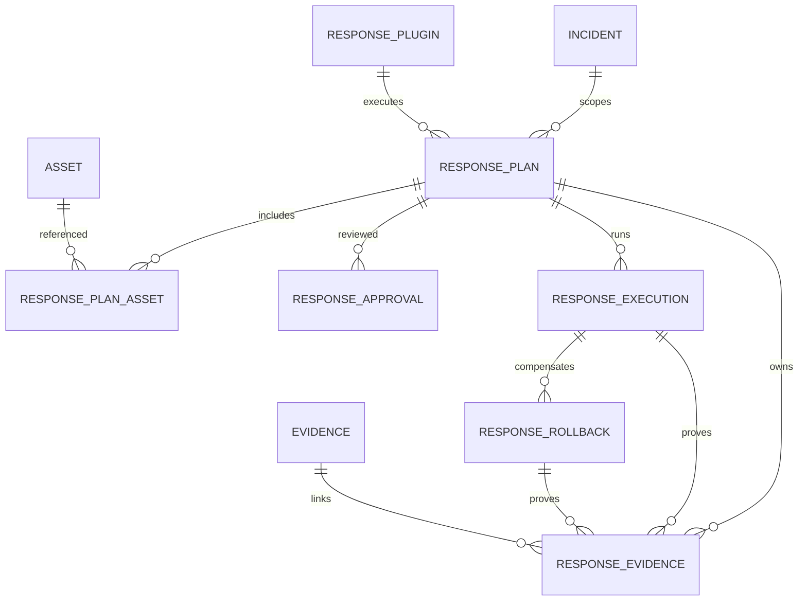

# Phase 14 Development Report

## 1. Phase 信息

- 项目：Cyber Agent Platform（CAP）
- 阶段：Phase 14 — Response Framework（统一安全响应框架）
- 角色：Engineer 实现与验证完成，等待 Architect Review
- 日期：2026-08-01
- 阶段结论：已建立平台级 Response Plan、Policy、Approval、Runtime、Plugin、Verification、Evidence 与 Rollback 闭环；本阶段只含非破坏性 synthetic plugin，不接入真实 WAF、Firewall、EDR、Kubernetes、Linux 或 Windows 动作。
- 阶段门禁：本报告提交后立即停止开发；等待 Architect 输出 Review Report 和明确的 `✅ Phase Passed`，未经通过不进入 Phase 15。

## 2. 本阶段完成内容

- [x] 建立 `ResponseService`、`ResponseRegistry`、`ResponsePlanner`、`ResponsePolicyEngine`、`ResponseRuntime`、`ApprovalService`、`RollbackService`。
- [x] 定义 `ResponsePlugin` SDK、递归只读 `ResponsePluginContext`、`ResponsePlanSpec`、`ResponseResult`、`ResponseVerification`。
- [x] 复用 Capability Registry，注册九个统一 `response.*` Capability。
- [x] 实现 Plan-scoped 审批、职责分离、有效期、多级审批预留、拒绝和到期状态。
- [x] 实现 Runtime-exclusive execute/verify/rollback 生命周期和 immutable scope 校验。
- [x] 实现独立 rollback token、Rollback Result、Verification、Evidence 与 Audit。
- [x] 实现 8 个要求的 Response API。
- [x] 新增 8 张 `response_*` 表及 Alembic upgrade/downgrade。
- [x] 不修改 Incident、SecurityEvent、Finding、Evidence、Asset 表结构。
- [x] 新增 synthetic non-destructive certification plugin、manifest 与运行说明。
- [x] 完成 Shuffle、StackStorm、TheHive/Cortex、Wazuh Active Response、OPA 基准分析。
- [x] 完成 ADR-0030、ADR-0031、ADR-0032、安全边界、安全论证、互操作、权衡与 Plugin Certification Checklist。

## 3. 项目 Tree 结构

```text
cyber-agent-platform/
├── backend/
│   ├── app/
│   │   ├── api/routes/response.py
│   │   ├── config/models.py
│   │   ├── config/provider.py
│   │   ├── dependencies/services.py
│   │   ├── events/contracts.py
│   │   ├── exceptions/base.py
│   │   ├── models/response.py
│   │   ├── repositories/response.py
│   │   ├── response/
│   │   │   ├── approval.py
│   │   │   ├── contracts.py
│   │   │   ├── fake_plugin.py
│   │   │   ├── planner.py
│   │   │   ├── policy.py
│   │   │   ├── registry.py
│   │   │   ├── rollback.py
│   │   │   ├── runtime.py
│   │   │   └── service.py
│   │   └── schemas/response.py
│   ├── alembic/versions/20260801_0014_response_framework.py
│   ├── config/response.yaml
│   └── tests/test_phase_14_response.py
├── plugins/response/synthetic/
│   ├── manifest.yaml
│   └── README.md
└── docs/
    ├── adr/ADR-0030-response-framework-independent-domain.md
    ├── adr/ADR-0031-approval-platform-capability.md
    ├── adr/ADR-0032-rollback-built-in.md
    ├── phase-14-response-framework.md
    └── Phase 14 Development Report.md
```

## 4. 技术实现说明

### 4.1 总体链路

```text
Incident + Asset references
  -> ResponsePlanner
  -> ResponsePolicyEngine (PDP)
  -> ResponsePlan snapshot
  -> ApprovalService
  -> ResponseRuntime (PEP)
  -> ResponsePlugin lifecycle
  -> ResponseResult
  -> Verification
  -> ResponseEvidence + Audit
  -> optional RollbackService/Runtime
```

### 4.2 Plugin 生命周期

```text
initialize -> plan -> validate -> execute -> verify -> shutdown
                                      |
                                      +-> rollback -> verify -> shutdown
```

`ResponseRuntime` 是唯一执行入口，负责 timeout、permission、plugin identity、capability、immutable Incident/Asset scope、Result size、Evidence count、Verification 和 JSON serializability 校验。`shutdown()` 在成功和失败路径均执行。

### 4.3 最小权限与不可变上下文

Plugin Context 仅包含 Plan ID、Incident ID、Asset IDs、actor、trace、capability、参数、rollback token 和已授予权限。参数通过 `MappingProxyType`、tuple、frozenset 递归冻结。Context 不提供 Session、Repository、IncidentService、AssetService、ReportService、ApprovalService 或 WorkflowService。

### 4.4 Policy-first

Policy 在 Plugin resolution 前检查 capability allow/deny、Incident 类型/严重度、Asset 类型、风险、业务时间、维护窗口和自动执行阈值。未定义、禁用、超范围或没有插件均 fail closed。执行使用创建时 policy snapshot，防止审批后策略漂移。

### 4.5 审批和回滚

审批对象是 `ResponsePlan`，不是 Plugin。支持审批人、意见、层级、决定时间、有效期和 requester/approver 职责分离。Rollback 仅接受已验证的成功执行，opaque token 只保存在 `ResponseExecution.rollback_token`，不进入公开 API。

## 5. 数据库设计

### 5.1 新增表

| 表 | 关键字段 | 用途 |
|---|---|---|
| `response_plugins` | name/version/capabilities/permissions/certified | Plugin 注册与认证快照 |
| `response_policies` | name/version/configuration | typed policy 持久化 |
| `response_plans` | incident/plugin/capability/states/policy_snapshot/plan/expires_at | 审批和执行主体 |
| `response_plan_assets` | plan_id/asset_id | 多资产只读作用域 |
| `response_approvals` | approver/decision/level/decided_at/expires_at | 审批轨迹 |
| `response_executions` | status/verification/result/rollback_token/timestamps | 执行轨迹 |
| `response_rollbacks` | execution/actor/reason/status/verification/result | 回滚轨迹 |
| `response_evidence` | execution/rollback/evidence/hash/reference/metadata | 响应证据血缘 |

### 5.2 ER 图



Migration：`20260801_0013 -> 20260801_0014`；具备 downgrade；单一 Head 为 `20260801_0014`。

## 6. API 设计

| Method | Endpoint | 说明 |
|---|---|---|
| POST | `/response/plans` | 创建 policy-evaluated Plan |
| GET | `/response/plans` | 按 Incident/审批/执行状态分页查询 |
| GET | `/response/plans/{id}` | 查询 Plan、审批、执行、回滚与证据 |
| POST | `/response/plans/{id}/approve` | 审批指定 Plan/level |
| POST | `/response/plans/{id}/reject` | 拒绝 Plan |
| POST | `/response/plans/{id}/execute` | 通过 Runtime 执行 |
| POST | `/response/plans/{id}/rollback` | 通过 Runtime 回滚 |
| GET | `/response/plugins` | 查询已启用认证 Plugin |

创建请求示例：

```json
{
  "incident_id": "11111111-1111-1111-1111-111111111111",
  "asset_ids": ["22222222-2222-2222-2222-222222222222"],
  "target_capability": "response.block",
  "requested_by": "soc-requester",
  "reason": "Contain confirmed compromise",
  "risk_level": "HIGH",
  "parameters": {"indicator": "synthetic.example"},
  "rollback_parameters": {"restore": true}
}
```

审批请求：

```json
{"approver": "soc-approver", "comment": "Scope reviewed", "level": 1}
```

执行成功后公开结果包含 Verification、Evidence 和状态，但不包含 `rollback_token`。

## 7. 核心代码说明

- `contracts.py`：Plugin Protocol 与递归只读 Context。
- `policy.py`：结构化 `ResponsePolicyInput/Decision`，只做决策不执行。
- `planner.py`：policy-first，解析 certified plugin，形成不可变 Plan。
- `registry.py`：Capability、permission、approval、rollback、sandbox 和文档认证。
- `runtime.py`：独占生命周期、scope/result/verification 安全校验。
- `approval.py`：Plan 状态机、多级审批、职责分离和 TTL。
- `rollback.py`：前置条件、opaque token、独立回滚验证。
- `service.py`：Repository、跨域只读校验、事务、Evidence 与 Audit 协调。
- `fake_plugin.py`：不访问网络、Shell、文件系统或真实安全设备的框架认证实现。

## 8. Docker / 部署

Phase 14 未新增容器或外部服务依赖。既有 FastAPI/PostgreSQL 部署执行 Alembic `upgrade head` 即可。`response.yaml` 由 Configuration Provider 加载。真实高影响插件在未来接入前必须配套 sandbox/worker、secret injection、rate limit、kill switch 和独立认证记录。

## 9. 测试情况

### 9.1 Phase 14 专项

```text
16 passed
```

覆盖 Plan、Policy、Approval、Execution、Verification、Evidence、Audit、Rollback、到期、多级审批、职责分离、API 严格模型、不可变上下文、认证拒绝矩阵、Result 越权、失败执行持久化、Incident/Asset 不变性和 Migration 边界。

### 9.2 Phase 9–14 联合回归

```text
64 passed
```

### 9.3 Phase 0–14 全量回归与覆盖率

```text
198 passed
9969 statements / 498 missed / 95.0045%
```

应用源码覆盖率以 `--precision=4 --fail-under=95` 验证通过，不依赖整数四舍五入。

### 9.4 静态与编译

- Ruff：应用源码 + Phase 14 测试 + Phase 14 Migration 通过。
- Black：通过。
- compileall：通过。
- 应用装配：`routes=101`，`response_tables=8`。

### 9.5 Migration

- Alembic：`20260801_0014 (head)`。
- PostgreSQL dialect offline upgrade：通过。
- PostgreSQL dialect offline downgrade：通过。

## 10. GitHub / Official Reference Analysis

分析详见 `docs/phase-14-response-framework.md`：

- Shuffle：Workflow/Action 与 Worker 执行侧分离。
- StackStorm：Action/Runner、Execution identity、Inquiry、immutable parameter。
- TheHive/Cortex：typed JSON responder、datatype、TLP/PAP、确认和 responder report。
- Wazuh Active Response：高影响 endpoint action、stateless/stateful 和 revert 风险。
- OPA：Policy Decision 与 Enforcement 分离、结构化输入/输出和 default deny。

CAP 只提炼架构模式，不复制其部署拓扑、SDK 或供应商协议。

## 11. Security Boundary Analysis

- API：`extra="forbid"`。
- Domain：Incident/Asset 仅引用且先校验；Plugin 无跨域写服务。
- Policy：allowlist/denylist + risk/time/window + fail closed。
- Approval：Plan-scoped、TTL、职责分离、多级预留。
- Runtime：唯一执行入口、permission/scope/result/timeout/size/evidence enforcement。
- Evidence：Plugin 只返回 descriptor，平台持久化。
- Rollback：server-only opaque token，成功执行绑定，独立 Verification/Audit。

明确禁止 Plugin 请求 `database.access`、`incident.modify`、`asset.modify`、`report.write`、`approval.decide`、`workflow.modify`、`shell.execute`、`filesystem.write`。

## 12. Safety Case Analysis

主要危险及控制：

- 误封/误隔离：Scope 校验、审批、immutable parameters、verify、rollback。
- 误删除：本阶段无 delete capability，禁 Shell/文件写权限。
- 误下发规则：WAF/Firewall/EDR 默认 denied，未认证前不可执行。
- 权限提升：最小 Context、Runtime-exclusive invocation、permission equality。
- 静默失败：FAILED execution 和失败 Audit 在抛错前提交。
- 不可逆动作：必须声明 `NOT_SUPPORTED`，不能伪造 rollback 能力。

本阶段 synthetic plugin 不产生任何真实外部副作用，因此安全论证限于框架治理机制，不宣称已认证任何生产设备响应插件。

## 13. Interoperability Analysis

- Incident/Asset：只读输入，不改变其生命周期和表结构。
- Detection/Telemetry：通过 Incident 上游衔接，无 Plugin 直接耦合。
- Workflow：可调用公开 Response API/Service，但不能绕过 Runtime。
- Capability Registry：复用已有动态 Capability 平台。
- Knowledge：未来由 Planner/Policy 平台服务消费，Plugin 不直接读取。
- Evidence/Report：ResponseEvidence 保留 lineage；Report 仍由平台生成。
- Audit：Plan/Approval/Execution/Rollback 事件统一进入现有 Event/Audit 链。

## 14. Architecture Trade-off Analysis

- 独立 Response domain 增加表和关联，但避免污染 Incident/Asset 生命周期。
- typed YAML policy 比 Phase 14 直接嵌入 OPA 简单；保留 `PolicyEngine` 接口供未来 OPA adapter 替换。
- in-process synthetic plugin 易测试但不是生产隔离方案；真实插件必须进入 sandbox/worker。
- policy snapshot 确保审批内容稳定，但策略更新后需创建新 Plan。
- opaque rollback token 防止 API 泄露，但部署需保障数据库/secret 保护。
- actor 当前是字符串，身份联邦、RBAC、签名审批仍属未来演进。

## 15. Plugin Certification Checklist

完整清单位于 `docs/phase-14-response-framework.md`，覆盖：

1. Identity/manifest/version；
2. Capability/permission 最小化；
3. Sandbox、secret、network/shell/filesystem 边界；
4. 完整生命周期和 shutdown；
5. immutable scope 与 schema-valid bounded result；
6. Approval/Safety Case/blast radius；
7. Verification/Evidence/hash/lineage；
8. truthful rollback declaration/token/verification；
9. contract/malicious/timeout/integration tests；
10. monitoring/rate limit/kill switch/upgrade compatibility。

## 16. 架构变化、Breaking Change、数据库与配置

- 架构变化：新增独立 Response bounded context 和平台 Approval/Rollback 能力。
- 影响模块：Configuration、DI、Capability、Events/Audit、API Router、ORM/Repository、Alembic。
- Breaking Change：无既有 API 或表结构破坏；新增 API 和表。
- 数据库变更：新增 8 张表，既有 Incident/SecurityEvent/Finding/Evidence/Asset 不变。
- 配置变更：新增 `backend/config/response.yaml` 和 `ResponseSettings`。
- 默认配置：仅 notify/ticket 被默认允许；高于 LOW 自动阈值仍需审批；其余能力默认拒绝。

## 17. Known Issues、风险与 Technical Debt

1. 只有 synthetic plugin；没有真实 WAF/Firewall/EDR/endpoint 集成。
2. in-process Runtime 尚未提供进程/容器级隔离，生产插件必须先接 sandbox/worker。
3. Actor/Approver 仍为字符串，尚未绑定平台 RBAC、SSO、MFA 或签名证明。
4. 多级审批按 level 计数，尚无审批组、法定人数、代理审批和并行/串行规则。
5. Rollback 是补偿操作，不保证外部系统事务原子性。
6. ResponseEvidence 尚未自动投影到统一 Report；所有权边界已预留。
7. Policy Engine 当前为 typed YAML；OPA adapter 尚未实现。
8. 历史测试目录存在 23 个 Ruff I001 导入分组遗留；Phase 14 变更集和应用源码通过，未为本阶段扩大无关格式变更。
9. 本阶段仅执行 PostgreSQL 方言 offline SQL 验证，未连接真实 PostgreSQL 服务进行在线迁移。

## 18. 交付物清单与后续建议

### 交付物

- Response Domain/SDK/Registry/Planner/Policy/Runtime/Service/Approval/Rollback。
- 8 个 API、8 张 ORM 表、Repository 和 `20260801_0014` Migration。
- typed `response.yaml`、DI、Capability bootstrap、Audit Events。
- synthetic plugin manifest/documentation。
- Phase 14 专项测试。
- ADR-0030/0031/0032。
- 架构、安全、互操作、权衡和认证清单文档。

### 后续建议（需 Architect 裁决，不在本阶段实施）

- 审核 Policy snapshot 与执行时紧急 kill-switch 的优先级。
- 确定真实 Plugin 的 out-of-process sandbox/worker 协议。
- 确定身份、RBAC、多级审批和签名审计模型。
- 确定第一个真实、低风险 Response Plugin（建议 notify/ticket，而非 block/isolate）。

## 19. Architect Review 准备、验收摘要与停止声明

建议 Architect 重点 Review：

1. Response 与 Incident/Asset/Report 的 bounded-context 边界；
2. Policy-first 与 snapshot 语义；
3. Approval 状态机和职责分离；
4. Runtime-exclusive execution 与 recursive readonly Context；
5. failure transaction、Evidence lineage 和 rollback token 保密；
6. Plugin Certification 是否足以进入真实集成阶段。

最终验收摘要以本阶段最终认证命令的实测值为准：

```text
Phase 14 专项：16 passed
Phase 9–14 联合：64 passed
Phase 0–14 全量：198 passed
应用源码覆盖率：95.0045%（9969 statements / 498 missed；门禁 >=95.0000%）
Ruff：passed（app + Phase 14 changes）
Black：passed
compileall：passed
Alembic head：20260801_0014
PostgreSQL offline upgrade：passed
PostgreSQL offline downgrade：passed
```

**停止声明：Phase 14 实现完成后，本 Engineer 在此停止开发并等待 Architect Review。未经明确 `✅ Phase Passed`，不得开始 Phase 15。**
