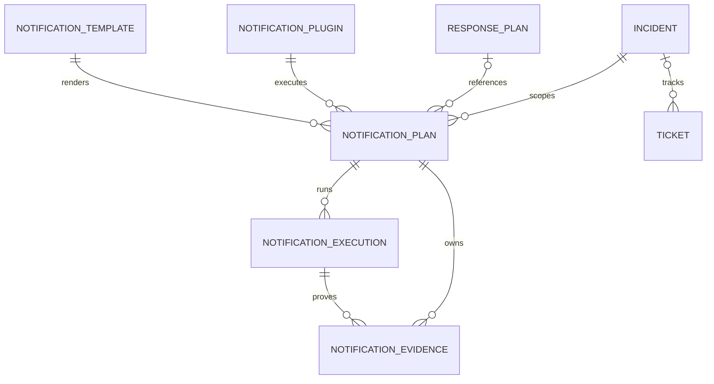

# Phase 15 Development Report

## 1. Phase 信息

- **项目**：Cyber Agent Platform（CAP）
- **阶段**：Phase 15 — Notification & Ticket Framework（通知与工单框架）
- **角色**：Engineer 实现与验证完成，等待 Architect Review
- **日期**：2026-08-02
- **阶段结论**：已建立独立的 Notification 与统一 Ticket 平台能力。邮件、Webhook、聊天、短信、Jira、ServiceNow、飞书、钉钉、企业微信等均保持为未来可认证的外部 Plugin，不被平台核心模型耦合。
- **阶段门禁**：本报告提交后立即停止开发；等待 Architect 的 Review Report 与明确的 `✅ Phase Passed`。未经通过不得进入 Phase 16。

## 2. Acceptance Checklist

- [x] 建立 `NotificationService`、`NotificationRegistry`、`NotificationPlanner`、`NotificationPolicyEngine`、`RoutingEngine`、`TemplateProvider`、`NotificationRuntime`。
- [x] 定义 Plugin SDK、递归只读 `NotificationPluginContext`、Plan、Result、Verification 与 Evidence 合约。
- [x] 支持 `notification.email`、`notification.webhook`、`notification.chat`、`notification.ticket`、`notification.sms`、`notification.custom` 六项 Capability。
- [x] 实现 `initialize -> render -> validate -> send -> verify -> shutdown` 独占生命周期。
- [x] 实现 Severity、Priority、Business Hours、Recipient Group、Rate Limit、Deduplication、Silence 与 Escalation 策略控制。
- [x] 强制 Recipient Allowlist；请求方不能提交任意邮件地址、Webhook 或直接 Provider 参数。
- [x] 支持 Markdown、HTML、JSON、Text 四种模板格式；模板仅允许声明式标量替换，禁止表达式或代码执行。
- [x] 新增统一 Ticket Model：title、description、priority、status、external_reference、labels。
- [x] 新增 Notification Plan、Execution、Plugin、Template、Evidence 与 Ticket 的持久化、Repository、API、事件和审计闭环。
- [x] 新增 Migration `20260801_0015`，不修改 Incident、Response、SecurityEvent 或 Finding 表结构。
- [x] 提供 non-network Synthetic Plugin、Compatibility Matrix、ADR-0033、ADR-0034 与 Certification Checklist。
- [x] 完成 Ruff、Black、compileall、专项/联合/全量测试、精确覆盖率、Alembic 和应用装配验收。

## 3. GitHub / Official Reference Analysis

| 官方基准 | 核心概念 | CAP 采用 | 不直接复制 |
|---|---|---|---|
| TheHive | Alert、Case、Task、证据型分析上下文 | Incident 仍是权威对象；通知只保存不可变 Incident 引用；Ticket 是中立跟进对象 | TheHive 的 Case/Alert/Task 数据模型与 UI 工作流 |
| StackStorm | Trigger、Rule、Action、Route 解耦；动作完成通知 | Planner、Policy、Routing、Runtime、Plugin 分离 | StackStorm Runner、Pack 和 ChatOps 实现 |
| Grafana Alerting | Contact Point、Notification Policy、可复用 Template | Recipient Group 作为受控 Contact Point；路由按 capability/severity/priority 选择组和模板 | Grafana matcher DSL 与 provisioning 语法 |
| Prometheus Alertmanager | Grouping、Deduplication、Silence、Routing、Inhibition | Plugin 之前执行 dedup、silence、rate-limit、route 决策 | Alertmanager 集群和 Prometheus Alert wire format |
| Jira Cloud REST API | Issue 创建、Transition、Workflow、权限约束 | CAP Ticket 使用稳定中立模型，通过 `external_reference` 连接外部系统 | Jira Issue 字段、Transition ID 和 workflow 内部语义 |

验证过的官方资料：

- TheHive：<https://docs.strangebee.com/thehive/user-guides/analyst-corner/alerts/alerts-description/actions/>
- StackStorm：<https://docs.stackstorm.com/chatops/notifications.html>
- Grafana：<https://grafana.com/docs/grafana/latest/alerting/fundamentals/notifications/>
- Prometheus Alertmanager：<https://prometheus.io/docs/alerting/latest/alertmanager/>
- Jira Cloud REST：<https://developer.atlassian.com/cloud/jira/platform/rest/v3/api-group-issues/>

## 4. Compatibility Matrix

| Plugin | Phase 15 状态 | Send 接受条件 | Verification 规则 | 网络边界 | 生产可用性 |
|---|---|---|---|---|---|
| Synthetic | 已实现并认证 | 生成确定性内存 receipt | receipt 与 Plan/Recipient scope 匹配 | 无网络 | 仅 Framework Certification |
| Email | Contract-compatible 目标 | Provider accepted / Message-ID | Provider acceptance 或 delivery receipt | Allowlisted Provider Endpoint | 本阶段未交付 Adapter |
| Webhook | Contract-compatible 目标 | HTTP 请求完成 | HTTP 2xx + 有界 response metadata | Allowlisted HTTPS Endpoint | 本阶段未交付 Adapter |

未来 Chat、SMS、Jira、ServiceNow、飞书、钉钉、企业微信 Plugin 必须通过同一生命周期、权限、Allowlist、Sandbox、Verification 与认证检查。

## 5. Safety Case Analysis

| 危害 | 主要控制 | 可审计证据 |
|---|---|---|
| 错误通知 | 严格 Route/Template/Capability 校验；确定性 Plan snapshot | Plan、Policy snapshot、Audit |
| 重复通知 | Deduplication Key 和时间窗口 | `SUPPRESSED` Plan、suppression_reason、事件 |
| 通知风暴 | Rate window、Recipient Group、Silence、路由层 | Policy snapshot、Suppressed 事件 |
| 敏感数据泄露 | Recipient Allowlist、标量模板变量、禁止任意 endpoint | Route、只读 Context、测试 |
| 模板代码执行 | 受限解析；禁止 block/comment/call/bracket/dunder/attribute traversal | Template 安全测试 |
| Plugin 改 Incident/Response | Context 不暴露 Session/Repository/跨域 Service；只读外键作用域 | Certification 拒绝矩阵与不变性测试 |
| 假成功 | 成功结果必须通过 Verification | Execution verification_status 与 receipt evidence |
| 外部服务失败 | FAILED Execution 和 Audit 持久化；核心域不变 | `NotificationExecutionFailed` |

## 6. Security Boundary Analysis

1. **API 边界**：所有输入使用 `extra="forbid"`；拒绝 direct incident close、Jira transition 等外部控制字段。
2. **域边界**：Incident 与可选 Response Plan 是只读外键引用；Plugin 无权关闭 Incident 或修改 Response。
3. **Recipient 边界**：调用方只可选择已配置的 Route/Group；最终 recipients 必须属于平台 Allowlist。
4. **Policy 边界**：Capability、Severity、Priority、Business Hour、Silence、Deduplication、Rate Limit、Escalation 都在 Plugin 运行前执行，默认拒绝。
5. **Template 边界**：只允许 `{{ scalar_name }}`；禁止 `eval`、`exec`、`import`、函数调用、下标、属性遍历、dunder 与 Jinja block/comment。
6. **Runtime 边界**：Runtime 是唯一生命周期入口，校验 permission identity、recipient immutability、result identity/capability、Evidence 数量、Result 大小、JSON serializability 与 verification。
7. **Plugin 边界**：不注入 AsyncSession、Repository、IncidentService、ResponseService、ReportService、Shell、文件写入或不受控 recipient authority。
8. **审计边界**：Plugin 只返回有界 Result/Evidence descriptor；平台负责持久化和 EventPublisher 审计。

**为什么 Notification 独立**：通知有独立的投递失败、敏感数据、收件人治理、风暴控制与验证语义。将其嵌入 Incident 或 Response 会使外部传输故障影响核心安全状态。

**为什么 Template 独立**：内容呈现变化频率高于路由和发送，Provider 接口能为未来 Jinja2/MJML adapter 留出空间，但必须保持 no-code、allowlisted-variable 约束。

**为什么 Ticket 统一**：Jira、ServiceNow、TheHive Task 等字段与状态机不兼容。CAP 的稳定 Ticket 模型避免第三方模型污染 Incident，并以 `external_reference` 连接外部实现。

## 7. Architecture Trade-off Analysis

- In-process Registry 简单、可预测、易测；未来分布式 Plugin Discovery、签名包加载是演进项。
- Rate Limit 当前通过数据库查询全局计数；多实例生产环境应演进为按租户/路由维度的 Redis 原子计数器。
- Deduplication 当前抑制近期已发送/已验证的同 key Plan；分组聚合与 inhibition 是已预留但未实现的扩展能力。
- Verification 表示 Provider 接受，不等价于人工阅读或业务完成；读回执需要 Provider-specific Plugin。
- 模板语法刻意弱于 Jinja2，以安全性、确定性与可审计性优先于表现力。
- `POST /notifications` 先持久化 Plan 再自动调用 Runtime；未来异步 Worker 可消费 PLANNED 记录，不改变领域模型。

## 8. Notification Framework

```text
Incident / optional Response Plan (read-only reference)
  -> NotificationService
  -> NotificationPlanner
  -> RoutingEngine
  -> NotificationPolicyEngine
  -> TemplateProvider
  -> NotificationRuntime
  -> Certified NotificationPlugin
  -> NotificationResult + Verification
  -> NotificationEvidence + Audit
```

核心文件：

- `backend/app/notification/contracts.py`：Plugin Protocol、递归冻结 Context。
- `backend/app/notification/registry.py`：Capability/permission/lifecycle/sandbox/certification 边界。
- `backend/app/notification/policy.py`：策略决策点（PDP）。
- `backend/app/notification/planner.py`：Plan snapshot、route/policy/plugin/template 绑定。
- `backend/app/notification/runtime.py`：独占执行点（PEP）。
- `backend/app/notification/service.py`：事务、Repository、Evidence、Audit 与 Ticket 协调。
- `backend/app/notification/fake_plugin.py`：非网络、非破坏性的认证参考实现。

Plugin 生命周期：

```text
initialize -> render -> validate -> send -> verify -> shutdown
```

`shutdown()` 通过 `finally` 在成功、失败或超时后执行。Plugin Context 使用 `MappingProxyType`、tuple、frozenset 递归冻结输入，不可访问数据库或跨域服务。

## 9. Routing Engine

路由链：

```text
Incident
  -> Notification Plan
  -> Route(capability + severity + priority)
  -> Recipient Group
  -> Allowlisted Recipient Set
  -> Template + Certified Plugin
```

- Route 由 capability、Severity、Priority 过滤，并可受请求 group/template 限制。
- 选择结果确定性排序；没有匹配 Route 时 fail closed。
- Group 不存在、为空或包含未 Allowlist recipient 时拒绝。
- Escalation 可依据最低严重度将 `from_group` 转为 `to_group`；未知 target group 拒绝。
- Business Hour、Silence、Duplicate、Rate Limit 生成有原因的 `SUPPRESSED` Plan，而不是绕过审计地丢弃请求。

## 10. Template Engine

`TemplateProvider` 支持 `TEXT`、`MARKDOWN`、`HTML`、`JSON`，统一输出 `RenderedNotification` 与 content type。

允许：

```text
CAP Incident {{incident_id}}
```

拒绝：

```text
{{ dangerous() }}

{{ __import__ }}
{{ incident.owner }}
```

模板变量必须预声明、完整提供且为 `None|string|int|float|bool` 标量；JSON 模板渲染后必须能通过 JSON parse。该设计避免模板成为代码执行或对象遍历入口。

## 11. Ticket Model

| 字段 | 含义 |
|---|---|
| `title` | 统一标题 |
| `description` | 平台中立描述 |
| `priority` | LOW / MEDIUM / HIGH / CRITICAL |
| `status` | OPEN / IN_PROGRESS / RESOLVED / CLOSED |
| `external_reference` | 外部 Jira/ServiceNow 等系统关联标识 |
| `labels` | 规范化、去重、大小写折叠的标签 |

`Ticket` 可选关联 Incident，但不通过 Ticket 插件直接改变 Incident 生命周期。外部系统字段、工作流与 transition 均由未来 adapter 映射。

## 12. 数据库设计

### 12.1 新增表

| 表 | 关键字段 | 作用 |
|---|---|---|
| `notification_plugins` | name/version/permissions/capabilities/certified | Plugin 注册与认证快照 |
| `notification_templates` | name/version/format/subject/body/variables | 安全模板登记 |
| `notification_plans` | incident/plugin/template/capability/recipients/status/policy_snapshot/plan | 通知计划与治理快照 |
| `notification_executions` | plan/plugin/status/verification/result/timestamps | 发送与验证轨迹 |
| `notification_evidence` | plan/execution/type/sha256/reference/metadata | Receipt 证据血缘 |
| `tickets` | incident/title/description/priority/status/external_reference/labels | 平台统一工单 |

- Migration：`20260801_0014 -> 20260801_0015`
- 单一 Head：`20260801_0015`
- PostgreSQL offline upgrade：6 个 `CREATE TABLE`，版本更新为 `20260801_0015`。
- PostgreSQL offline downgrade：6 个 `DROP TABLE`，版本回退为 `20260801_0014`。
- 无 Incident、Response、SecurityEvent、Finding 表结构修改。

### 12.2 ER 图



## 13. API 设计

| Method | Endpoint | 说明 |
|---|---|---|
| POST | `/notifications` | 创建、持久化并在 Plan 允许时通过 Runtime 发送 |
| GET | `/notifications` | 按 Incident/Status 分页读取 |
| GET | `/notifications/{id}` | 读取 Plan、Execution、Evidence、suppression reason |
| GET | `/notification/plugins` | 读取已启用、已认证 Plugin |
| POST | `/tickets` | 创建平台统一 Ticket |
| GET | `/tickets` | 按 Status 分页读取 Ticket |

创建通知示例：

```json
{
  "incident_id": "11111111-1111-1111-1111-111111111111",
  "capability": "notification.custom",
  "severity": "HIGH",
  "priority": "HIGH",
  "requested_by": "analyst@example.test",
  "variables": {
    "incident_title": "Confirmed notification",
    "incident_id": "11111111-1111-1111-1111-111111111111",
    "severity": "HIGH"
  }
}
```

成功响应语义：`VERIFIED` Plan 包含 immutable recipients、plan snapshot、Execution verification、Evidence；重复/静默/限流则产生 `SUPPRESSED` Plan 及 `suppression_reason`。

创建 Ticket 示例：

```json
{
  "incident_id": "11111111-1111-1111-1111-111111111111",
  "title": "Investigate endpoint compromise",
  "description": "Unified CAP Ticket independent of Jira or ServiceNow.",
  "priority": "HIGH",
  "status": "OPEN",
  "external_reference": "synthetic-ticket-15",
  "labels": ["endpoint", "phase15"],
  "created_by": "analyst@example.test"
}
```

## 14. 核心代码说明

- `NotificationPolicyEngine.decide()`：先检查 enable/capability/severity/priority/allowlist，再按 escalation、business hour、silence、deduplication、rate limit 形成决策。
- `RoutingEngine.route()`：从显式配置解析 group/template，拒绝未知 group 与 Allowlist 逃逸。
- `TemplateProvider`：以受限正则解析声明式变量，禁止 code/expression 并限制标量值。
- `NotificationRuntime.execute()`：唯一执行入口，强制 lifecycle、timeout、permission scope、result immutability 与 verification。
- `NotificationService.create/send()`：Plan-first 持久化；失败时保存 FAILED Execution/Plan、发布 Audit 后重新抛出异常。
- `NotificationService.create_ticket()`：以统一模型创建 Ticket 并发布 `TicketCreated`，不暴露外部系统 transition。

新增 EventType：`NotificationPlanCreated`、`NotificationSuppressed`、`NotificationExecutionStarted`、`NotificationVerified`、`NotificationExecutionFailed`、`TicketCreated`。

## 15. Docker / 部署

Phase 15 未新增容器或外部网络依赖。现有 FastAPI/PostgreSQL 部署执行：

```bash
alembic upgrade head
```

Configuration Provider 加载 `backend/config/notification.yaml`，无文件时使用安全的 typed default policy。生产接入真实 Email/Webhook/Ticket Plugin 前，必须补充独立 worker/sandbox、密钥注入、provider endpoint allowlist、kill switch、per-tenant quota 与插件认证记录。

## 16. 测试情况

### 16.1 专项与回归

| 范围 | 结果 |
|---|---|
| Phase 15 专项 | `12 passed` |
| Phase 9 + 10 + 14 + 15 联合回归 | `48 passed` |
| Phase 0–15 全量回归 | `209 passed` |
| 应用源码精确覆盖率 | `95.0317%`（`11030 statements / 548 missed`） |

Phase 15 专项覆盖：Plan 创建、路由、Allowlist、Template 安全、Rate Limit、Deduplication、Silence、Escalation、Runtime 生命周期、Verification、Evidence、Audit、Incident/Response 不变性、Ticket Model、API strict schema、Registry 认证拒绝、Result 越权、失败执行持久化、配置拒绝矩阵、Migration 边界。

### 16.2 质量门禁

| 门禁 | 结果 |
|---|---|
| Ruff | passed |
| Black | passed（293 files unchanged） |
| compileall | passed |
| Coverage | `coverage report --precision=4 --fail-under=95` passed，`95.0317%` |
| Alembic heads | 单一 head：`20260801_0015` |
| App assembly | `107 routes`、`6` 个 Notification/Ticket 表 |
| PostgreSQL offline upgrade | passed：6 `CREATE TABLE` |
| PostgreSQL offline downgrade | passed：6 `DROP TABLE` |

说明：本 Windows 环境中，若 pytest 使用某些工作区 `--basetemp` 路径，测试输出可能已全部通过但进程在临时目录清理后返回 exit code 1。验收以 pytest 的明确 pass 输出、coverage 数据库和后续全量/联合复验为准；本阶段无测试失败或 traceback。

## 17. Known Issues 与 Technical Debt

### Known Issues

1. 未交付真实 Email、Webhook、Chat、SMS、Jira、ServiceNow 等外部 Adapter，避免在平台框架阶段引入未认证网络副作用。
2. Verification 目前定义为 Provider acceptance/receipt；不覆盖人类阅读、最终投递或业务处理成功。
3. `POST /notifications` 当前在同一请求内完成发送，适用于确定性 reference implementation；生产高吞吐需改为 worker 异步执行。
4. Windows pytest `--basetemp` 清理偶发非零退出是环境问题，已通过 12/48/209 passed 输出和独立 coverage 门禁复验。

### Technical Debt

1. 分布式 Rate Limit 需迁移到 Redis 原子计数，增加 tenant/route/provider 维度。
2. Grouping、inhibition、可配置 retry/backoff、dead-letter 仍为未来能力。
3. Plugin Registry 尚未实现签名包、远程发现和独立进程隔离。
4. Template Provider 未实现 Jinja2/MJML adapter；若未来加入，必须维持 AST/allowlist/no-code 安全语义。
5. Ticket 的外部状态同步、transition 映射和双向幂等性待在经过认证的 Provider Plugin 中实现。

## 18. Plugin Certification Checklist 与 Architect Review 准备说明

### Certification Checklist

- [ ] 唯一且非空的 name/version，且声明受支持的 `notification.*` capability。
- [ ] 实现 `initialize/render/validate/send/verify/shutdown/health`。
- [ ] 仅声明 `notification.render`、`notification.send`、`notification.verify` 允许权限。
- [ ] 无 DB/session/repository 和 Incident/Response/Report 修改服务。
- [ ] 无 shell、文件写入、动态 import 或模板代码执行。
- [ ] Sandbox compatible，且提供 operational documentation。
- [ ] 不改变 Plan identity、Incident/Response 引用或 recipients。
- [ ] 仅向 Runtime 提供的 Allowlisted recipients 投递。
- [ ] 返回有界且 JSON-serializable 的 `NotificationResult`。
- [ ] 成功必须有可验证的 Provider acceptance。
- [ ] Evidence 含 SHA-256、reference 与不含 secret 的 metadata。
- [ ] 失败/超时不改变核心域，并保留平台 Audit。
- [ ] Email 映射记录 message-ID/acceptance 语义；Webhook 映射限定 HTTPS/HTTP 2xx；Ticket 映射记录字段/状态/priority/external reference。

### Architect Review 准备

请重点审查：

1. Notification bounded context 是否保持对 Incident/Response 的只读边界。
2. Policy、Routing、Template、Runtime 与 Plugin 是否分层清晰且满足 Plugin First / Interface First。
3. Recipient Allowlist、模板 no-code、verification、失败持久化与审计是否足以 fail closed。
4. 统一 Ticket Model 是否没有泄漏 Jira/ServiceNow workflow 细节。
5. 迁移的表约束、外键 RESTRICT/CASCADE 组合与 downgrade 是否符合数据生命周期要求。
6. 是否接受当前的同步发送 reference implementation，以及后续 worker/Redis/plugin sandbox 的演进方向。

**停止点**：Phase 15 开发、文档和验收已完成。等待 Architect Review；未经明确 `✅ Phase Passed`，不进入 Phase 16。
