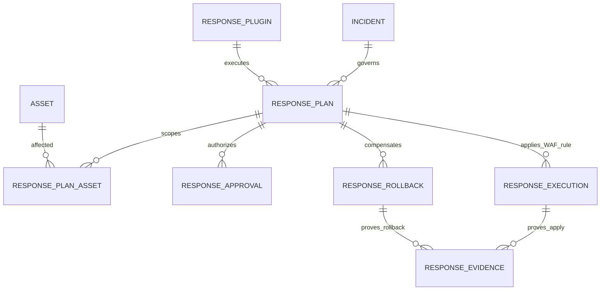

# Phase 16 Development Report

## 1. Phase 信息

- 项目：Cyber Agent Platform（CAP）
- 阶段：Phase 16
- 主题：WAF Response Plugin（首个真实类型 Response Plugin）
- 状态：开发与工程验收完成，等待 Architect Review
- 阶段门禁：Phase 14 Response Framework 与 Phase 15 Notification & Ticket Framework 已获 Architect 通过后启动
- 明确边界：未进入 Phase 17；未连接或修改任何真实生产 WAF；未修改 Response Framework 核心源码

## 2. 本阶段完成内容

1. 新增统一、Provider-neutral 的 `WAFRule` 模型，字段完整覆盖 `id/name/action/condition/priority/version/status/source/checksum`。
2. 新增 `WAFPolicy` 与 `WAFPolicyProvider`，实现规则 Action、Condition Field、Source、Priority、Rollback Action 的 allowlist 治理。
3. 新增无网络、无生产访问、无凭据、无持久化副作用的 `MockWAFProvider`。
4. 新增 `WAFAdapter`，负责参数解析、Policy 校验、Apply、Read-back Verification、Rollback 和 Rollback Verification。
5. 新增 `WAFResponsePlugin`，完整实现现有 Response SDK：`initialize/plan/validate/execute/verify/rollback/shutdown/health`。
6. 注册 Capability `response.waf`，保留既有 Approval、Runtime、Evidence、Audit、Rollback 治理链路。
7. 实现三种 Rollback：Rule Remove、Rule Disable、Rule Restore。
8. Evidence 包含操作、完整规则快照、checksum、Provider Reference、变更标志、时间、影响资产范围、`network_access=false` 与 `production_access=false`。
9. 新增 Manifest、运营说明、ADR-0035、官方/GitHub Reference Analysis 和 WAF Rule Safety Analysis。
10. 新增 7 个 Phase 16 专项测试，完成 Phase 14 联合及 Phase 0–16 全量回归。

## 3. Tree 项目目录结构

```text
cyber-agent-platform/
├── backend/
│   ├── app/
│   │   ├── dependencies/
│   │   │   └── services.py                  # 注册 WAF Plugin；App-scoped Mock Provider
│   │   ├── plugins/
│   │   │   └── waf/
│   │   │       ├── __init__.py
│   │   │       └── plugin.py                # WAFResponsePlugin
│   │   └── tools/
│   │       └── waf/
│   │           ├── __init__.py
│   │           ├── adapter.py               # WAFAdapter
│   │           ├── contracts.py             # WAFRule / Action / Status / Change
│   │           ├── policy.py                # WAFPolicy / WAFPolicyProvider
│   │           └── provider.py              # MockWAFProvider
│   ├── config/
│   │   └── response.yaml                    # response.waf 允许且强制审批
│   └── tests/
│       ├── test_phase_14_response.py        # 历史断言适配第二个认证插件
│       └── test_phase_16_waf_response.py    # Phase 16 专项验收
├── plugins/
│   └── response/
│       └── waf/
│           ├── manifest.yaml
│           └── README.md
├── docs/
│   ├── adr/
│   │   └── ADR-0035-waf-response-plugin-boundary.md
│   ├── phase-16-waf-response-plugin.md
│   └── Phase 16 Development Report.md
└── outputs/
    └── Phase 16 Development Report.md
```

## 4. 技术实现说明

### 4.1 分层与依赖方向

```text
ResponseService / ResponseRuntime（既有，不修改）
                    ↓
            WAFResponsePlugin
                    ↓
                WAFAdapter
              ↙             ↘
   WAFPolicyProvider    MockWAFProvider
                    ↓
          WAFRule / WAFRuleChange
```

Plugin 不访问数据库、IncidentService、AssetService、ReportService 或网络。Provider 只维护应用实例内的内存状态。所有调用均由现有 Response Runtime 独占执行。

### 4.2 WAFRule

- `WAFRuleAction`：`BLOCK`、`LOG`、`ALLOW`；Schema 具备中立表达能力，但 Phase 16 Policy 禁止 `ALLOW`。
- `WAFRuleStatus`：`ENABLED`、`DISABLED`、`REMOVED`。
- Condition 采用受限 `field:value` 声明式语法。
- 禁止换行、NUL、模板标记、反引号、命令替换、分号、`exec/shell/import` 前缀。
- checksum 为语义内容的 canonical JSON SHA-256；不包含运行态 status，从而保留 Disable/Remove 前后的语义身份。
- 启用中的同 ID 规则不得被不同 checksum 静默覆盖。

### 4.3 Policy

默认允许：

- Action：`BLOCK`、`LOG`；
- Condition Field：`client_ip/http_method/path_prefix/header/query_parameter`；
- Source：`cap/incident/assessment`；
- Rollback：`REMOVE/DISABLE/RESTORE`；
- 最大 Priority：10000；
- Mock-only：强制为 true；
- Block：必须由 Response Plan 标记为审批必需。

### 4.4 Provider 与生命周期

`MockWAFProvider` 是 App-scoped 依赖，使 Execute 与 Rollback 跨 API 请求时共享同一合成状态；不同 FastAPI 应用实例之间隔离。Provider 明确声明：

```text
network_access = false
production_access = false
```

Plugin `health()` 同时验证上述两项边界。

### 4.5 Verification

Apply 后读取 Provider 状态，要求完整 Rule 相等且为 `ENABLED`。Rollback 后分别要求：

- Remove：`REMOVED`；
- Disable：`DISABLED`；
- Restore：与原始规则完全相等。

现有 Response Runtime 继续执行成功结果必须 Verified、Evidence 数量上限、Result 身份与 Capability、JSON 可序列化和尺寸约束。

### 4.6 Rollback Token

Token 绑定：

```text
Response Plan ID + Incident ID + Rule ID + Version + Checksum
```

Token 由 Plugin 生成、由既有 Response Framework 私有持久化；公开 API 结果排除 `rollback_token`。无 Token 或 Token 不匹配均 fail closed。

## 5. 数据库设计

### 5.1 本阶段数据库变更

无。

Phase 16 复用 Phase 14 的 8 张 Response 表：

- `response_plugins`
- `response_policies`
- `response_plans`
- `response_plan_assets`
- `response_approvals`
- `response_executions`
- `response_rollbacks`
- `response_evidence`

`WAFRule` 作为 Plan/Result/Evidence 的强类型 JSON 内容，不新增 Provider-specific 表，避免平台核心耦合具体 WAF 产品。

### 5.2 Mermaid ER 图



### 5.3 Migration

- Phase 16 无 migration。
- Alembic 单头：`20260801_0015 (head)`。
- Phase 14 Response 表数量：8。

## 6. API 设计

未新增 API，复用既有 Response Framework 端点：

```text
POST /response/plans
POST /response/plans/{id}/approve
POST /response/plans/{id}/execute
POST /response/plans/{id}/rollback
GET  /response/plans/{id}
GET  /response/plugins
```

### 6.1 创建 WAF Plan 请求示例

```json
{
  "incident_id": "8bd96922-8b4b-40b4-a31c-58c1b51d70ca",
  "asset_ids": ["5c28df56-460d-43ec-995d-434428866f62"],
  "target_capability": "response.waf",
  "plugin_name": "waf-response",
  "requested_by": "soc-requester@example.test",
  "reason": "Block confirmed malicious source",
  "risk_level": "HIGH",
  "parameters": {
    "rule": {
      "id": "cap-rule-001",
      "name": "Block confirmed malicious client",
      "action": "BLOCK",
      "condition": "client_ip:203.0.113.9",
      "priority": 500,
      "version": "1.0.0",
      "status": "ENABLED",
      "source": "cap",
      "checksum": "<64-char-sha256>"
    }
  },
  "rollback_parameters": {"action": "DISABLE"}
}
```

### 6.2 创建响应

```json
{
  "target_capability": "response.waf",
  "approval_state": "PENDING_APPROVAL",
  "execution_state": "BLOCKED",
  "rollback_state": "AVAILABLE",
  "supports_rollback": true,
  "plan": {
    "plugin_name": "waf-response",
    "approval_required": true,
    "steps": ["initialize", "plan", "validate", "execute", "verify", "shutdown"]
  }
}
```

### 6.3 执行后的 Evidence 示例

```json
{
  "evidence_type": "WAF_RULE_CHANGE",
  "reference": "mock-waf://rules/cap-rule-001/1.0.0",
  "metadata": {
    "operation": "APPLY",
    "changed": true,
    "network_access": false,
    "production_access": false,
    "rule": {"id": "cap-rule-001", "status": "ENABLED", "checksum": "<sha256>"}
  }
}
```

## 7. 核心代码说明

### 7.1 Rule checksum

```python
def calculate_checksum(self) -> str:
    encoded = json.dumps(
        self.canonical_content(),
        sort_keys=True,
        separators=(",", ":"),
    ).encode("utf-8")
    return hashlib.sha256(encoded).hexdigest()
```

### 7.2 Policy-first apply

```python
async def apply(self, rule: WAFRule, *, approval_required: bool) -> WAFRuleChange:
    self._policy.validate_rule(rule, approval_required=approval_required)
    return await self._provider.apply(rule)
```

### 7.3 Verification

```python
async def verify_applied(self, rule: WAFRule) -> bool:
    actual = await self._provider.get(rule.id)
    return actual == rule and actual.status.value == "ENABLED"
```

### 7.4 Mock-only health

```python
async def health(self) -> bool:
    return (
        not self._adapter.provider.network_access
        and not self._adapter.provider.production_access
    )
```

## 8. Docker / 部署

- 无 Docker 镜像、Compose 服务、端口、Secret 或外部 WAF 依赖变更。
- Mock Provider 在 FastAPI 应用实例内存中运行。
- 无网络访问，无 DNS/HTTP/SDK 调用，无生产凭据。
- 重启后 Mock 状态丢失是预期行为；该 Provider 只用于 Phase 16 生命周期认证。
- 未来生产 Adapter 必须在独立阶段定义网络 allowlist、凭据 Provider、TLS、Provider Lock、Reconciliation、Canary、Rollback 与审计策略。

## 9. 测试情况

### 9.1 Phase 16 专项

```text
7 passed
```

覆盖：

- API Plan → Approval → Execute → Verify → Evidence → Audit → Rollback；
- Incident/Asset 不变性；
- Remove/Disable/Restore；
- Rule checksum 与 strict schema；
- Action/Source/Condition/Priority/Approval allowlist；
- Provider-owned ID 拒绝；
- rollback token 拒绝；
- enabled rule 不可静默覆盖；
- disabled policy、非法 rollback、缺失 rule、缺失 provider state；
- `network_access=false` / `production_access=false`。

### 9.2 Phase 14 + Phase 16 联合回归

```text
23 passed
```

### 9.3 Phase 0–16 全量回归

```text
217 passed in 69.33s
```

Windows/WorkBuddy 环境仍出现“全部 tests passed 但 pytest 进程退出码为 1”的既有临时目录清理现象；无失败、Error 或 traceback。专项、联合、全量及 Coverage 结果互相印证。

### 9.4 精确覆盖率

```text
11352 statements
559 missed
95.0758%
```

门禁命令使用：

```text
coverage report --precision=4 --fail-under=95
```

返回成功，未依赖整数四舍五入。

### 9.5 静态质量

```text
Ruff: passed
Black: passed (302 files unchanged)
compileall: passed
```

### 9.6 应用与迁移装配

```text
routes=107
response_tables=8
Alembic head=20260801_0015
```

Phase 16 无数据库变更，因此无需新增 Upgrade/Downgrade SQL。

## 10. GitHub / Official Reference Analysis

1. OWASP ModSecurity：Rule、Operator、Action 与 Anomaly Scoring，参考官方 v3 Reference Manual。
2. OWASP Coraza：WAF Engine、SecLang、Transaction、请求阶段、Interruption 与 Logging 生命周期。
3. F5 WAF for NGINX（原 NGINX App Protect WAF）：声明式 Policy、Violation、Signature、IP list、Override rule 与更新机制。
4. Open Policy Agent：Policy Evaluation 与 Application Enforcement 分离，结构化 Input/Data 产生 Decision。
5. Kubernetes Gateway API / HTTPRoute：声明式 Desired State 与 Controller-observed Status/Conditions 分离。

CAP 的采用结论：统一保存中立 Rule Intent；Policy 与 Adapter 分离；Apply 与 Observed Verification 分离；Provider-specific 细节不进入 Response Framework。

详细分析见：`docs/phase-16-waf-response-plugin.md`。

## 11. WAF Rule Safety Analysis

### 11.1 为什么不会误伤业务

Phase 16 根本不接入真实流量或生产 WAF；其次通过条件字段 allowlist、语法限制、禁止 ALLOW、禁止 Provider-owned ID、禁止静默覆盖和强制 Approval 降低未来适配风险。

### 11.2 如何验证

Apply/Remove/Disable/Restore 后读取 Mock Provider 实际状态，比对完整规则、status 与 checksum。Response Runtime 拒绝任何“success=true 但 verified=false”的结果。

### 11.3 如何回滚

执行结果签发私有 Token，绑定 Plan、Incident、Rule ID、Version、Checksum。Rollback 仅接受 `REMOVE/DISABLE/RESTORE`，每次产生独立 Evidence 与 Audit。

### 11.4 如何审批

`response.waf` 在 Response Policy 中被允许，但列入 `approval_required_capabilities`。Plugin 再次校验 `plan.approval_required=true`。现有审批人隔离、TTL 与多级审批规则保持有效。

### 11.5 如何记录影响范围

Response Plan 持久化 Incident 与 Asset scope；Runtime 禁止 Plugin 修改；Result metadata 记录 asset IDs；Evidence 记录 Rule 快照、checksum、Provider reference 与 operation；Audit 记录 Plan/Approval/Execution/Rollback。

## 12. Known Issues

1. Mock Provider 为单应用实例内存状态，不支持重启恢复、分布式锁或多副本一致性；符合 Phase 16 Synthetic 范围。
2. Condition grammar 是受限中立表达，不等同 SecLang、F5 Policy、OPA Rego 或 HTTPRoute；真实 Provider 需要独立 translator 与 conformance tests。
3. Restore 当前恢复本次 Plan 的原始规则快照；生产场景应保存 Provider apply 前状态并处理并发版本冲突。
4. Phase 16 不实现真实 WAF staged rollout、shadow mode、canary、traffic impact metrics 或 provider reconciliation。
5. Git 仓库内容整体处于 untracked 状态，无法用 Git diff 证明未修改框架；本阶段使用 Response 文件哈希与显式文件审计作为替代证据。

## 13. 本阶段架构变化

- 新增 WAF Plugin bounded integration：Rule / Policy / Adapter / Provider / Plugin。
- Response Framework 内部架构无变化。
- Capability `response.waf` 从“预留且默认拒绝”升级为“有认证插件、默认允许且强制审批”。
- Mock Provider 生命周期采用 App-scoped DI，避免 Execute/Rollback 跨请求丢失合成状态。

## 14. 影响模块与 Breaking Change

### 影响模块

- `backend/app/plugins/waf/*`
- `backend/app/tools/waf/*`
- `backend/app/dependencies/services.py`
- `backend/config/response.yaml`
- Phase 14/16 tests
- Plugin manifest 与 docs

### Breaking Change

- API Schema、数据库、Response SDK：无 Breaking Change。
- 行为变化：`response.waf` 不再由默认 Policy 拒绝；它现在可创建 Plan，但必须审批并由 `waf-response` 执行。
- `/response/plugins` 从 1 个认证插件增加到 2 个。

## 15. 数据库与配置变更

### 数据库

无。

### 配置

`backend/config/response.yaml`：

- `response.waf` 加入 `allowed_capabilities`；
- 从 `denied_capabilities` 移除；
- 加入 `approval_required_capabilities`。

WAF-specific Policy 当前以不可变默认对象注入；后续生产适配前应进入独立 typed YAML bounded configuration。

## 16. 风险分析与 Technical Debt

### 风险

- 若未来将 Mock Provider 替换为网络 Provider 而未增加独立门禁，可能引入生产影响；Manifest、health 与 Policy 明确阻止 Phase 16 发生此行为。
- 应用实例内状态不适用于多进程；仅用于 Synthetic Certification。
- 中立条件模型若过度扩展，可能演变为可执行 DSL；后续必须保持声明式、可验证、无代码执行。

### Technical Debt

1. 生产 Provider SPI 尚未抽象为通用 Protocol；Phase 16 只有一个 Mock Provider，避免过早抽象。
2. 尚无 provider-side ETag/version lock 和 reconciliation worker。
3. 尚无 staged/canary/shadow verification telemetry。
4. 尚无 WAF provider credential reference 与 secret rotation。
5. 项目 Git 基线需由用户/Architect 后续建立，便于阶段 diff 审查。

## 17. 后续建议

仅在 Architect 明确输出 `✅ Phase Passed` 并提供下一阶段 Prompt 后：

1. 先修复 Review 中全部 Critical/Major；
2. 若进入真实 Provider 阶段，先定义 Provider Protocol、SecretProvider、NetworkPolicy、Idempotency、Version Lock、Canary 与 Reconciliation；
3. 任何生产 WAF 操作继续默认拒绝，并要求明确授权目标、独立审批、影响窗口和回滚演练；
4. 不应在未 Review 前开始 Phase 17。

## 18. 交付物清单

### 代码

- `backend/app/plugins/waf/__init__.py`
- `backend/app/plugins/waf/plugin.py`
- `backend/app/tools/waf/__init__.py`
- `backend/app/tools/waf/contracts.py`
- `backend/app/tools/waf/policy.py`
- `backend/app/tools/waf/provider.py`
- `backend/app/tools/waf/adapter.py`
- `backend/app/dependencies/services.py`
- `backend/config/response.yaml`

### 测试

- `backend/tests/test_phase_16_waf_response.py`
- `backend/tests/test_phase_14_response.py`（仅调整阶段演进断言）

### Plugin 资产

- `plugins/response/waf/manifest.yaml`
- `plugins/response/waf/README.md`

### 文档

- `docs/phase-16-waf-response-plugin.md`
- `docs/adr/ADR-0035-waf-response-plugin-boundary.md`
- `docs/Phase 16 Development Report.md`
- `outputs/Phase 16 Development Report.md`

### 验收中间产物

- `_待删_回收区/phase16-final-validation-20260802/.coverage-phase16`
- `_待删_回收区/phase16-final-validation-20260802/pytest-*`

上述验收中间产物已放入隔离回收区，不属于正式交付物。

## 19. Response Framework 未修改证明

本阶段未编辑以下文件：

- `backend/app/response/contracts.py`
- `backend/app/response/registry.py`
- `backend/app/response/planner.py`
- `backend/app/response/policy.py`
- `backend/app/response/runtime.py`
- `backend/app/response/service.py`
- `backend/app/response/rollback.py`
- `backend/app/response/fake_plugin.py`

最终 SHA-256：

```text
ade718f521da3db89e6b5d2eb22c6a890697a6c902bbe8bac7158e0eb1972854  contracts.py
7b9c73b2fcaf0b25ea19ce5095d59c4eff7e37f7d8acfcfe4964775563621446  registry.py
e447e860b0a2432a4ef8c1a71b3e1a561376aaaf1eeb6c4345c339b2d9e5fc15  planner.py
d2320d02b35970b06164b709987907469cee45fb8cfc3a9012f96fe6e95f80b7  policy.py
ec2cb6df124b838f9c3dcb30159db56bae1757c5708afea4a6eaf2f9779aca43  runtime.py
d01d553fe4dbef0d136fa3bd4845c0e83c374078e539e6e1925aad6278b02874  service.py
ab8ed33e141b205f8c243aa8682dee0a4c0264c68c86a14e35cbfc98ed2e3a5f  rollback.py
52b32a0da5b24ca9f0a01d874905814d8991f09a9dd9ceb9f0b1abb649b0ea01  fake_plugin.py
```

由于仓库整体未被 Git 跟踪，无法输出可信 Git diff；以上哈希和代码审计为本阶段替代证据。

## 20. Architect Review 准备说明

建议 Architect 重点审查：

1. WAFRule 中立模型是否足够且没有演变为可执行 DSL；
2. checksum 是否应包含 status，当前选择“不包含”是否符合语义身份设计；
3. App-scoped Mock Provider 是否满足 Synthetic 生命周期认证；
4. Approval 双重校验是否充分；
5. Rollback Token 绑定字段与 Restore 语义是否合理；
6. Provider-owned ID、禁止 ALLOW、禁止静默覆盖是否满足 Safety Case；
7. 无数据库迁移是否符合 Plugin-first 设计；
8. 95.0758% 精确覆盖率和 217 项全量回归是否可接受。

---

**Engineer 结论：Phase 16 开发与验证已完成。现停止开发，等待 Architect Review；未进入 Phase 17。**
