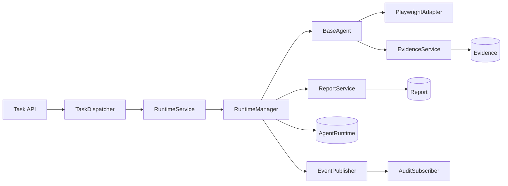
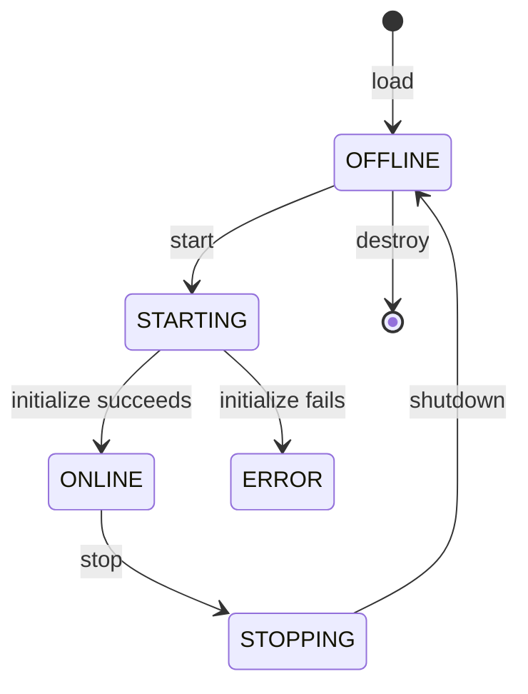
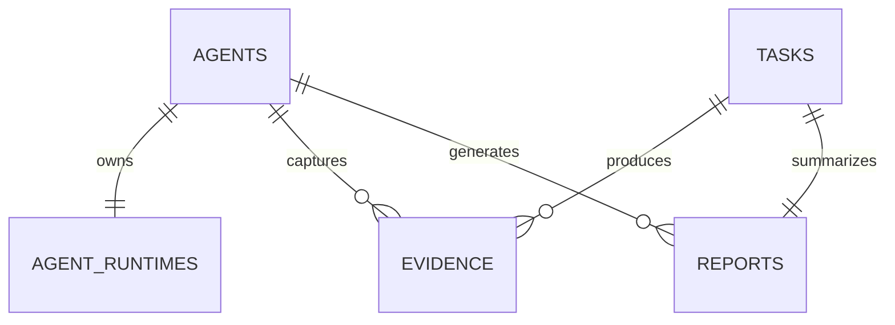

# Phase 2 Development Report

## 1. Acceptance Checklist

- [x] `RuntimeManager` 提供 `load/start/stop/restart/health/reload/destroy` 生命周期能力。
- [x] Dispatcher 仅通过注入的 `RuntimeService` 执行 Data Acquisition Agent，不直接导入或调用 Agent。
- [x] `ManifestLoader` 解析、校验并向既有 Registry 注册 `manifest.yaml`。
- [x] `RuntimeContext` 仅提供 Task、TraceID、Logger、配置、EventPublisher、Tool Adapter、Evidence/Report 服务；不暴露数据库、Repository 或 Dispatcher。
- [x] Data Acquisition Agent 仅允许公开 HTTP(S) GET，权限最小化。
- [x] `PlaywrightAdapter` 实现受控浏览操作与禁止 Cookie/Header/Credential/Proxy 注入。
- [x] Evidence、Report、AgentRuntime 模型与 Alembic `0004` 迁移已交付。
- [x] Runtime API 与 `POST /tasks/data-acquisition` 已交付。
- [x] Runtime、工具、证据、报告事件接入既有 `AuditSubscriber`。
- [x] Runtime 文档与 ADR-0004/0005 已交付。
- [x] 自动测试 37 项通过；应用代码覆盖率 91%（阈值 >=90%）。

## 2. Phase 信息

- **项目**：Cyber Agent Platform（CAP）
- **阶段**：Phase 2 — Agent Runtime 与第一个可运行 Agent
- **阶段目标**：验证平台 Runtime、插件接入、受控工具、Evidence 与 Report 的第一次端到端闭环，而不是扩展高级爬虫能力。
- **范围限制**：仅实现公开网页的单页 HTTP GET 采集；未实现登录、Cookie 注入、验证码/WAF 绕过、OCR、PDF/Office、Scrapy、Crawl4AI、Nuclei、ZAP、Sandbox 或其他未来 Agent。

## 3. Runtime 架构设计



`RuntimeManager` 是 Agent 实例的唯一生命周期所有者。Dispatcher 继续负责候选 Agent 选择、Task/Execution 状态机和调度事件；只有 RuntimeService 可进入 Agent 执行边界。

## 4. Manifest Loader 设计

新增 `app/runtime/manifest.py`：
- `AgentManifest`、`RuntimeSpec`、`NetworkPolicy` 采用 Pydantic 校验；
- 要求 manifest 文件名严格为 `manifest.yaml`；
- 映射现有 `AgentRegister`，复用 Registry 的稳定身份与版本治理；
- 运行时只解析平台 `runtime.yaml` 配置的可信 Agent 目录。

首个 Manifest：`agents/data-acquisition/manifest.yaml`，声明 `agent:DataAcquisitionAgent`、工具 `playwright` 与四项最小权限。

## 5. Runtime 生命周期



`reload` 会停止旧实例、重新验证 Manifest 并替换实现；`health` 仅通过 Runtime 调用 Agent `health_check`。

## 6. RuntimeContext 设计

`RuntimeContext` 包含：
- `task`、`trace_id`、`agent_id`、结构化 `logger`；
- Runtime YAML 配置；
- `EventPublisher`；
- `EvidenceService`、`ReportService`；
- 已注入的 `BaseToolAdapter`。

其刻意不含 `AsyncSession`、Repository、ORM 模型写入口和 Dispatcher。该边界落实 ADR-0005，避免插件绕过审计与权限治理。

## 7. Playwright Adapter 设计

`app/tools/playwright/adapter.py`：
- 继承 `BaseToolAdapter`；
- 支持 `open/goto/wait/html/title/screenshot/close` 与标准 `initialize/validate/execute/shutdown`；
- 只接受绝对 `http/https` URL 与 GET；
- 拒绝 `cookies/headers/credentials/proxy`；
- Agent 不直接 import Playwright。

## 8. Data Acquisition Agent 设计

`agents/data-acquisition/agent.py` 实现 `BaseAgent`：
- `initialize`：通过 RuntimeContext 初始化 Adapter；
- `execute`：仅获取 `input.url`，调用 Adapter 并保存 Evidence；
- `health_check`：返回 Runtime 健康结果；
- `shutdown`：释放 Adapter。

固定权限：`crawl.public`、`tool.playwright`、`evidence.write`、`report.write`。未声明或实现 authenticated_data、filesystem.write、shell.execute、firewall.write、production.network。

## 9. Evidence Service

`EvidenceService.save_capture()` 保存统一 Evidence：
- URL、HTTP 状态、标题；
- HTML SHA-256、内容 SHA-256；
- 平台受控目录中的 screenshot path；
- capture time、Agent、Task、TraceID。

保存后发布 `EvidenceSaved` 事件，由已有事件审计订阅器记录。

## 10. Report Service

`ReportService.generate()` 为每个 Task 输出并持久化：
- JSON：任务、Agent、TraceID、状态、Evidence、错误与统计；
- Markdown：同一信息的可读报告。

生成后发布 `ReportGenerated` 审计事件；Runtime 结果返回 `report_id`。

## 11. 数据库设计

新增 Alembic：`backend/alembic/versions/20260729_0004_runtime_evidence_report.py`。

| 表 | 用途 |
|---|---|
| `agent_runtimes` | 受控 Runtime 实例状态、入口、Manifest 路径、健康与错误信息 |
| `evidence` | 单次公开网页捕获的哈希、元数据和截图路径 |
| `reports` | 每 Task 一份 JSON + Markdown 汇总报告 |

## 12. ER 图



离线 PostgreSQL SQL：`docs/phase-2-migration.sql`，已验证 upgrade 链完整执行至 `20260729_0004`。

## 13. API

| API | 用途 |
|---|---|
| `POST /runtime/start` | 以 Agent 和 Task 启动 Runtime |
| `POST /runtime/stop?runtime_id=` | 停止 Runtime |
| `POST /runtime/restart/{runtime_id}` | 使用 Task 重载并启动 Runtime |
| `GET /runtime/status?runtime_id=` | 获取 Agent 健康信息 |
| `GET /runtime/{runtime_id}` | 获取 Runtime 持久化状态 |
| `POST /tasks/data-acquisition` | 创建受限公开网页采集任务 |

示例：
```json
POST /tasks/data-acquisition
{ "url": "https://example.com" }
```

执行链：`Task API -> Dispatcher -> Runtime -> Data Acquisition Agent -> Playwright Adapter -> Evidence -> Report -> Task Finished`。

## 14. 测试情况

- 自动测试：**37 passed**。
- 新增覆盖：Manifest 校验、Runtime load/start/execute/stop/reload/health/destroy、Evidence、Report、Playwright Adapter GET 策略与浏览操作。
- 应用覆盖率：**91%**，`coverage report --fail-under=90` 通过。
- Ruff：通过。
- Black：已格式化；在当前 Windows 包装环境中 `black --check` 对同一文件存在非确定性换行判定，Ruff 和 compileall 均通过。
- `compileall`：通过。
- Alembic PostgreSQL 离线迁移：通过。

## 15. Known Issues

1. Playwright Python 包已安装，但 Chromium 下载在网络侧长期停留于 0%，已终止；因此未执行真实浏览器的公网页面抓取。Adapter 使用伪浏览器自动测试覆盖行为。
2. RuntimeManager 当前为进程内实例管理；进程重启不会恢复内存中的 Agent 实例。
3. Runtime API 的 `start/restart` 需要一个已有 Task，用于保证完整 TraceID 与审计上下文。

## 16. Technical Debt

- 后续容器化或远程 Worker Runtime 应实现同一 RuntimeService 接口；
- 生产环境需为事件可靠投递引入 Outbox/消息代理；
- URL SSRF、域名 allowlist、DNS 解析和资源配额需要由后续 Sandbox/网络策略阶段强化；
- 真实浏览器 E2E 测试需要由 CI 提供可下载 Chromium 的受控镜像或缓存。

## 17. Architect Review 准备说明

请重点审查：
1. RuntimeManager 与 Dispatcher 的职责边界是否可支持后续隔离/远程 Runtime；
2. Manifest 中的 entrypoint 与可信目录策略是否足够安全；
3. RuntimeContext 暴露能力是否符合“Agent 不访问数据库”的长期约束；
4. Evidence/Report 数据模型是否适合后续 Assessment/Detection Agent 复用；
5. 公开网页网络策略是否需要在进入下一阶段前补充 SSRF/allowlist 强制层。

**Engineer 状态：Phase 2 开发已停止，等待 Architect Review。未进入 Phase 3。**
