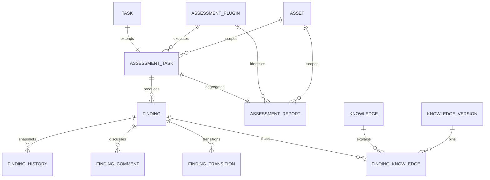

# Phase 7 Development Report

## Phase 信息

- 项目：Cyber Agent Platform（CAP）
- 阶段：Phase 7 — Nuclei Assessment Plugin（首个真实 Assessment Tool）
- 状态：Engineer 实现与验证完成，等待 Architect Review
- 阶段边界：仅接入 ProjectDiscovery Nuclei；未进入 Phase 8；未执行真实 Nuclei 或互联网扫描

## 1. Acceptance Checklist

- [x] 分析 Nuclei、httpx、DefectDojo、OWASP ZAP、OpenVEX 官方架构
- [x] 实现 NucleiAssessmentPlugin 六阶段生命周期
- [x] 实现 NucleiAdapter、JSONL 解析和错误处理
- [x] Plugin 不直接调用 subprocess
- [x] 新增 SandboxProvider 和 LocalProcessSandbox
- [x] 预留 Docker、Firecracker、Remote Worker Sandbox
- [x] Target 只能从存在且未软删除的 Asset 派生
- [x] Policy Asset/Capability 边界在 Planner 中 fail closed
- [x] 仅允许受信本地模板、批准清单、SHA-256 和请求预算
- [x] 禁止动态模板下载、Cloud Upload、stdin、隐式 httpx、shell
- [x] 统一 AssessmentResult / RawFinding / Finding / Severity / Confidence / Evidence / Reference
- [x] 映射已有 CVE/CWE/CPE/CISA KEV/MITRE ATT&CK Knowledge，未命中保留 Reference
- [x] 新增可替换 FingerprintProvider，默认 SHA-256 并兼容 Phase 6
- [x] 新增 Finding State Machine、History、Comment、Transition
- [x] 新增平台拥有的 AssessmentReport
- [x] 新增 Nuclei、Finding transition、Report API
- [x] 新增 Audit Events
- [x] 新增 ADR-0016、ADR-0017
- [x] Ruff、Black、compileall、Alembic、测试和覆盖率门禁通过

## 2. GitHub Reference Analysis

Nuclei 被确定为外部模板驱动执行引擎，而不是 CAP 领域模块。CAP 采用每次 Assessment 一个受控进程、显式模板选择和 JSONL 边界，拒绝默认社区模板、动态下载、长期 service、Cloud Upload、stdin 与隐式 httpx。httpx 保留为未来独立 Target Discovery Adapter。DefectDojo 的稳定工具 ID/Hash/duplicate lineage、ZAP 的风险与置信度分离、OpenVEX 的显式状态语义分别用于指导去重、统一 Finding 和生命周期设计。

完整分析：`docs/github-reference-analysis-phase-7.md`。

## 3. Tool Integration Analysis

```text
AssessmentService -> AssessmentRuntime -> NucleiAssessmentPlugin
                  -> NucleiAdapter -> SandboxProvider
                  -> LocalProcessSandbox -> Nuclei CLI
                  -> JSONL -> NucleiResultNormalizer -> AssessmentResult
                  -> Finding / Knowledge / Report / Audit
```

Plugin 只负责 SDK 生命周期；Adapter 负责目标形状、模板信任、参数、Sandbox 和 JSONL；Sandbox 独占进程创建；平台服务独占 Asset/Policy、持久化、去重、Knowledge、Report、Transition 和 Audit。

## 4. Security Boundary Analysis

- API 不接受任意 target，只接受 `asset_id`。
- Asset 不存在或已 Soft Delete 时拒绝；APPLICATION 必须有 `properties.url`。
- Planner 检查 Asset allow/deny list 和 Capability allowlist。
- 模板必须在 trusted root 内、位于批准清单、SHA-256 匹配且不超请求预算。
- CLI 无 shell、stdin、动态更新、Cloud Upload 和隐式 httpx；限制速率、并发、批量、超时、重试和输出。
- Plugin Context 不包含 Session、Repository 或 shell；Plugin 不能写数据库或报告。
- 非零退出、超时、截断、非法 JSONL、非法 Severity 全部 fail closed。
- 测试仅使用 Fake Sandbox、本地模板和无网络 Python 子进程；未运行 Nuclei。

## 5. Architecture Trade-off Analysis

- LocalProcessSandbox 可部署但共享宿主内核；生产高风险场景应升级 Docker/Firecracker/Remote Worker。
- JSONL 有序列化成本，但建立 scanner anti-corruption layer。
- 模板批准清单降低模板覆盖迭代速度，但换来完整性、可复现性和预算治理。
- Asset-first 增加资产登记步骤，但消除任意目标扩权。
- 平台报告牺牲部分工具原生展示，但保证跨工具一致模型。
- 显式状态机提升审计性，但组织自定义工作流仍需未来策略化。

## 6. Nuclei Plugin

`backend/app/plugins/nuclei/plugin.py` 实现 `initialize/plan/execute/validate/normalize/shutdown`。Capabilities 为 `template.scan`、`web.scan`；Permissions 为 `assessment.execute`、`tool.invoke`、`evidence.write`。Plugin 从 Context 读取平台派生 target/template，唯一外部依赖为 `NucleiAdapter`。结构审计确认 `subprocess` 仅出现在 Sandbox 层。

## 7. Nuclei Adapter

`backend/app/tools/nuclei/adapter.py` 实现：

- 单 HTTP(S) 目标验证和控制字符拒绝；
- 模板 ID 去重、批准清单、根目录约束、文件存在、SHA-256、请求预算；
- `-jsonl -silent -duc -ni -no-stdin -no-httpx -or -ot`；
- `-rl/-c/-bs/-timeout/-retries 0` 资源约束；
- 动态模板下载和 Cloud Upload 环境开关；
- JSONL object 校验、退出码、截断与 stderr 错误转换。

受信模板 SHA-256：`3dc8714f03b5a39e9c25112b1bae272069d8524312d7b77f1e38e27c478ec4e2`。

## 8. Sandbox

`SandboxProvider` 定义 shell-free typed port。`LocalProcessSandbox` 实现 executable allowlist、最小环境、合法 cwd、DEVNULL stdin、受控 stdout/stderr、timeout kill 和 output truncation。Docker/Firecracker/RemoteWorker 为显式保留 Provider，当前调用抛 `NotImplementedError`。

## 9. Normalizer

`NucleiResultNormalizer` 将 template ID/name、severity、matcher/extractor、matched-at/host、request/response/curl/timestamp/tags/classification/reference 转成 `RawFinding`。解析 CVE、CWE、CPE、ATT&CK Technique；已有 Knowledge 固定 current KnowledgeVersion，CVE 同时尝试 CISA KEV；未命中不创建伪知识，只保留 Reference。

## 10. Finding State Machine

状态集合：NEW、TRIAGED、CONFIRMED、FALSE_POSITIVE、ACCEPTED_RISK、FIXED、REOPENED。非法跳转返回 `INVALID_STATE_TRANSITION`（HTTP 409）。合法跳转同时写 FindingTransition、FindingHistory snapshot、Finding 当前状态和 `FindingTransitioned` Audit Event。

## 11. Assessment Report

平台在 Assessment 成功后生成一对一 AssessmentReport，包含 Plugin/version、Asset、Template/Rule、Finding、Severity/Confidence/Status、Risk、KnowledgeVersion links、Evidence 和 References。Plugin 无报告写权限。只读 API：`GET /assessment/reports/{id}`。

## 12. 数据库设计

新增：

- `finding_history`：finding_id、actor、action、from_status、to_status、reason、snapshot；
- `finding_comments`：finding_id、author、body；
- `finding_transitions`：finding_id、from/to status、actor、reason、trace_id；
- `assessment_reports`：assessment_task_id(unique)、plugin_id、asset_id、trace_id、status、summary、content。

Finding 状态数据迁移：OPEN→NEW、MITIGATED→FIXED、ACCEPTED→ACCEPTED_RISK；downgrade 提供反向兼容映射。Alembic 唯一 head：`20260731_0010`。PostgreSQL 离线 SQL：upgrade 106 行、downgrade 26 行。

## 13. ER 图



完整字段图：`docs/phase-7-database-er.md`。

## 14. API

### POST /assessment/nuclei

```json
{
  "asset_id": "67f2c948-f60a-4551-8287-3efc12a1d3a4",
  "templates": ["cap-http-missing-content-type-options"],
  "execute": false,
  "policy": {
    "max_requests": 10,
    "capability_allowlist": ["template.scan", "web.scan"]
  }
}
```

返回 AssessmentTaskRead；目标不在请求体中。

### POST /assessment/findings/{id}/transition

```json
{"status": "TRIAGED", "actor": "security-reviewer", "reason": "reviewed"}
```

返回 FindingTransitionRead；非法跳转返回 409。

### GET /assessment/findings/{id}

返回统一 Finding 详情，保持 Phase 6 兼容。

### GET /assessment/reports/{id}

返回只读 AssessmentReportRead。

## 15. 测试情况

- Phase 7 专项：21 passed；覆盖 Adapter、模板信任、JSONL、Plugin lifecycle、Sandbox、Normalizer、Knowledge、Fingerprint、State Machine、API、软删除、Policy、History/Comment/Transition/Report/Audit/Migration。
- Phase 6+7 组合回归：23 passed（扩展专项前的早期门禁）。
- 最终 Phase 0–7 全量：119 passed，执行至 100%，无 F/E。
- 应用覆盖率（greenlet-aware）：5258 statements / 265 missed / 95%。
- Ruff：All checks passed。
- Black：189 files unchanged。
- compileall：通过。
- Alembic：唯一 head `20260731_0010`；upgrade/downgrade PostgreSQL offline SQL 成功生成。
- 安全验证：未执行真实 Nuclei，未扫描互联网，未访问任何授权外目标。

环境说明：Windows WorkBuddy 安全删除钩子会在 pytest 完成全部测试后拦截临时目录清理，使部分命令进程不退出或返回 1；测试输出均明确完成至 100% 且无失败。覆盖率数据文件在测试结束后正常生成并可读取。

## 16. Known Issues

1. LocalProcessSandbox 不是强内核隔离，生产高风险执行应换用未来 Docker/Firecracker/Remote Worker Provider。
2. CAP 不负责安装 Nuclei binary；执行环境需单独受控安装与版本固定。
3. 仅交付一个批准的低请求量本地模板，不代表漏洞覆盖范围。
4. FindingComment 仅完成持久化预留，未公开 Comment API。
5. 未实现 OpenVEX import/export、httpx Target Discovery、Interactsh 或真实扫描验收。
6. pytest 临时目录清理受桌面安全钩子影响，但不影响测试项和覆盖率结果。

## 17. Technical Debt

- 实现生产级 Docker/Firecracker/Remote Worker Sandbox 与网络 egress/CPU/内存/只读文件系统策略。
- 为 Sandbox 增加结构化 telemetry 和 Tool invocation Audit Event 细节。
- 将 Finding transition graph 配置化并增加角色/审批策略。
- 增加模板签名/供应链元数据、Nuclei binary checksum/version allowlist。
- 增加 AssessmentReport schema version 和导出格式。
- 在明确授权的隔离 CI 环境中增加真实 Nuclei smoke test；当前阶段刻意不执行。

## 18. Architect Review 准备说明

建议 Architect 重点审查：

1. Plugin -> Adapter -> Sandbox 边界是否足够阻止 Plugin 绕过治理；
2. LocalProcessSandbox 是否仅可作为开发/低风险默认，生产是否应强制更强 Provider；
3. Asset 派生 target 与 Planner Policy 的双层校验是否满足授权边界；
4. 模板 allowlist + SHA-256 + max_requests 是否满足供应链与请求预算要求；
5. Finding 状态迁移、History/Transition/Audit 是否满足不可抵赖性；
6. AssessmentReport JSON 存储及一对一约束是否适合后续版本化；
7. downgrade 的状态折叠是否可接受。

Engineer 已停止 Phase 7 开发，不进入 Phase 8。等待 Architect 输出 Review Report、问题清单和明确的 `✅ Phase Passed` 结论。
