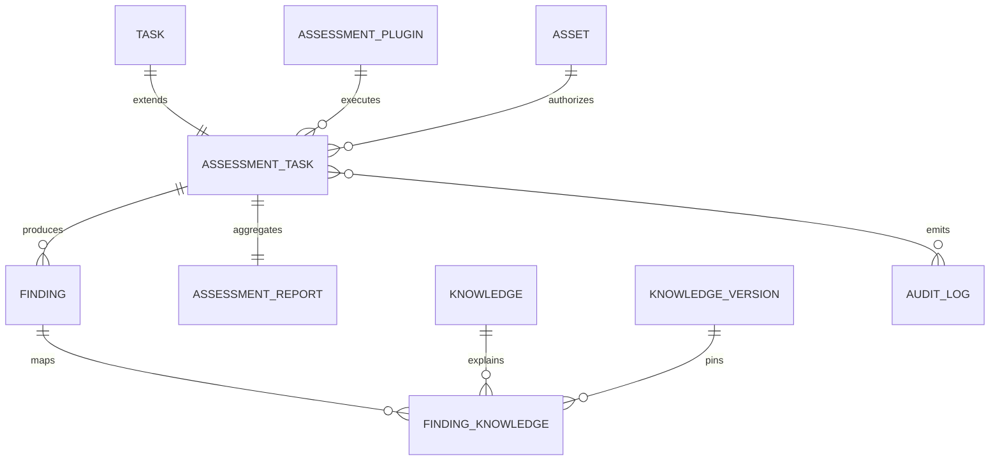

# Phase 8 Development Report

## Phase 信息

- 项目：Cyber Agent Platform（CAP）
- 阶段：Phase 8 — OWASP ZAP Assessment Plugin（第二个真实 Assessment Tool）
- 状态：Engineer 实现与验证完成，等待 Architect Review
- 边界：仅接入 OWASP ZAP；未修改 Assessment Runtime；未启动真实 ZAP；未连接或扫描互联网；未进入 Phase 9
- 架构变化：新增状态型 Daemon/API Tool 的 Plugin/Adapter/Client/Sandbox Profile 扩展，实现 CLI 型 Nuclei 与 API 型 ZAP 共用统一框架
- Breaking Change：无
- 数据库变更：无；无 Alembic Migration
- 配置变更：新增 ZAP API、Scan Policy、Sandbox Profile；API Key 由 `CAP_ZAP_API_KEY` 环境变量注入

### 本阶段 Tree

```text
backend/app/plugins/zap/
├── __init__.py
├── normalizer.py
└── plugin.py
backend/app/tools/zap/
├── __init__.py
├── adapter.py
├── client.py
└── contracts.py
plugins/zap/manifest.yaml
tools/zap/manifest.yaml
backend/tests/test_phase_8_zap.py
docs/adr/ADR-0018-zap-daemon-api.md
docs/adr/ADR-0019-zap-passive-default.md
docs/phase-8-zap-analysis.md
docs/Phase 8 Development Report.md
```

影响的既有模块：Assessment schemas/service、DI factory、Assessment API、EventType、YAML config、`.env.example` 和 backend dependency declaration。

## 1. Acceptance Checklist

- [x] 分析 OWASP ZAP、zap-api-python、DefectDojo、OWASP ASVS、OWASP Top 10
- [x] 实现 `ZapAssessmentPlugin` 六阶段生命周期
- [x] 实现 `ZapAdapter` 的 Session、Context、Scan Policy、API、Alert 和错误处理
- [x] Plugin 不直接调用 ZAP API，不导入 `zapv2`，不调用 subprocess
- [x] 复用 `SandboxProvider` 并新增 `ZapSandboxProfile`
- [x] 新增 `web.dast`、`web.spider`、`web.passive_scan`、`web.active_scan`
- [x] `web.active_scan` 从默认 allowlist 排除
- [x] Passive 默认启用，Active 默认关闭
- [x] Active 同时要求显式请求、Policy Capability、允许的 Scan Policy、Asset 授权和 Planner 校验
- [x] 实现可配置 Passive/Active/Spider 深度/URL/时间/并发策略
- [x] ZAP Alert 转统一 AssessmentResult/RawFinding/Finding
- [x] 映射 Severity、Confidence、CWE、WASC、OWASP、CVE、CAPEC、Reference、Evidence
- [x] 统一报告增加 Scan Policy、Scope、Duration、Tool Version、Mode、Alert Summary
- [x] 完成 Operational Readiness、Security Boundary、Tool Integration、Trade-off 分析
- [x] 新增三个 ZAP API，复用统一报告 API
- [x] 客户端不能传 target，所有扫描引用 Asset
- [x] Mock ZAP API/Fake Alert/Fixture 测试，无真实网络
- [x] 应用覆盖率达到 95%
- [x] 新增 ADR-0018、ADR-0019

## 2. GitHub Reference Analysis

ZAP 被定位为外部、有状态 DAST Engine，而不是 CAP 核心模块。官方文档明确 Active Scan 是对目标的攻击，因此其启用不能只依赖普通布尔开关。`zap-api-python` 作为官方客户端适合放在 Adapter 之后，但其同步 API、可变字典和 ZAP 组件对象不能泄漏到 Plugin/Runtime。DefectDojo 的工具身份、归一化和去重经验支持保留 `pluginId` 与统一指纹；ASVS/OWASP Top 10 作为 Knowledge 分类，不复制为专属 Finding 模型。

官方参考与决策详见 `docs/phase-8-zap-analysis.md`。

## 3. Tool Integration Analysis

```text
Asset -> AssessmentService -> AssessmentRuntime -> ZapAssessmentPlugin
      -> ZapAdapter -> ZapApiClient -> isolated ZAP Daemon
      -> Alert -> ZapResultNormalizer -> AssessmentResult
      -> Finding / Evidence / Knowledge / AssessmentReport / Audit
```

采用 ZAP API，因为 Session、Context、Spider、Passive/Active Scanner 和 Alert 是有状态组件；采用 Daemon，因为这些组件需要共享受控生命周期；采用 Adapter，因为 Plugin 不应理解 API endpoint、轮询或错误格式；采用 Sandbox Profile，因为 Daemon 的 CPU/Memory/Timeout/Network 必须由部署 Provider 治理；Alert 必须转 Finding，因为工具原生结构不能成为平台事实模型。

## 4. Security Boundary Analysis

1. API 仅接受 `asset_id`，Pydantic 禁止额外 `target` 字段。
2. Asset 必须存在、未软删除，且是 WEBSITE 或 APPLICATION；目标从 `value`/`properties.url` 派生。
3. Passive 默认启用；Active 默认关闭，`web.active_scan` 不在默认 Capability allowlist。
4. Active 需要 `active_scan_enabled=true`、显式 `web.active_scan`、允许的 active Scan Policy、Asset `properties.assessment.active_scan_authorized=true`、Planner Asset/Capability 校验。
5. Context include regex 锁定 Asset origin/path；exclude regex、depth、URL、requests、concurrency、scan/runtime/sandbox timeout 防止范围扩大。
6. API Key 仅从 `CAP_ZAP_API_KEY` 注入；缺失时 fail closed；Daemon 应只绑定 loopback/隔离网络并关闭文件传输和动态 Add-on。
7. 每任务唯一临时 Session/Context，finally 清理；Plugin 无 DB、shell、API client 权限。
8. 测试完全使用 Mock/Fake，不启动 ZAP，不访问网络。

## 5. Operational Readiness Analysis

- 部署：版本固定 `zaproxy/zap-stable:2.17.0` 或内部镜像 digest，非 root，基础文件系统只读，临时 ZAP Home 可写。
- Daemon：API 绑定 loopback/隔离服务网络，强制 API Key，关闭文件传输与未批准 Add-on。
- 版本：ZAP 2.17.0 与 Python `zaproxy>=0.6.0,<1.0.0` 固定兼容窗口。
- 升级：测试环境执行 Mock contract + 授权实验室 smoke，再蓝绿切换。
- 回滚：保留前一 image digest/依赖锁，切回旧 worker；Session 非持久化，无数据迁移。
- 资源：默认 CPU 1.0、Memory 1024 MB、Sandbox Timeout 600 秒。
- 健康：`GET /assessment/zap/status` 返回 API version/profile/错误；无 Key 或不可达时 unhealthy。
- 日志：采集 Daemon stdout/stderr 和平台 Audit，脱敏 API Key、Cookie、Authorization、请求体。
- 恢复：失败 Session 废弃，Daemon 不健康时重启 worker；不得自动扩大 scope 或切换 Active。

## 6. Architecture Trade-off Analysis

- ZAP 作为 Plugin：工具可替换、可禁用，不污染平台核心。
- 不修改 Runtime：现有六阶段生命周期足以同时承载一次性 CLI Nuclei 与有状态 API ZAP，验证框架兼容性。
- 保持统一 Finding：保证跨工具 dedup、状态机、Knowledge、报告和审计一致。
- Daemon+API 的运维成本高于一次性 CLI，但正确表达 Session/Context/Scanner 状态并支持健康治理。
- `ZapSandboxProfile` 当前是 Provider-neutral 约束声明；生产硬隔离依赖 Docker/Remote Worker Provider。
- Burp Enterprise 可复用 `BurpAssessmentPlugin -> BurpAdapter -> typed API client -> RawFinding`，无需改变 Asset/Policy/Finding/Knowledge/Report/Audit。

## 7. ZAP Plugin

`backend/app/plugins/zap/plugin.py` 实现 initialize/plan/execute/validate/normalize/shutdown。Capabilities：`web.dast`、`web.spider`、`web.passive_scan`、`web.active_scan`；Permissions：`assessment.execute`、`tool.invoke`、`evidence.write`。Plugin 只依赖 `ZapAdapter` 与 `ZapResultNormalizer`，结构测试确认源码不含 `zapv2`/subprocess。

## 8. ZAP Adapter

`backend/app/tools/zap/adapter.py` 负责：

- 单 HTTP(S) Asset URL、无凭据/fragment/控制字符校验；
- 唯一 Session/Context 创建与清理；
- 由 Asset 派生 include regex 和配置化 exclude regex；
- 允许的 Scan Policy 校验；
- 可选 Spider、Passive、Active；
- 最大 URL、扫描时间、Sandbox timeout、Asset Active 授权；
- Alert 获取、版本、汇总和 transport error 转换。

`ZapApiClient` Protocol 隔离官方同步客户端；`ZapV2ApiClient` 用 `asyncio.to_thread` 提供异步 facade。`SandboxProvider` 被复用为 Daemon 运行环境边界依赖，`ZapSandboxProfile` 声明 CPU/Memory/Timeout/Network；长驻 Daemon 不被错误建模成每扫描一次的短进程命令。

## 9. Policy

`ZapPolicy` 扩展统一 `AssessmentPolicy`：

- `passive_scan_enabled=true`
- `active_scan_enabled=false`
- `spider_enabled=false`
- `spider_depth=1`
- `max_urls=100`
- `max_scan_time_seconds=300`
- `max_concurrency`、`max_requests`、`timeout_seconds`
- `scan_policy=cap-passive-baseline`
- `exclude_regexes=[]`

Active 启用但 Capability 未显式允许、Asset 未授权、Policy 未批准或时间超过 Runtime/Sandbox 时全部 fail closed。

## 10. Normalizer

`ZapResultNormalizer` 将 Alert `alert/url/pluginId/risk/confidence/description/solution/reference/cweid/wascid/method/param/attack/evidence/messageId` 转为统一 `RawFinding`。ZAP `Informational` 映射 INFO；Confidence 保持 LOW/MEDIUM/HIGH；工具 ID、WASC、Solution、Evidence 和有限 raw metadata 保留在 attributes，不把原始 Alert 存成平台实体。

## 11. Knowledge Mapping

Normalizer 生成 `knowledge_references`：CWE、CVE、CAPEC、OWASP_CATEGORY。平台 `FindingKnowledgeMapper` 复用 Knowledge Center、固定 current KnowledgeVersion，并对 CVE 同时查 CISA KEV。未命中时不创建伪 Knowledge，保留 ZAP、MITRE、OWASP 等 Reference。WASC 当前保留为 attributes/reference，因为 KnowledgeType 尚无 WASC，避免擅自扩展统一枚举。

## 12. Report Integration

复用 `AssessmentReport`。平台报告新增：

- Scan Policy
- Scan Scope
- Scan Duration
- Tool Version
- Passive/Active Mode
- Alert Summary

同时保留 Asset、Plugin/version、Finding、Risk、Evidence、Knowledge、Reference。报告由 AssessmentService 生成，Plugin 无报告写权限。

## 13. 数据库设计

本阶段无数据库结构变化：

- ZAP Session 是临时工具运行状态，不建立 `ZapSession` 表；
- ZapPolicy 序列化进既有 `assessment_tasks.policy`；
- Plan/Result Summary/Report 使用既有 JSON 字段；
- Finding/Evidence/Knowledge/AssessmentReport/Audit 全部复用。

因此：无 Alembic Migration、无 PostgreSQL upgrade/downgrade SQL、既有 head `20260731_0010` 不变。

## 14. ER 图（无变化）



ZAP Session/Context 不进入 ER 图，因为它们不是平台持久化事实。

## 15. API

### POST /assessment/zap

```json
{
  "asset_id": "67f2c948-f60a-4551-8287-3efc12a1d3a4",
  "execute": false,
  "policy": {
    "passive_scan_enabled": true,
    "active_scan_enabled": false,
    "spider_enabled": false,
    "max_urls": 100,
    "max_scan_time_seconds": 300,
    "scan_policy": "cap-passive-baseline"
  }
}
```

不接受 `target`；返回 AssessmentTaskRead。Active 请求需额外显式 Capability 和 Asset 授权。

### GET /assessment/zap/policies

返回 `cap-passive-baseline` 与 `cap-active-controlled` 的安全属性。

### GET /assessment/zap/status

返回 `healthy/version/profile/error`；不触发扫描。

### GET /assessment/reports/{id}

复用统一 AssessmentReportRead。

## 16. 测试情况

- Phase 8 专项：15 passed；覆盖 Plugin、Adapter、official client facade、Normalizer、Policy、Knowledge reference、API、Asset 授权、Report metadata、Sandbox Profile、Audit、安全输入。
- Phase 0–8 全量：134 passed（最终 release 回归 33.28 秒）；API Key/Schema 安全修正后专项再次 15 passed。
- 应用覆盖率（greenlet-aware）：5681 statements / 295 missed / 95%。
- Ruff：All checks passed。
- Black：186 files unchanged。
- compileall：通过。
- 数据库：无 schema 变化；Alembic head 保持 `20260731_0010`。
- 安全：未运行真实 ZAP，未连接互联网，所有 Alert/API 测试为 Mock/Fake/Fixture。

环境说明：Windows WorkBuddy 安全删除钩子会在 pytest 完成 100% 后使命令保持运行或返回码 1；判定依据为 pytest 明确 `passed` 输出、无 F/E 和可读取 coverage 文件。

## 17. Known Issues

1. 未在授权隔离实验室启动真实 ZAP 2.17.0 做 smoke test；本阶段刻意禁止真实连接。
2. Sandbox Profile 已建立，但 CPU/Memory/Network 的硬 enforcement 仍依赖生产 Docker/Remote Worker Provider。
3. Passive 模式仍需访问 Asset 才能产生被动扫描消息；“Passive”不代表零网络。
4. Authenticated Scan、AJAX Spider、OpenAPI/GraphQL Import、Replacer/Script 不在 Phase 8 范围。
5. WASC 没有专属 KnowledgeType，当前保留 attributes/reference。
6. pytest 临时目录清理受桌面安全钩子影响，不影响测试与覆盖率结果。

## 18. Technical Debt

- 实现生产 DockerSandbox/RemoteWorkerSandbox 的 CPU/Memory/egress/只读文件系统硬约束。
- 增加内部镜像 digest、SBOM、ZAP Add-on allowlist 和供应链签名检查。
- 增加授权实验室真实 Daemon smoke test、版本兼容矩阵和健康探针。
- 将 Asset Active 授权升级为独立 Approval 记录/有效期/审批人，而不是仅用 metadata 布尔值。
- 增加敏感 Evidence 脱敏策略及 ZAP request/response 安全存储。
- 为 WASC/ASVS 建立经 Architect 评审的 KnowledgeType 或映射规范。

## 19. Architect Review 准备说明

建议 Architect 重点审查：

1. Daemon 生命周期属于 Sandbox/部署边界、API 调用属于 Adapter 的职责划分；
2. Active 三重门禁和 `web.active_scan` 默认排除是否满足 Default Deny；
3. Asset 派生 target、Context regex、Policy 限制是否足够防误扫/越权；
4. `ZapApiClient` anti-corruption port 是否足以隔离 zap-api-python；
5. 不新增 ZapSession/ZapPolicyProfile 表是否符合平台事实边界；
6. Alert -> RawFinding -> Finding -> Knowledge/Report/Audit 链路是否保持统一语义；
7. `ZapSandboxProfile` 与未来生产 Provider 的 enforcement 缺口是否接受；
8. Burp Enterprise 复用路径是否成立。

Engineer 已完成 Phase 8 并停止开发。不得进入 Phase 9，等待 Architect Review Report、修复意见和明确的 `✅ Phase Passed` 结论。
