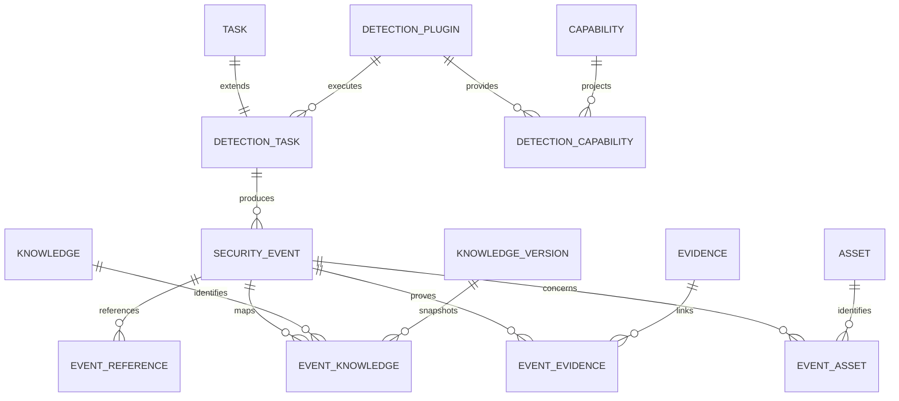

# Phase 9 Development Report

## Phase 信息

- 项目：Cyber Agent Platform（CAP）
- 阶段：Phase 9 — Detection Framework（统一检测分析框架）
- 状态：Engineer 实现与验证完成，等待 Architect Review
- 阶段边界：仅建设 Framework；只注册不访问网络的 `FakeDetectionPlugin`；未接入 Suricata、Zeek、Sigma、YARA、Elastic、Splunk、Wazuh 或任何真实检测工具；未进入 Phase 10
- 架构变化：新增独立 Detection Bounded Context、统一 SecurityEvent、规则关联引擎、Detection Plugin SDK、持久化、API、配置与审计投影
- 影响模块：Runtime/Workflow/Capability/Asset/Knowledge/Evidence/Audit/Configuration/API/Database；Assessment 与 Finding 模型未被修改或复用
- Breaking Change：无；仅新增模块、路由、表、枚举和配置
- 数据库变更：新增 8 张表；Alembic `20260731_0011`，上游 `20260731_0010`
- 配置变更：新增 `backend/config/detection.yaml`
- 风险等级：Framework 可验收；真实插件隔离、流式背压、分布式限速与生产保留清理仍需未来阶段评审

### 本阶段 Tree

```text
backend/app/detection/
├── __init__.py
├── contracts.py
├── correlation.py
├── fake_plugin.py
├── normalizer.py
├── planner.py
├── registry.py
├── runtime.py
└── service.py
backend/app/api/routes/detection.py
backend/app/models/detection.py
backend/app/repositories/detection.py
backend/app/schemas/detection.py
backend/config/detection.yaml
backend/alembic/versions/20260731_0011_detection_framework.py
backend/phase9-upgrade.sql
backend/phase9-downgrade.sql
backend/tests/test_phase_9_detection.py
docs/adr/ADR-0020-assessment-detection-domain-separation.md
docs/adr/ADR-0021-security-event-unified-model.md
docs/phase-9-detection-framework.md
docs/Phase 9 Development Report.md
```

## 1. Acceptance Checklist

- [x] 分析 Suricata Alert/Flow/EVE JSON、Zeek Log/Connection/Event、Sigma Rule/Metadata、TheHive Alert/Observable/Case、Wazuh Event/Rule/Correlation
- [x] 建立 DetectionService、Registry、Runtime、Planner、Policy、Plugin、Result
- [x] 注册八个 Detection Capability
- [x] 实现 initialize/collect/parse/detect/normalize/shutdown 生命周期
- [x] Plugin 无数据库、Workflow、Assessment、Report、Incident 权限
- [x] 建立统一 SecurityEvent；不把工具原始数据保存为最终模型
- [x] 建立时间/Asset/Source/IOC/Rule 规则关联，不使用 AI
- [x] 建立六个要求的 Detection API 与八张表
- [x] 完成安全边界、互操作、架构取舍、数据模型演进分析
- [x] 新增 ADR-0020、ADR-0021
- [x] 专项 7 passed；全量 141 passed；应用覆盖率 95%；Ruff/Black/compileall/Alembic 全部通过

## 2. GitHub Reference Analysis

Suricata 将协议处理和异构 EVE JSON 输出分离，Alert/Flow 是时间观测而非 Incident；Zeek 以事件驱动分析和 typed log stream 表达 Connection/Event；Sigma 是包含 log source、detection expression 和 metadata 的可移植规则规范，不是执行或存储引擎；TheHive 明确区分 Alert、Observable、Case，支持“检测事件不得由 Plugin 直接升级为 Case”；Wazuh 的 decoder/rule/frequency/timeframe 结构支持解析、规则和关联职责分离。CAP 据此采用 `source record -> DetectionResult -> SecurityEvent` 反腐层，不复制任何工具原生 schema。完整分析见 `docs/phase-9-detection-framework.md`。

## 3. Detection Framework Architecture

```text
Workflow -> DetectionPlanner -> Capability Registry -> DetectionRegistry
         -> DetectionRuntime -> DetectionPlugin -> DetectionResult
         -> DetectionResultNormalizer -> SecurityEvent
         -> RuleBasedCorrelationEngine
         -> Evidence + KnowledgeVersion + Asset -> Report/Audit consumers
```

Framework 遵循 Interface First、Plugin First 和 Service Layer。Registry 负责受控注册与确定性解析；Planner 在生成计划前验证 Capability/Plugin/Log Source/Parser；Runtime 执行六阶段生命周期并治理权限、超时、数量、大小、采样和速率；Service 独占 ORM、事务、跨域 ID 验证、持久化、关联和审计。

## 4. Security Boundary Analysis

`DetectionPluginContext` 是 frozen/slots 最小权限 DTO，只含 detection/task/asset/trace ID、Capability、Policy、input 和权限名称。它不含 AsyncSession、Repository、WorkflowService、AssessmentService、ReportService 或 IncidentService。Registry 仅允许 `detection.execute`、`evidence.read`；显式拒绝 `database.access`、`workflow.access`、`assessment.access`、`report.generate`、`incident.create`、`shell.execute`、`filesystem.write` 及其他未声明权限。

Plugin 不能访问 Workflow，因为它不得修改编排图、重试或跨 Agent 调用；不能访问数据库，因为否则会绕过关系验证、审计和事务；不能访问 Assessment，因为检测观察不能隐式触发主动扫描或产生 Finding；不能访问 Report，因为报告是平台对已验证实体的投影。Plugin 只能返回 DetectionResult，由 Runtime 验证身份与预算，再由 Service 创建 SecurityEvent；因此 Plugin 也不能创建 Incident/Case。

## 5. Interoperability Analysis

DetectionTask 通过一对一 `task_id` 复用平台 Task，Workflow 只依赖 Capability 和任务状态；八个 `*.detect` Capability 继续由统一 Capability Registry 治理。每个任务必须绑定现有主 Asset，每个 Event 必须保留该主 Asset且附加 Asset 也必须存在且未删除。Evidence 和 Knowledge 只接受现有 ID；Knowledge 关系固定到 exact current KnowledgeVersion。完整原始日志/包/工具 payload 应进入 Evidence/object storage，SecurityEvent 仅保留规范化事实。

Event 不是 Finding：Event 回答“何时、何源观察到什么”，生命周期是 NEW/CORRELATED/TRIAGED/IGNORED/ARCHIVED；Finding 回答“评估确认了什么弱点或风险”，面向整改、风险和去重。Finding 不能替代 Event，否则高频瞬时遥测会污染漏洞风险和整改状态；SecurityEvent 也不能替代 Finding，因为观察不等于持久弱点结论。

## 6. Architecture Trade-off Analysis

- 独立 Detection Context 而非扩展 Assessment：增加显式映射，但保持 Event/Finding 语义和生命周期正确。
- 统一 SecurityEvent 而非工具表：牺牲部分工具原生细节，换取稳定跨工具契约；完整细节转 Evidence。
- Phase 9 使用进程内 Fake Plugin：适合验证接口，但不等于真实第三方代码隔离。
- 同步可选执行：便于 Framework 验收；高吞吐队列、流式消费、checkpoint 和 backpressure 后续实现。
- 规则关联而非 AI：结果可解释、可重现、可审计，但不推断复杂攻击链。
- 持久化每个规范化事件：保留时序证据和查询能力，但生产规模需要分区、归档与 retention worker。

## 7. Data Model Evolution Analysis

Phase 9 新增 Detection bounded context，不修改 Assessment 表。`detection_tasks` 扩展 Task；`detection_plugins` 与 `detection_capabilities` 表达受治理插件及平台 Capability 投影；`security_events` 保存统一时间事实；四类 link table 连接 Reference、KnowledgeVersion、Evidence 和 Asset。SecurityEvent 不保存 Incident/Case 状态，不复制 Finding 状态，不持久化嵌套工具原始文档。未来通过独立 migration 增加分区、事件 lineage、持久化 correlation group、stream checkpoint 和 retention job，避免用 attributes 承载核心关系。

## 8. Detection Plugin SDK and Lifecycle

`DetectionPlugin` Protocol 固定生命周期：

```python
initialize(context)
collect(context) -> list[DetectionRecord]
parse(records, context) -> list[DetectionRecord]
detect(records, context) -> DetectionResult
normalize(result) -> DetectionResult
shutdown()
```

Runtime 在 `finally` 中 shutdown；初始化成功后无论超时、身份不符、数量/大小超限都释放生命周期。Runtime 校验 `detection.execute` 与注册权限完全一致。`FakeDetectionPlugin` 只读取 `context.input["fake_events"]`，不访问网络、进程、文件系统或真实工具。

## 9. Capability, Registry and Planner

Capabilities：`network.detect`、`host.detect`、`log.detect`、`ids.detect`、`traffic.detect`、`event.detect`、`ioc.detect`、`rule.detect`。Registry 拒绝空身份、未知 Capability、重复注册和越权权限，并按 `(name, version)` 确定性解析。Planner 按 Policy fail closed 校验 Capability allowlist、allowed plugin、log source、parser 及 Plugin coverage，输出六阶段步骤和 Policy limits。

## 10. SecurityEvent and Normalization

统一字段覆盖：`id`、`event_type`、`source`、`severity`、`confidence`、`timestamp`、Asset/Knowledge/Evidence、Plugin、Tool、References、Status、Attributes，并增加 `fingerprint`、`rule`、`detection_task_id`。时间统一转换为 UTC；event type/source 规范化；Reference/IOC 去重排序；attributes 最多 100 项，只保留有界 scalar/list，丢弃 nested tool-native tree。SHA-256 指纹由 Asset、event type、Plugin、Rule、Source、tool unique ID 构成，属性变化不破坏稳定身份。

## 11. Rule-Based Correlation Engine

`RuleBasedCorrelationEngine` 在配置时间窗口内按相同 Asset、Source、IOC、Rule 分组，至少两个事件才生成 CorrelationGroup；窗口外事件不关联。匹配事件状态更新为 CORRELATED，并发布 `SecurityEventsCorrelated` 审计事件。引擎不使用 AI、不判断因果、不创建 Incident/Case、不执行响应动作；CorrelationGroup 当前为 DTO/审计 payload，不是独立持久化表。

## 12. Detection Policy and Configuration

`backend/config/detection.yaml` 的强类型 Policy 包含 Capability、Log Source、Plugin、Parser allowlist，sampling rate、max event size、rate limit、retention days、timeout、max events、correlation window。Planner 执行身份/来源/解析器/Capability 门禁；Runtime 执行 timeout/count/size、确定性 sampling 和单执行批次 rate bound。`retention_days` 持久化为平台清理器依据，Plugin 永远不能删除事件。当前 rate bound 不是分布式 token bucket，已列为 Technical Debt。

## 13. Database Design and Migration

主要字段：

- DetectionPlugin：name/version/description/enabled/permissions/configuration
- DetectionCapability：plugin_id/capability_id/configuration
- DetectionTask：task_id/plugin_id/status/requested_capabilities/policy/plan/result_summary/start/finish/error
- SecurityEvent：detection_task_id/fingerprint/event_type/source/severity/confidence/timestamp/plugin/tool/rule/status/attributes
- EventReference：event_id/url
- EventKnowledge：event_id/knowledge_id/knowledge_version_id
- EventEvidence：event_id/evidence_id
- EventAsset：event_id/asset_id



Migration `20260731_0011` 创建 8 张表及外键、索引、唯一约束、CheckConstraint 和完整 downgrade；`alembic heads` 返回唯一 `20260731_0011 (head)`。离线 upgrade/downgrade SQL 均成功生成并以 COMMIT 结束。

## 14. API Design

新增：`POST /detection/tasks`、`GET /detection/tasks`、`GET /detection/events`、`GET /detection/events/{id}`、`GET /detection/plugins`、`GET /detection/capabilities`。Event 列表支持 severity/status/asset_id 与分页；应用启动验证共 74 条路由，Detection 正好 6 条。

请求示例：

```json
{
  "name": "Synthetic network detection",
  "asset_id": "11111111-1111-1111-1111-111111111111",
  "capabilities": ["network.detect", "ioc.detect"],
  "log_source": "synthetic",
  "parser": "structured-json",
  "execute": true,
  "input": {"fake_events": [{"event_type": "network.alert", "source": "synthetic", "severity": "HIGH", "timestamp": "2026-07-31T08:00:00Z"}]}
}
```

响应摘要示例：

```json
{
  "status": "SUCCESS",
  "requested_capabilities": ["network.detect", "ioc.detect"],
  "result_summary": {"success": true, "events": 1, "correlation_groups": 0, "records_collected": 1}
}
```

未知 Asset 返回 `ASSET_NOT_FOUND`；未知 Event 返回 `SECURITY_EVENT_NOT_FOUND`；额外 `target` 字段因 `extra="forbid"` 返回 422；Policy 违反返回 `DETECTION_POLICY_VIOLATION`。

## 15. Service, Audit and Core Code

DetectionService 的闭环为：bootstrap Plugin/Capability -> 创建 Task/DetectionTask -> Planner -> Runtime -> Normalizer -> 验证 Asset/Evidence/KnowledgeVersion -> 持久化 SecurityEvent -> Correlation -> 状态更新 -> 事务审计。新增审计事件：DetectionTaskCreated、DetectionExecutionStarted、DetectionExecutionFailed、DetectionResultNormalized、SecurityEventCreated、SecurityEventsCorrelated。Repository 提供 Task 分页、Event eager detail、severity/status/asset 查询和 enabled Plugin 查询；API/ORM 不承载业务规则。

## 16. Docker, Deployment and Operational Boundary

Phase 9 无新容器、端口、凭据和外部服务；沿用现有 FastAPI/PostgreSQL/Redis 部署。`FakeDetectionPlugin` 的持久化配置明确 `network_access=false`、`real_tool=false`。生产接入真实 detector 前必须增加独立 Worker/Sandbox Provider、只读或最小权限 telemetry source、网络/文件系统隔离、CPU/Memory/Timeout、队列/backpressure、健康检查、版本固定、升级/回滚和 Evidence 保留方案；未经 Architect Review 不得直接把真实工具注册到当前进程内 Runtime。

## 17. Test, Quality and Security Verification

- Phase 9 专项：7 passed；覆盖 Policy、Registry、Planner、六阶段 Runtime、permission/timeout/identity/count/size、sampling/rate、UTC、Normalizer、fingerprint、Correlation、API、Audit、Knowledge/Evidence/Asset、ORM、Migration、错误契约。
- Phase 0–9 全量：141 passed in 62.88s，0 failed、0 error。
- 应用覆盖率（greenlet-aware）：6479 statements / 347 missed / 95%；`--fail-under=95` 通过。
- Detection 路由覆盖率 100%；Detection Runtime 100%；ORM 100%；Repository 100%；Schema 99%。
- Ruff：All checks passed。
- Black：212 files would be left unchanged。
- compileall：通过。
- Alembic：唯一 head `20260731_0011`；upgrade/downgrade SQL 通过。
- 安全：Detection 核心源码无 Suricata/Zeek/Sigma/YARA/Elastic/Splunk/Wazuh、网络客户端或 subprocess 引用；所有事件为 synthetic fixture，无网络访问、无真实检测、无主动扫描。

## 18. Known Issues, Technical Debt, Deliverables and Architect Review

Known Issues / Technical Debt：真实插件硬隔离未实现；全局分布式 rate limit/backpressure 未实现；retention cleanup worker 未实现；CorrelationGroup 未持久化；ReportService 暂未渲染 SecurityEvent；无 Incident/Case/Response；sampling 依赖规范化 Event JSON，生产应优先使用稳定 source event ID；当前同步可选执行不适合大规模流式遥测。

后续建议仅供 Architect 裁决，不代表进入 Phase 10：评审真实工具的隔离 Worker/Adapter 标准、流式 ingestion/partition/retention、CorrelationGroup 模型、Event-to-Incident 审批边界和 Report 投影。不得在 Phase 9 后直接接入 Suricata/Zeek/Sigma 或响应执行器。

交付物包括 Detection 核心 9 个模块、Schema/Enums/Exceptions、8 个 ORM、3 个 Repository、Migration 与双向 SQL、6 个 API、DI/Config/Audit 集成、Fake Plugin、专项测试、ADR-0020、ADR-0021、分析文档和本报告。

建议 Architect 重点审查：1) Assessment/Detection 分域；2) Context 与 Permission denylist；3) DetectionResult-only 边界；4) SecurityEvent 统一模型及 raw payload 丢弃；5) Event/Finding 不可替代性；6) 规则关联的确定性和 Incident 禁止；7) Policy 执行语义；8) 八表关系与 KnowledgeVersion snapshot；9) 真实插件前置隔离门禁。

Engineer 已完成 Phase 9 并停止开发。不得进入 Phase 10，等待 Architect Review Report、修复意见和明确的 `✅ Phase Passed` 结论。
