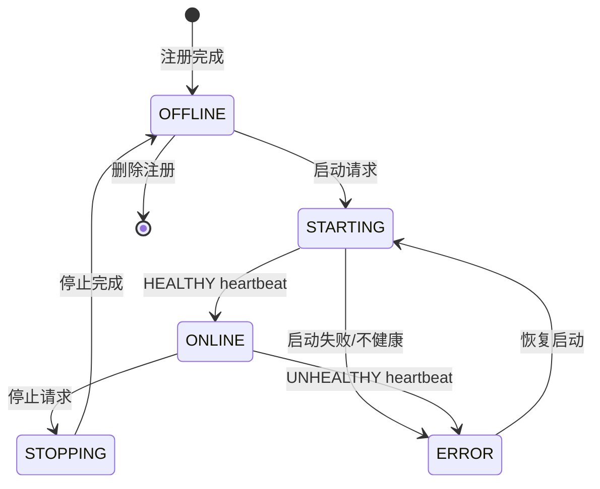

# Agent 生命周期

## 规则

- 新注册 Agent 默认 `OFFLINE`，不会因为注册成功而变为可调度。
- 只有 `ONLINE` 且权限覆盖任务所需权限的 Agent 才可被 Dispatcher 选择。
- `HEALTHY` heartbeat 会更新 `heartbeat_time` 并将 Agent 标记为 `ONLINE`。
- 在线 Agent 上报非健康状态时转为 `ERROR`，从调度候选中移除。
- 高风险动作由 `approval_policy` 描述；Phase 1 不执行高风险动作。
- Agent 名称为稳定身份，版本更新写入 `AgentVersion` 追加历史并更新当前版本快照。
