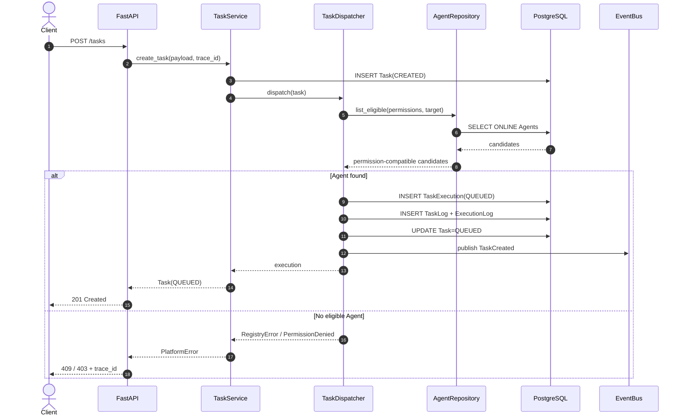

# Phase 1 Task Dispatch Sequence

```mermaid
sequenceDiagram
    autonumber
    actor Client
    participant API as FastAPI
    participant Service as TaskService
    participant Dispatcher as TaskDispatcher
    participant Registry as AgentRepository
    participant DB as PostgreSQL
    participant Bus as EventBus

    Client->>API: POST /tasks
    API->>Service: create_task(payload, trace_id)
    Service->>DB: INSERT Task(CREATED)
    Service->>Dispatcher: dispatch(task)
    Dispatcher->>Registry: list_eligible(permissions, target)
    Registry->>DB: SELECT ONLINE Agents
    DB-->>Registry: candidates
    Registry-->>Dispatcher: permission-compatible candidates
    alt Agent found
        Dispatcher->>DB: INSERT TaskExecution(QUEUED)
        Dispatcher->>DB: INSERT TaskLog + ExecutionLog
        Dispatcher->>DB: UPDATE Task=QUEUED
        Dispatcher->>Bus: publish TaskCreated
        Dispatcher-->>Service: execution
        Service-->>API: Task(QUEUED)
        API-->>Client: 201 Created
    else No eligible Agent
        Dispatcher-->>Service: RegistryError / PermissionDenied
        Service-->>API: PlatformError
        API-->>Client: 409 / 403 + trace_id
    end
```
