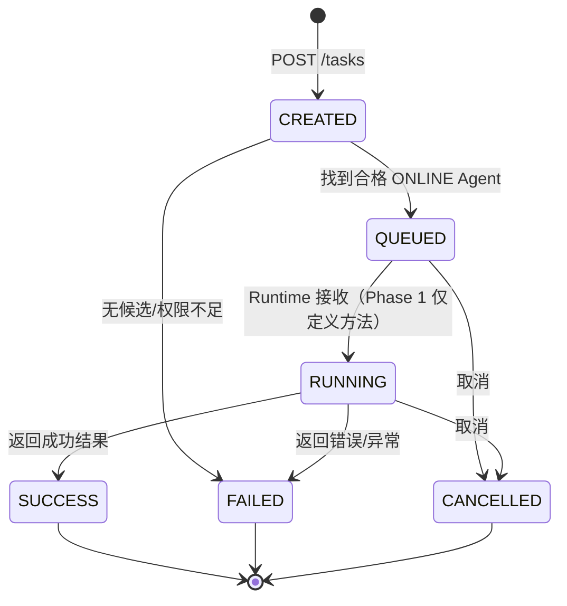

# Task 生命周期

## Phase 1 行为

- API 创建 `CREATED` Task。
- Dispatcher 根据 `target_agent_id`、Agent `ONLINE` 状态和权限集合选择 Agent。
- 找到 Agent 后创建 `TaskExecution`、`TaskLog` 和 `ExecutionLog`，Task 进入 `QUEUED`。
- Phase 1 不调用 Agent Runtime，因此 API 流程不会自动进入 `RUNNING` 或终态。
- Dispatcher 已提供 `mark_running` 和 `mark_finished` 方法，为后续 Runtime Adapter 注入保留接口。
