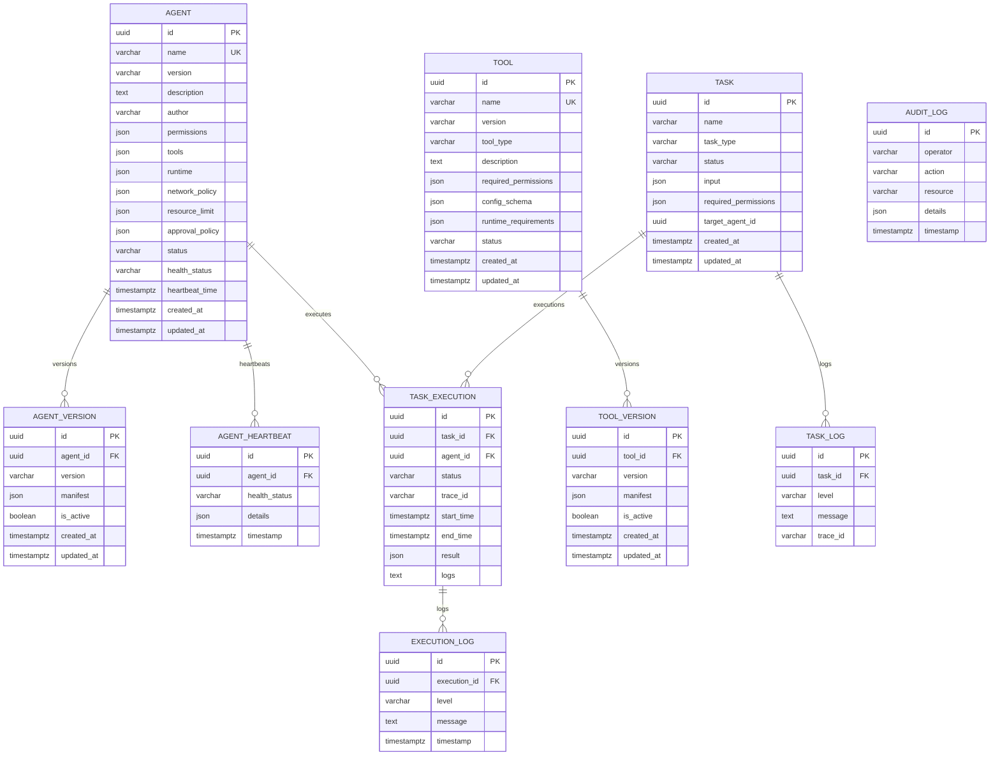

# CAP Phase 1 数据库 ER 图

## 约束说明

- `Agent.name` 与 `Tool.name` 是稳定唯一身份；当前版本在主表，历史 Manifest 追加至 Version 表。
- `(agent_id, version)` 与 `(tool_id, version)` 唯一。
- Task 删除时级联 TaskExecution/TaskLog/ExecutionLog；被执行记录引用的 Agent 限制删除。
- Heartbeat 是追加记录，同时更新 Agent 当前健康快照。
- `target_agent_id` 在 Phase 1 是可选调度偏好，未设数据库外键，以便未来支持逻辑 Agent 池；由 Service 校验实际 Agent。
