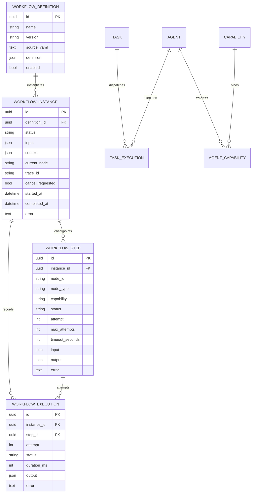

# Phase 3 Database ER

`WorkflowStep(instance_id, node_id)` 唯一，保存节点最新 checkpoint；`WorkflowExecution` 追加保存每次 attempt。Workflow 与 Task 不建立永久外键，因为 Workflow Step 通过 Capability 动态生成 Task，Agent 选择属于每次调度历史而非 Definition 静态结构。
