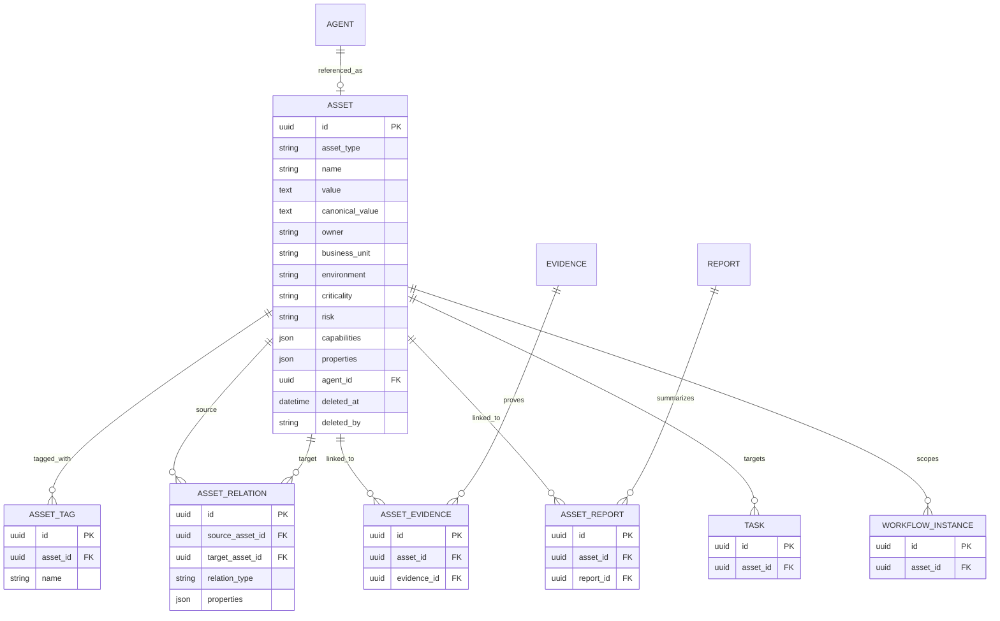

# Phase 4 Asset Center Database ER

## Identity 与约束

- `assets(asset_type, canonical_value)` 唯一，防止同类型规范身份重复；
- `assets.agent_id` 唯一且可空，只有 `AGENT` Asset 可引用 Agent；
- `asset_relations(source_asset_id, target_asset_id, relation_type)` 唯一；
- `asset_tags(asset_id, name)` 唯一；
- `asset_evidence(asset_id, evidence_id)` 与 `asset_reports(asset_id, report_id)` 唯一；
- Asset、Relation、Task 与 Workflow 外键使用 `RESTRICT`，符合 Soft Delete 治理；
- Tag 在 Asset 被物理清理时使用 `CASCADE`，但正常业务路径不物理删除 Asset；
- Evidence/Report 删除时关联记录使用 `CASCADE`，不反向删除 Asset。

## Migration

- Revision：`20260730_0007`
- Down revision：`20260730_0006`
- 新建：`assets`、`asset_relations`、`asset_tags`、`asset_evidence`、`asset_reports`；
- 变更：`tasks.asset_id`、`workflow_instances.asset_id`；
- Upgrade 与 downgrade 均显式创建/移除索引、外键和列。

## 兼容策略

`tasks.asset_id` 和 `workflow_instances.asset_id` 在 Phase 4 保持可空，以兼容 Phase 1—3 历史数据与未指定目标的通用 Workflow。任何提供了 `asset_id` 的新执行都必须验证 Asset 存在且未软删除，并在 Dispatcher、Runtime、Agent、Evidence 与 Report 链路中传播。
