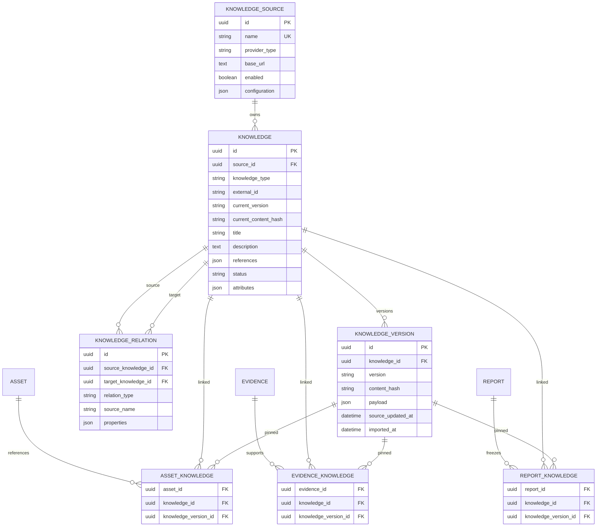

# Phase 5 Database ER

Core uniqueness:

- Knowledge: `(source_id, knowledge_type, external_id)`
- Version snapshot: `(knowledge_id, version, content_hash)`
- Relation: `(source_knowledge_id, target_knowledge_id, relation_type)`
- Cross-domain links: `(owner_id, knowledge_id)`
