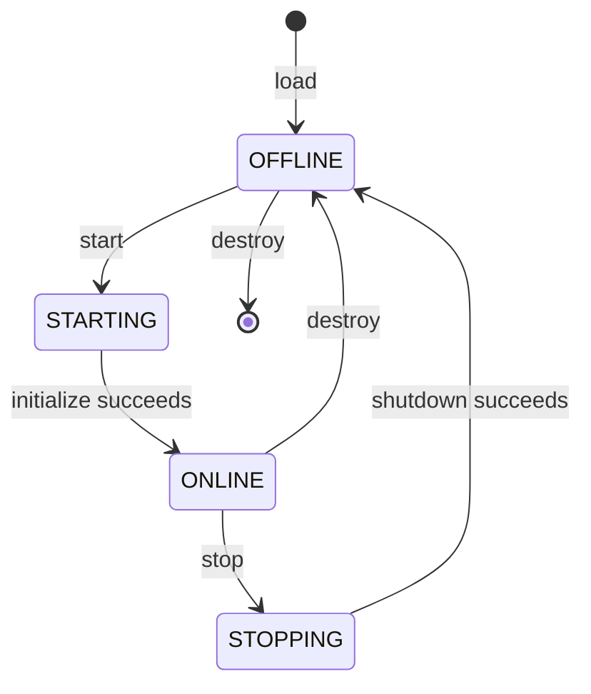

# Runtime Lifecycle

`reload` stops the current instance, validates the manifest again, replaces the implementation, and leaves it ready for a later start. Invalid manifests and unsupported entrypoints fail before an Agent is invoked.

RuntimeContext no longer exposes a concrete Tool Adapter. It exposes a typed ServiceProvider; Agent resolves ToolManager and platform services explicitly. RuntimeManager owns Agent instances, ToolManager owns Adapter instances, and BrowserManager owns Playwright Browser/BrowserContext resources. The request-scoped dependency cleanup calls `ToolManager.shutdown_all()` so Tool resources are released even when execution fails.
