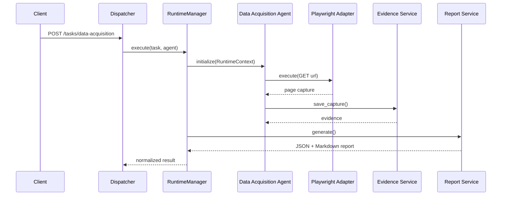

# Data Acquisition Execution Sequence

```mermaid
sequenceDiagram
    participant C as Client
    participant D as Dispatcher
    participant R as RuntimeManager
    participant A as Data Acquisition Agent
    participant P as Playwright Adapter
    participant E as Evidence Service
    participant O as Report Service

    C->>D: POST /tasks/data-acquisition
    D->>R: execute(task, agent)
    R->>A: initialize(RuntimeContext)
    A->>P: execute(GET url)
    P-->>A: page capture
    A->>E: save_capture()
    E-->>A: evidence
    R->>O: generate()
    O-->>R: JSON + Markdown report
    R-->>D: normalized result
```

All Runtime, tool, evidence, report, and task events are published and handled by the existing AuditSubscriber.
