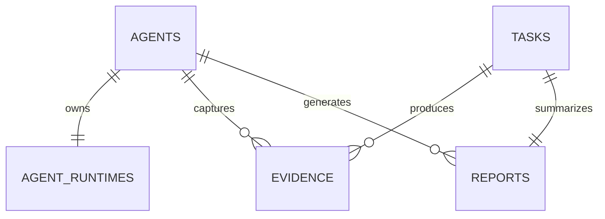

# CAP Agent Runtime

RuntimeManager is the sole in-process owner of a loaded Agent. It provides `load`, `start`, `stop`, `restart`, `health`, `reload`, and `destroy` operations.

The Dispatcher selects an eligible Agent and creates an execution record, then invokes the injected RuntimeService. It never imports or calls an Agent implementation directly.

Runtime state is persisted in `agent_runtimes`; Agent registry state remains the durable control-plane identity.

