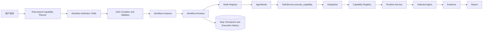
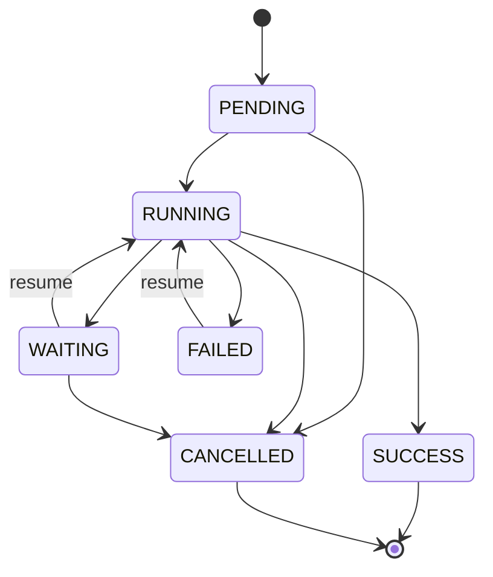

# Phase 3 Workflow Engine

## 执行架构

## YAML

支持显式 DAG 和简洁 capability sequence。`yaml.safe_load` 后必须通过 Pydantic 契约和 DAG 校验。YAML 1.1 中 `yes/no/on/off` 可能被解析为布尔值，作为 Node ID 时必须加引号或使用非保留字。

## Node 类型

- StartNode：初始化执行起点；
- AgentNode：提交 Capability 任务到 Dispatcher/Runtime；
- ConditionNode：支持受限的 `path == literal` 条件语言；
- ApprovalNode：Phase 3 空实现，将实例持久化为 WAITING；
- EndNode：标记 DAG 正常结束。

NodeRegistry 是插件边界。新增节点类型必须实现统一异步 Handler，并通过稳定 `WorkflowNodeType` 注册。

## 状态机

每个节点 Attempt 写入 `workflow_executions`；节点最新 checkpoint 写入 `workflow_steps`。恢复时保留 SUCCESS/SKIPPED 节点，仅重置 FAILED 或 WAITING 节点，避免重复执行已完成节点。

## Retry / Timeout / Cancel / Resume

- Retry：每节点独立 `max_attempts` 和 `delay_seconds`，最大 10 次；
- Timeout：`asyncio.wait_for`，每节点 1–3600 秒；
- Cancel：设置持久化 cancel flag，并将未完成 Step 标为 CANCELLED；
- Resume：重新读取 Definition 与 Step checkpoint，从最后一个未完成节点继续；
- Failure：保存错误、Attempt、耗时和实例 FAILED 状态。

## 安全边界

- 不执行 YAML 中的 Python 表达式；
- 不使用 `eval`；
- 不允许环；
- AgentNode 不接受 Agent ID；
- Workflow 不直接调用 Agent；
- Phase 3 不含 LLM、Memory、RAG 或新增安全 Agent。
