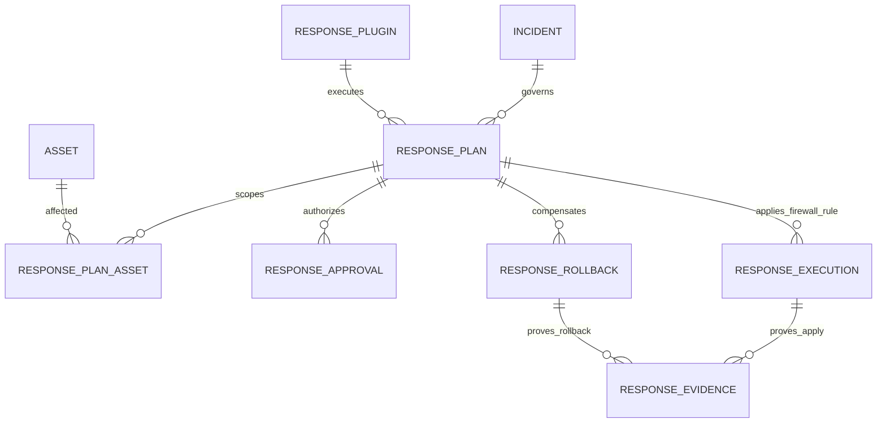

# Phase 17 Development Report

## 1. Phase 信息

- 项目：Cyber Agent Platform（CAP）
- 阶段：Phase 17
- 主题：Firewall Response Plugin（第二个真实类型 Response Plugin）
- 状态：开发与工程验收完成，等待 Architect Review
- 阶段门禁：Phase 14 Response Framework、Phase 15 Notification & Ticket Framework、Phase 16 WAF Response Plugin 均已获 Architect 通过后启动
- 明确边界：仅实现 Firewall Response Plugin；未进入 Phase 18；未连接、读取或修改任何真实生产防火墙；未修改 Response Framework 核心源码

## 2. 本阶段完成内容

1. 新增 Provider-neutral、不可变、严格校验的 `FirewallRule`，统一描述 Action、Direction、CIDR、Protocol、Ports、Table、Chain、Priority、Version、Status、Impact Scope 与 checksum。
2. 新增 `FirewallPolicy` 与 `FirewallPolicyProvider`，实现 Action、Direction、Protocol、Table、Chain、Priority、Ports、Rollback Action 等 allowlist 治理。
3. 新增管理面保护：拒绝默认路由、任意网络、过宽 CIDR、管理/控制面网络、回环/链路本地/组播网络、受保护管理端口和 ANY 协议拒绝规则。
4. 新增无网络、无生产访问、无凭据、无 Shell、无文件写入、无数据库副作用的 `MockFirewallProvider`。
5. 新增 `FirewallAdapter`，负责强类型解析、Policy 校验、Apply、Read-back Verification、Rollback 和 Rollback Verification。
6. 新增 `FirewallResponsePlugin`，完整实现既有 Response SDK 生命周期：`initialize/plan/validate/execute/verify/rollback/shutdown/health`。
7. 注册 Capability `response.firewall`，沿用既有 Approval、Runtime、Evidence、Audit、Rollback 治理链路。
8. 实现 `REMOVE`、`DISABLE`、`RESTORE` 三种受控回滚，回滚操作均执行 Provider 状态回读验证。
9. 强制 Firewall Rule `impact_scope` 与不可变 Response Plan Asset scope 完全一致，拒绝 Scope Expansion。
10. Evidence 记录操作、规则快照、checksum、Provider Reference、变更标志、时间、影响范围及 `network_access=false`、`production_access=false`。
11. 新增 Manifest、运营说明、ADR-0036、Firewall Architecture and Safety Case，以及 nftables、iptables、pfSense、OPNsense、OPA 架构分析。
12. 新增 Phase 17 专项测试并更新 Phase 14 阶段演进断言，完成联合回归、全量回归及精确覆盖率门禁。

## 3. Tree 项目目录结构

```text
cyber-agent-platform/
├── backend/
│   ├── app/
│   │   ├── dependencies/
│   │   │   └── services.py                       # 注册 Firewall Plugin；App-scoped Mock Provider
│   │   ├── plugins/
│   │   │   └── firewall/
│   │   │       ├── __init__.py
│   │   │       └── plugin.py                     # FirewallResponsePlugin
│   │   └── tools/
│   │       └── firewall/
│   │           ├── __init__.py
│   │           ├── adapter.py                    # FirewallAdapter
│   │           ├── contracts.py                  # Rule / Action / Direction / Protocol / Change
│   │           ├── policy.py                     # FirewallPolicy / FirewallPolicyProvider
│   │           └── provider.py                   # MockFirewallProvider
│   ├── config/
│   │   └── response.yaml                         # response.firewall 允许且强制审批
│   └── tests/
│       ├── test_phase_14_response.py             # 历史断言适配第三个认证插件
│       └── test_phase_17_firewall_response.py    # Phase 17 专项验收
├── plugins/
│   └── response/
│       └── firewall/
│           ├── manifest.yaml
│           └── README.md
├── docs/
│   ├── adr/
│   │   └── ADR-0036-firewall-response-plugin-boundary.md
│   └── phase-17-firewall-response-plugin.md
└── outputs/
    └── Phase 17 Development Report.md
```

## 4. 技术实现说明

### 4.1 分层与依赖方向

```text
ResponseService / ResponseRuntime（既有，不修改）
                         ↓
              FirewallResponsePlugin
                         ↓
                  FirewallAdapter
                   ↙             ↘
      FirewallPolicyProvider   MockFirewallProvider
                         ↓
             FirewallRule / FirewallRuleChange
```

职责边界：

- Plugin：Response SDK 生命周期适配、不可变 Scope 校验、Evidence/Result 组织、Rollback Token 绑定。
- Adapter：参数解析、Policy-first 调用、Provider-neutral Apply/Verify/Rollback。
- Policy：授权与安全决策，默认拒绝不在 allowlist 或可能导致管理面锁死、影响面过大的规则。
- Provider：维护应用实例内的合成 observed state，不接触真实网络设备。
- Response Framework：继续负责审批、执行门禁、持久化、审计、Evidence、Rollback 编排；本阶段未修改。

### 4.2 FirewallRule

`FirewallRule` 使用 Pydantic frozen model 与 `extra="forbid"`，包含：

- 身份：`id`、`name`、`version`；
- 动作：`BLOCK`、`REJECT`、`LOG`；
- 方向：`INGRESS`、`EGRESS`、`FORWARD`；
- 匹配：`source`、`destination`、`protocol`、`source_ports`、`destination_ports`；
- 放置：`table`、`chain`、`priority`；
- 生命周期：`ENABLED`、`DISABLED`、`REMOVED`；
- 治理：`impact_scope`、canonical SHA-256 `checksum`。

规范化在 checksum 前执行：

- CIDR 使用 `ipaddress.ip_network(..., strict=False)` 标准化；
- 端口去重并排序；
- `impact_scope` 去空、去重并排序；
- Enum 使用稳定字符串值；
- canonical JSON 使用稳定 key 排序和紧凑分隔符。

`status` 不参与 checksum，使同一语义规则在 Enabled/Disabled/Removed 生命周期中保持身份稳定。

### 4.3 Provider-neutral 约束

Phase 17 仅允许：

- `filter` table；
- Ingress → `INPUT`、Egress → `OUTPUT`、Forward → `FORWARD`；
- 明确且有界的 IPv4/IPv6 CIDR；
- 有界端口集合、优先级和影响资产集合。

不表达或不允许：

- raw nft/iptables 命令；
- NAT；
- 默认 Chain Policy 修改；
- Table Flush、Chain Delete；
- 任意 Target、脚本、模板或动态代码；
- 实时连接跟踪表重置；
- 真实 Provider Credential 或网络连接。

### 4.4 Firewall Policy

默认 Policy：

- `enabled=true`；
- `mock_only=true` 且不可关闭；
- Action allowlist：`BLOCK/REJECT/LOG`；
- Direction、Protocol、Table、Chain、Rollback Action 均使用非空 allowlist；
- 最大 Priority：10000；
- 单一方向端口上限：16；
- 所有规则变更必须审批；
- Rollback 仅允许 `REMOVE/DISABLE/RESTORE`。

管理面和爆炸半径控制：

- 拒绝 `any`、`*`、`0.0.0.0/0`、`::/0`；
- IPv4 前缀不得宽于 `/8`，IPv6 不得宽于 `/32`；
- 保护管理网段 `10.255.0.0/16`、`192.0.2.0/24`、`2001:db8:ffff::/48`；
- 保护 loopback、link-local、multicast；
- 阻断动作不得涉及管理端口 22、3389、443、8443；
- 禁止 `ANY` 协议的无端口 BLOCK/REJECT；
- 禁止 Provider-owned Rule ID；
- 禁止已启用同 ID 规则被不同 checksum 静默替换。

### 4.5 Provider 与生命周期

`MockFirewallProvider` 通过 `request.app.state.mock_firewall_provider` 作为 App-scoped 依赖注入：

- Execute 与 Rollback 跨 API 请求共享同一合成状态；
- 不同 FastAPI 应用实例之间相互隔离；
- 应用重启后状态丢失符合 Synthetic Certification 预期。

Provider 强制声明：

```text
network_access = false
production_access = false
```

Manifest 同时声明无 database/incident/asset/report write、无 shell execute、无 filesystem write。Plugin `health()` 对网络和生产访问边界进行运行时校验。

### 4.6 Verification

Apply 后，Adapter 从 Provider 回读 observed state，要求：

- Rule 完整相等；
- Status 为 `ENABLED`。

Rollback 后分别要求：

- Remove：Status 为 `REMOVED`；
- Disable：Status 为 `DISABLED`；
- Restore：Observed Rule 与原始 validated Rule 完全相等。

Response Runtime 继续执行 Verified、Evidence 上限、Result 身份、Capability、一致性、JSON 可序列化与尺寸约束。成功但未验证的结果会被 fail closed。

### 4.7 Scope 与 Rollback Token

Plugin 校验：

```text
Rule impact_scope == immutable Response Plan asset_ids
```

不允许子集、超集、通配符或运行时 Scope Expansion。

Rollback Token 绑定：

```text
Response Plan ID + Incident ID + Rule ID + Version + Checksum
```

Token 由 Plugin 签发，由既有 Response Framework 私有持久化；公开 API 结果不暴露 Token。缺少 Token、伪造 Token或绑定字段不匹配均拒绝回滚。

## 5. 数据库设计

### 5.1 本阶段数据库变更

无。

Phase 17 复用 Phase 14 的 8 张 Response 表：

- `response_plugins`
- `response_policies`
- `response_plans`
- `response_plan_assets`
- `response_approvals`
- `response_executions`
- `response_rollbacks`
- `response_evidence`

`FirewallRule` 作为 Plan/Result/Evidence 中的强类型 JSON 内容，不新增 nftables、iptables、pfSense 或 OPNsense 专有表，避免平台核心与具体防火墙产品耦合。

### 5.2 Mermaid ER 图



### 5.3 Migration

- Phase 17 无 migration。
- Alembic 单头：`20260801_0015 (head)`。
- Response 表数量：8。

## 6. API 设计

未新增 API，复用既有 Response Framework 端点：

```text
POST /response/plans
POST /response/plans/{id}/approve
POST /response/plans/{id}/execute
POST /response/plans/{id}/rollback
GET  /response/plans/{id}
GET  /response/plugins
```

### 6.1 创建 Firewall Plan 请求示例

```json
{
  "incident_id": "8bd96922-8b4b-40b4-a31c-58c1b51d70ca",
  "asset_ids": ["5c28df56-460d-43ec-995d-434428866f62"],
  "target_capability": "response.firewall",
  "plugin_name": "firewall-response",
  "requested_by": "firewall-requester@example.test",
  "reason": "Block a confirmed malicious source in the synthetic Firewall provider",
  "risk_level": "HIGH",
  "parameters": {
    "rule": {
      "id": "cap-firewall-rule-001",
      "name": "Block confirmed malicious network source",
      "action": "BLOCK",
      "direction": "INGRESS",
      "source": "203.0.113.9/32",
      "destination": "198.51.100.20/32",
      "protocol": "TCP",
      "source_ports": [],
      "destination_ports": [8080],
      "table": "filter",
      "chain": "INPUT",
      "priority": 500,
      "version": "1.0.0",
      "status": "ENABLED",
      "impact_scope": ["5c28df56-460d-43ec-995d-434428866f62"],
      "checksum": "<64-char-sha256>"
    }
  },
  "rollback_parameters": {"action": "DISABLE"}
}
```

### 6.2 创建响应示例

```json
{
  "target_capability": "response.firewall",
  "approval_state": "PENDING_APPROVAL",
  "execution_state": "BLOCKED",
  "rollback_state": "AVAILABLE",
  "supports_rollback": true,
  "plan": {
    "plugin_name": "firewall-response",
    "approval_required": true,
    "steps": ["initialize", "plan", "validate", "execute", "verify", "shutdown"]
  }
}
```

### 6.3 执行后的 Evidence 示例

```json
{
  "evidence_type": "FIREWALL_RULE_CHANGE",
  "reference": "mock-firewall://tables/filter/chains/INPUT/rules/cap-firewall-rule-001/1.0.0",
  "metadata": {
    "operation": "APPLY",
    "changed": true,
    "provider": "mock-firewall",
    "network_access": false,
    "production_access": false,
    "desired_state": "ENABLED",
    "rule": {
      "id": "cap-firewall-rule-001",
      "status": "ENABLED",
      "checksum": "<sha256>"
    }
  }
}
```

## 7. 核心代码说明

### 7.1 Canonical checksum

```python
def calculate_checksum(self) -> str:
    encoded = json.dumps(
        self.canonical_content(),
        sort_keys=True,
        separators=(",", ":"),
    ).encode("utf-8")
    return hashlib.sha256(encoded).hexdigest()
```

`create()` 在计算 checksum 前规范化 CIDR、端口和 Impact Scope，避免等价输入产生不同身份。

### 7.2 Policy-first apply

```python
async def apply(self, rule: FirewallRule, *, approval_required: bool) -> FirewallRuleChange:
    self._policy.validate_rule(rule, approval_required=approval_required)
    return await self._provider.apply(rule)
```

Provider 操作之前必须通过 Policy；Policy Disabled、Allowlist 不匹配、Approval 缺失或管理面风险均阻止 Provider 调用。

### 7.3 不可变 Scope

```python
expected_scope = {str(item) for item in plan.asset_ids}
if set(rule.impact_scope) != expected_scope:
    raise ResponsePolicyViolation(
        "Firewall rule impact scope must exactly match immutable Asset scope"
    )
```

### 7.4 Apply read-back verification

```python
async def verify_applied(self, rule: FirewallRule) -> bool:
    actual = await self._provider.get(rule.id)
    return actual == rule and actual.status.value == "ENABLED"
```

### 7.5 Mock-only health

```python
async def health(self) -> bool:
    return (
        not self._adapter.provider.network_access
        and not self._adapter.provider.production_access
    )
```

## 8. Docker / 部署

- 无 Docker 镜像、Compose 服务、端口、Secret 或外部 Firewall 依赖变更。
- Mock Provider 在 FastAPI 应用实例内存中运行。
- 无 DNS、HTTP、Socket、SDK、Subprocess 或 Shell 调用。
- 无防火墙凭据、API Token、SSH Key、配置文件或生产设备地址。
- 应用重启后 Mock 状态丢失是预期行为，不适用于生产收敛。
- 未来真实 Provider 必须在 Architect 批准的独立阶段定义网络 allowlist、Credential Provider、TLS、Provider Lock、Atomic Commit/Compensation、Canary、Out-of-band Reachability、State-table Impact、Reconciliation 和 Emergency Bypass。

## 9. 测试情况

### 9.1 Phase 17 专项

```text
14 passed
```

覆盖：

- API Plan → Approval → Execute → Verify → Evidence → Audit → Rollback；
- Incident/Asset 不变性；
- Remove/Disable/Restore 和状态回读；
- checksum 规范化、CIDR 标准化和 strict schema；
- 默认路由、Any Network、过宽 CIDR 拒绝；
- Direction/Chain 不匹配、ICMP/ANY 非法端口拒绝；
- Impact Scope Expansion 拒绝；
- 管理/控制面网段和管理端口锁死保护；
- ANY 协议 Deny 拒绝；
- Provider-owned Rule 拒绝；
- 无效 Rollback Token 拒绝；
- 已启用规则语义替换拒绝；
- Disabled Policy、空 Allowlist、非法保护网段、非法 Rollback、缺失 Provider State 等 fail-closed 分支；
- `network_access=false` / `production_access=false`。

### 9.2 Phase 14 + Phase 16 + Phase 17 联合回归

```text
37 passed
```

验证 Fake、WAF、Firewall 三个已认证 Response Plugin 可同时注册，历史 Response Framework 行为保持兼容。

### 9.3 Phase 0–17 全量回归

```text
231 passed
```

### 9.4 精确覆盖率

```text
11773 statements
574 missed
95.1244%
```

门禁：

```text
coverage report --precision=4 --fail-under=95
```

返回成功，精确覆盖率高于 95.0000%，未依赖整数四舍五入。

### 9.5 静态质量

```text
Ruff: passed
Black: passed (310 files unchanged)
compileall: passed
```

### 9.6 应用与迁移装配

```text
routes=107
response_tables=8
Alembic head=20260801_0015
```

Phase 17 无数据库变更，因此无需新增 Upgrade/Downgrade SQL。

### 9.7 环境说明

验证期间出现过 WorkBuddy/Windows 环境中的外部 500/502/503、pytest 临时目录清理和 Coverage 环境变量污染问题。通过本地结果交叉校验、清除 `COVERAGE_PROCESS_START/COVERAGE_PROCESS_CONFIG`、专项/联合/全量分层验证及独立 Coverage 报告完成确认；最终结果中无测试失败、Error 或未处理 traceback。

## 10. GitHub / Official Reference Analysis

### 10.1 nftables

采用 `Table → Chain → Rule` 的分层思想、显式优先级、Desired Rule 与 Provider Observed State 分离、read-back verification。Phase 17 不开放 raw nft syntax、规则集 flush 或真实 Netfilter hook。

### 10.2 iptables

参考 Table、Built-in/User-defined Chain、ordered match 与 Target/Policy 概念。CAP 将 Target 抽象为 `FirewallAction`，将 Chain 映射到 Direction；Phase 17 拒绝默认 Policy 变更和任意 Target。

### 10.3 pfSense

参考 Interface/Direction/Source/Destination/Protocol/Port 和 Alias 的治理边界。CAP 核心模型保留显式 CIDR，不在本阶段解析或下发 Alias；未来 Adapter 必须将 Alias 解析成员作为 Evidence。

### 10.4 OPNsense

参考 Interface/Floating/Group Rule、Pass/Block/Reject、Quick/Ordering 和 State-table 影响。CAP 要求 Priority 和 Observed Verification；Phase 17 不重置真实 State Table。

### 10.5 Open Policy Agent

采用 Policy Decision 与 Enforcement 分离：`FirewallPolicyProvider` 负责结构化决策，Adapter/Provider 负责执行和观察。Phase 17 不运行 Rego、不连接 OPA。

CAP 采用结论：保存 Provider-neutral Intent；Policy、Enforcement、Observed State 分离；厂商语法不进入 Response Framework；任何真实设备接入必须通过新 ADR 和阶段门禁。

详细分析见：`docs/phase-17-firewall-response-plugin.md`。

## 11. Firewall Rule Safety Analysis

### 11.1 为什么不会误阻断生产

Phase 17 Provider 不含网络客户端、凭据、Shell、Subprocess 或生产地址，物理上无法访问真实防火墙。模型与 Policy 又拒绝默认路由、任意网络、管理网络、管理端口、过宽 CIDR、ANY 协议 Deny、Provider-owned Rule 和静默覆盖。

### 11.2 如何验证

Apply、Remove、Disable、Restore 后从 Mock Provider 回读完整 observed state，比对 Rule、Status、checksum 和 Provider Reference。Response Runtime 拒绝任何成功但 `verified=false` 的结果。

### 11.3 如何回滚

仅允许 `REMOVE/DISABLE/RESTORE`。私有 Token 绑定 Plan、Incident、Rule ID、Version 和 Checksum。Rollback 生成新的 Evidence 与 Audit，并执行独立 read-back verification。

### 11.4 如何避免管理网络锁死

Policy 保护配置的管理 CIDR、loopback、link-local、multicast 和管理端口 22/3389/443/8443；Direction 必须匹配 Chain；Impact Scope 必须与 Plan Asset scope 完全一致。未来生产 Provider 还必须在 Commit 前证明 Out-of-band Management Reachability。

### 11.5 如何限制爆炸半径

CIDR 必须明确且有界；端口数量、Priority、Asset 数量均有限制；不提供 Default Policy、Table Flush、Chain Delete、NAT、任意 Target 或 unrestricted ANY-protocol deny 表达能力；所有变更必须审批。

### 11.6 如何审计影响范围

Response Plan 持久化 Incident 与 Asset scope；Runtime 禁止 Plugin 修改 Scope；Result metadata 记录 Impact Scope；Evidence 保存完整 Rule 快照、checksum、Provider Reference、Operation 和 Access Flags；Audit 保存 Plan/Approval/Execution/Rollback 活动。

## 12. Known Issues

1. Mock Provider 为单应用实例内存状态，不支持重启恢复、分布式锁、多副本一致性或生产收敛；符合 Phase 17 Synthetic 范围。
2. Provider 类型当前由 Adapter 直接绑定 `MockFirewallProvider`，尚未抽象通用 Firewall Provider Protocol；只有一个实现时避免过早抽象。
3. `RESTORE` 恢复本次 Plan 的 validated Rule，而非真实 Provider apply 前快照；生产实现必须保存 before-state 并处理并发版本冲突。
4. 管理网段和管理端口为不可变默认 Policy 对象；未来生产配置需进入独立 typed YAML，并支持环境级保护集和不可弱化基线。
5. 规则模型未表达 stateful session、connection tracking、rate limit、ICMP type/code、interface、zone、alias、object group 或 provider handle；这些必须由未来阶段评审后扩展。
6. Phase 17 不实现 staged rollout、shadow/canary、atomic ruleset swap、provider reconciliation、out-of-band probe、emergency bypass 或真实流量影响指标。
7. Git 仓库内容整体处于 untracked 状态，无法使用可信 Git diff 证明框架未修改；本阶段使用 Response 核心文件 SHA-256 与显式代码审计作为替代证据。

## 13. 本阶段架构变化

- 新增 Firewall Plugin bounded integration：Rule / Policy / Adapter / Provider / Plugin。
- 保持 `Plugin → Adapter → Provider`，没有将厂商语法或真实连接逻辑放入 Plugin。
- Response Framework 内部架构无变化。
- Capability `response.firewall` 从预留且默认拒绝升级为有认证 Plugin、默认允许且强制审批。
- Mock Provider 生命周期采用 App-scoped DI，支持 Execute/Rollback 跨请求共享合成状态。
- `/response/plugins` 中认证插件从 2 个增加到 3 个：`fake-response`、`waf-response`、`firewall-response`。

## 14. 影响模块与 Breaking Change

### 14.1 影响模块

- `backend/app/plugins/firewall/*`
- `backend/app/tools/firewall/*`
- `backend/app/dependencies/services.py`
- `backend/config/response.yaml`
- `backend/tests/test_phase_14_response.py`
- `backend/tests/test_phase_17_firewall_response.py`
- `plugins/response/firewall/*`
- `docs/phase-17-firewall-response-plugin.md`
- `docs/adr/ADR-0036-firewall-response-plugin-boundary.md`

### 14.2 Breaking Change

- Public API Schema：无 Breaking Change。
- 数据库 Schema：无 Breaking Change。
- Response SDK：无 Breaking Change。
- 行为变化：`response.firewall` 不再由默认 Policy 拒绝；现在可创建 Plan，但必须审批并由 `firewall-response` 执行。
- 插件发现变化：`/response/plugins` 从 2 个认证插件增加到 3 个。

## 15. 数据库与配置变更

### 15.1 数据库

无。

### 15.2 配置

`backend/config/response.yaml`：

- `response.firewall` 加入 `allowed_capabilities`；
- 从 `denied_capabilities` 移除；
- 加入 `approval_required_capabilities`；
- 未实现的 `response.edr` 作为默认拒绝 Capability 保留。

Firewall-specific Policy 当前以不可变 typed 默认对象注入；真实 Provider 阶段前应进入独立 typed YAML bounded configuration，且管理面保护基线不得被普通运行配置弱化。

## 16. 风险分析与 Technical Debt

### 16.1 风险

- 若未来直接将 Mock Provider 替换为网络 Provider 而未增加新的 Architect 门禁，可能引入生产网络影响；Manifest、Policy、health 和本 ADR 明确阻止 Phase 17 发生此行为。
- 应用实例内状态不适用于多进程或多副本；仅用于 Synthetic Certification。
- 中立规则模型若持续无边界扩展，可能演变为可执行 DSL；后续必须保持声明式、可验证、无代码执行。
- 网络控制的错误通常影响范围大于单一应用规则；真实实现必须增加 canary、out-of-band probe、state impact 和 emergency access。

### 16.2 Technical Debt

1. 尚无通用 Firewall Provider Protocol 与 provider capability negotiation。
2. 尚无 provider-side ETag/version lock、atomic transaction 或 reconciliation worker。
3. 尚无 staged/canary/shadow verification telemetry。
4. 尚无 Provider credential reference、secret rotation 和网络 allowlist。
5. 尚无真实 ruleset before-state、provider handle 和 drift detection。
6. 尚无 connection tracking/state-table impact analysis。
7. 项目 Git 基线需由用户/Architect 后续建立，以支持可信阶段 diff 审查。

## 17. 后续建议

仅在 Architect 明确输出 `✅ Phase Passed` 并提供下一阶段 Prompt 后：

1. 优先修复 Review 中全部 Critical/Major；
2. 若进入真实 Firewall Provider 阶段，先定义 Provider Protocol、SecretProvider、NetworkPolicy、Provider Lock、Atomic Commit/Compensation、Canary、Out-of-band Reachability、State-table Impact、Reconciliation 和 Emergency Bypass；
3. 真实防火墙操作继续默认拒绝，并要求明确授权 Target、独立审批、维护窗口、影响评估和回滚演练；
4. 未经 Review 不进入 Phase 18，不修改 Response Framework，不连接生产防火墙。

## 18. 交付物清单

### 18.1 代码

- `backend/app/plugins/firewall/__init__.py`
- `backend/app/plugins/firewall/plugin.py`
- `backend/app/tools/firewall/__init__.py`
- `backend/app/tools/firewall/contracts.py`
- `backend/app/tools/firewall/policy.py`
- `backend/app/tools/firewall/provider.py`
- `backend/app/tools/firewall/adapter.py`
- `backend/app/dependencies/services.py`
- `backend/config/response.yaml`

### 18.2 测试

- `backend/tests/test_phase_17_firewall_response.py`
- `backend/tests/test_phase_14_response.py`（仅调整阶段演进断言）

### 18.3 Plugin 资产

- `plugins/response/firewall/manifest.yaml`
- `plugins/response/firewall/README.md`

### 18.4 文档

- `docs/phase-17-firewall-response-plugin.md`
- `docs/adr/ADR-0036-firewall-response-plugin-boundary.md`
- `outputs/Phase 17 Development Report.md`

## 19. Response Framework 未修改证明

本阶段未编辑以下文件：

- `backend/app/response/contracts.py`
- `backend/app/response/registry.py`
- `backend/app/response/planner.py`
- `backend/app/response/policy.py`
- `backend/app/response/runtime.py`
- `backend/app/response/service.py`
- `backend/app/response/rollback.py`
- `backend/app/response/fake_plugin.py`

最终 SHA-256 与 Phase 16 基线逐项一致：

```text
ade718f521da3db89e6b5d2eb22c6a890697a6c902bbe8bac7158e0eb1972854  contracts.py
7b9c73b2fcaf0b25ea19ce5095d59c4eff7e37f7d8acfcfe4964775563621446  registry.py
e447e860b0a2432a4ef8c1a71b3e1a561376aaaf1eeb6c4345c339b2d9e5fc15  planner.py
d2320d02b35970b06164b709987907469cee45fb8cfc3a9012f96fe6e95f80b7  policy.py
ec2cb6df124b838f9c3dcb30159db56bae1757c5708afea4a6eaf2f9779aca43  runtime.py
d01d553fe4dbef0d136fa3bd4845c0e83c374078e539e6e1925aad6278b02874  service.py
ab8ed33e141b205f8c243aa8682dee0a4c0264c68c86a14e35cbfc98ed2e3a5f  rollback.py
52b32a0da5b24ca9f0a01d874905814d8991f09a9dd9ceb9f0b1abb649b0ea01  fake_plugin.py
```

由于仓库整体未被 Git 跟踪，无法输出可信 Git diff；以上哈希和显式代码审计为本阶段替代证据。

## 20. Architect Review 准备说明

建议 Architect 重点审查：

1. `FirewallRule` 是否保持 Provider-neutral，且未演变为 raw command/可执行 DSL；
2. checksum 排除 `status`、但包含规范化 CIDR/Ports/Impact Scope 的语义是否合理；
3. IPv4 `/8`、IPv6 `/32`、管理网段和管理端口默认保护是否满足 Safety Case；
4. `impact_scope == immutable asset_ids` 是否充分阻止 Scope Expansion；
5. Provider-owned ID 与 enabled semantic replacement 拒绝逻辑是否完整；
6. App-scoped Mock Provider 是否满足 Execute/Rollback 跨请求 Synthetic 生命周期认证；
7. Apply/Rollback read-back verification 与 Evidence lineage 是否充分；
8. Rollback Token 对 Plan、Incident、Rule ID、Version、Checksum 的绑定是否合理；
9. 无数据库迁移、无新 API 是否符合 Plugin-first 设计；
10. Framework 八个文件 SHA-256 与 Phase 16 基线一致，是否可接受为未修改证明；
11. 14 项专项、37 项联合、231 项全量回归和 95.1244% 精确覆盖率是否满足阶段门禁；
12. 是否明确判定 `✅ Phase Passed`，以及是否存在必须先修复的 Critical/Major。

---

**Engineer 结论：Phase 17 开发与验证已完成。现停止开发，等待 Architect Review；未进入 Phase 18。**
