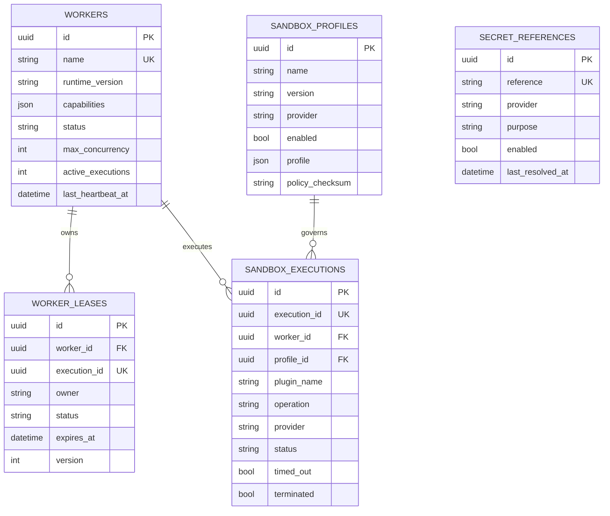

# Phase 18 Development Report

## 1. Phase 信息

- 项目：Cyber Agent Platform（CAP）
- 阶段：Phase 18
- 主题：Plugin Sandbox & Worker Framework（插件沙箱与执行框架）
- 状态：实现与阶段验证完成，等待 Architect Review
- 目标执行链：`Workflow → Planner → Runtime → Worker → Sandbox → Plugin → Result`
- 阶段边界：本阶段只建立统一 Worker、Sandbox、Lease、Secret Reference、Manifest、Health 与控制面持久化抽象；未集成 Docker、Kubernetes、Firecracker、gVisor、Nomad、Temporal 或任何真实远程 Worker。
- 隔离声明：`MemorySandboxProvider.real_isolation = false`。本阶段只认证平台执行语义，不认证 OS、Kernel、Container、VM、OOM、cgroup、seccomp 或网络命名空间隔离。
- 阶段门禁：未进入 Phase 19；本报告提交后停止开发，等待 Architect 明确输出 `✅ Phase Passed`。

## 2. 本阶段完成内容

1. 新增统一 Worker Framework：`WorkerManager`、`WorkerRegistry`、`WorkerScheduler`、`WorkerRuntime`、Worker Heartbeat 与 Worker Health。
2. 新增 Worker Lease：Acquire、Renew、Release、Expire、Owner Guard、TTL 与 Version。
3. 新增统一 Plugin Sandbox 抽象：`SandboxProvider`、`SandboxRuntime`、`SandboxProfile`、`SandboxPolicy`、`SandboxPolicyEngine`。
4. 新增 `MemorySandboxProvider`，认证 Worker/Sandbox 调度、超时、终止标记、重试、结果边界及身份校验，但显式不提供真实隔离。
5. 新增 `PluginWorkerRuntime`，将领域 Runtime 的 Plugin 生命周期调用统一桥接到 Worker/Sandbox 边界。
6. Assessment、Detection、Telemetry、Response、Notification 五个领域 Runtime 已接入统一 `PluginWorkerRuntime`，API Process 不再直接调用这些领域 Plugin 的执行生命周期。
7. 新增 Capability-aware Worker Placement：只选择声明目标 Capability、状态可用且并发容量未耗尽的 Worker。
8. 新增 Worker Result Boundary：序列化 Pydantic Result，校验 Execution/Worker/Sandbox Identity，并将 `error_code/error_details` 跨边界传输。
9. 修复跨边界异常兼容性：Worker 失败时恢复原 `PlatformError` 领域异常类型，避免统一包装破坏既有 API/测试契约。
10. 新增 Secret Provider 抽象、Opaque `SecretReference`、短生命周期 `ResolvedSecret(SecretStr)` 与 `MemorySecretProvider`。
11. ZAP API Key 从环境变量读取改为 `api_key_secret_reference: zap-api-key`；控制面不保存 Secret Value。
12. 新增五张独立控制面表：`workers`、`worker_leases`、`sandbox_executions`、`sandbox_profiles`、`secret_references`。
13. 新增 Worker/Sandbox 只读控制面 API 与聚合 Worker Health API。
14. 新增 Worker/Sandbox/Lease/Secret Audit Event 类型。
15. 新增 Phase 18 Portable Plugin Manifest 强类型模型，并扩展全部 8 个现有 Plugin Manifest。
16. 保留 Phase 7 既有 Tool Sandbox；新平台 Sandbox Result 以 `PluginSandboxResult` 别名导出，避免公共命名冲突。
17. 新增 Alembic 迁移 `20260802_0016`，并保持单一 Head。
18. 完成 Phase 18 专项测试、五领域联合回归、静态格式修复和迁移头验证。

## 3. Tree 项目目录结构

```text
cyber-agent-platform/
├── backend/
│   ├── alembic/versions/
│   │   └── 20260802_0016_plugin_sandbox_worker_framework.py
│   ├── app/
│   │   ├── api/routes/worker.py
│   │   ├── dependencies/services.py
│   │   ├── exceptions/{base.py,__init__.py}
│   │   ├── events/contracts.py
│   │   ├── models/worker.py
│   │   ├── repositories/worker.py
│   │   ├── runtime/plugin_manifest.py
│   │   ├── schemas/worker.py
│   │   ├── sandbox/
│   │   │   ├── profile.py
│   │   │   ├── policy.py
│   │   │   ├── runtime.py
│   │   │   └── secret.py
│   │   ├── worker/
│   │   │   ├── contracts.py
│   │   │   ├── registry.py
│   │   │   ├── scheduler.py
│   │   │   ├── lease.py
│   │   │   ├── runtime.py
│   │   │   ├── manager.py
│   │   │   └── plugin_runtime.py
│   │   ├── assessment/runtime.py
│   │   ├── detection/runtime.py
│   │   ├── telemetry/runtime.py
│   │   ├── response/runtime.py
│   │   ├── notification/runtime.py
│   │   └── main.py
│   ├── config/assessment.yaml
│   └── tests/test_phase_18_worker_sandbox.py
├── plugins/
│   ├── nuclei/manifest.yaml
│   ├── zap/manifest.yaml
│   ├── suricata/manifest.yaml
│   ├── zeek/manifest.yaml
│   ├── notification/synthetic/manifest.yaml
│   └── response/{synthetic,waf,firewall}/manifest.yaml
└── outputs/
    └── Phase 18 Development Report.md
```

## 4. 技术实现说明

### 4.1 统一执行链

```text
API / Workflow
      ↓
Domain Planner
      ↓
Domain Runtime
      ↓
PluginWorkerRuntime
      ↓
WorkerScheduler → WorkerRegistry
      ↓                 ↓
WorkerLeaseManager   Heartbeat / Capacity
      ↓
WorkerRuntime
      ↓
SandboxRuntime → SandboxPolicyEngine
      ↓
SandboxProvider
      ↓
Plugin lifecycle callback
      ↓
Serialized Result / Error Boundary
      ↓
Domain Result / Domain PlatformError
```

API Process 仍承载控制面和当前 Synthetic Provider 对象，但领域 Runtime 不再直接调用 Plugin 生命周期。真实执行进程分离需要后续 Provider/Transport 阶段实现；本阶段不得将内存回调误称为进程隔离。

### 4.2 Worker Registry、Heartbeat 与 Placement

`WorkerRecord` 使用 frozen Pydantic Model，包含：

- `id/name/runtime_version/capabilities/status`；
- `max_concurrency/active_executions`；
- `registered_at/last_heartbeat_at`。

状态包括 `ONLINE/BUSY/DRAINING/OFFLINE/UNHEALTHY`。Scheduler 依据 Capability、可调度状态和容量选择 Worker；同等条件下优先负载更低的 Worker。Heartbeat 更新状态和活动执行数；超过阈值的 Worker 被标记为 stale/unhealthy。

### 4.3 Lease 语义

`WorkerLease` 绑定：

```text
Lease ID + Worker ID + Execution ID + Owner + Status
+ Acquired At + Renewed At + Expires At + Version
```

- Acquire：同一 Execution 只允许一个 Active Lease；
- Renew：只允许 Owner 续租并递增 Version；
- Release：只允许 Owner 释放；
- Expire：到期 Lease 转为 `EXPIRED`；
- Worker Runtime 在 `finally` 中释放 Lease 并恢复 Worker 容量。

当前 Lease Manager 为应用内存实现；数据库表为未来持久化控制面准备，尚未实现数据库分布式 CAS/锁。

### 4.4 Sandbox Profile 与 Policy

`SandboxProfile` 为 Provider-neutral、不可变、`extra="forbid"` 的 Desired Boundary，包含：

- CPU：`cpu_millicores`；
- Memory：`memory_mb`；
- Filesystem：默认只读、绝对工作目录、只读 Mount、受限 Tmp Mount；
- Network：默认关闭；开启时必须有显式 allowlist；
- Environment：禁止 secret/token/password/credential/api_key/private_key 类键；
- Secret：仅允许 Opaque Reference，禁止 `.env` 引用；
- Timeout：1–86400 秒；
- Mount：数量和大小均受 Typed Model 与平台 Policy 限制。

`SandboxPolicy` 是 Manifest 不可弱化的平台上限。默认只允许 `memory-sandbox`，禁止网络和 Host Filesystem Write，并限制 CPU、Memory、Timeout 和 Mount 数量。任何不满足条件的请求在 Provider 调用前 fail closed。

### 4.5 Memory Sandbox Provider

`MemorySandboxProvider`：

```text
provider_name = "memory-sandbox"
real_isolation = false
```

它提供：

- 确定性的异步执行边界；
- `asyncio.timeout` 超时；
- Active/Terminated Execution 记录；
- Success/Failure/Timeout 结果标准化；
- PlatformError code/details 传输；
- Provider Health。

它不提供：

- 进程隔离、PID Namespace、cgroup、seccomp；
- 文件系统隔离、Network Namespace、egress enforcement；
- OOM Kill、CPU Throttling；
- Container/VM/microVM 边界；
- 恶意 Plugin 对宿主进程的防护。

### 4.6 Retry、Timeout、Recovery 与 Result Boundary

`WorkerRuntime` 在 Lease 保护下执行 `retry_limit + 1` 次：

1. Scheduler 选择 Worker；
2. Acquire Lease；
3. Heartbeat → BUSY，活动执行数加一；
4. Sandbox Policy 校验；
5. Provider 执行；
6. 成功返回；失败按 Retry Policy 重试；
7. 最终构造 `WorkerExecutionResult`；
8. `finally` Release Lease，Heartbeat → ONLINE，活动执行数减一。

`PluginWorkerRuntime` 将领域 Pydantic Result 序列化为 JSON dict，执行后再用声明的 `result_type` 校验。Sandbox 返回的 `execution_id/provider` 必须与请求一致，否则抛出 `SandboxExecutionError`。Worker 失败携带 `error_code/error_details`，边界侧只重建平台已注册的 `PlatformError` 子类；未知错误统一映射为 `WorkerExecutionError`。

### 4.7 Secret 治理

- 控制面仅保存 `SecretReference` 元数据，不保存 Value；
- `secret_references` 表不存在 `value` 列；
- Worker 侧解析结果使用 `SecretStr`，repr/序列化不泄露明文；
- Provider 名称必须与 Reference 匹配；缺失 Secret fail closed；
- `.env` 文件和 Secret-like Environment Key 被模型拒绝；
- ZAP 配置只保存 `zap-api-key` Reference。

`MemorySecretProvider` 仅为 App-local Certification Provider，不支持 Vault/KMS、轮换、TTL、撤销、租约或分布式访问审计。

### 4.8 Domain Runtime 接入

以下领域 Runtime 构造器均接收 `PluginWorkerRuntime`：

- `AssessmentRuntime`；
- `DetectionRuntime`；
- `TelemetryRuntime`；
- `ResponseRuntime`；
- `NotificationRuntime`。

App-scoped DI 将同一 `WorkerRuntime` 注入各领域。为保持独立单元测试和历史构造方式兼容，领域 Runtime 在未显式注入时创建 Synthetic Worker Runtime；它仍通过 Worker/Sandbox 边界执行，不回退到直接 Plugin 调用。

### 4.9 Manifest Contract

全部 8 个 Manifest 新增并强类型校验：

- `runtime_version`；
- `capabilities`；
- `sandbox`；
- `worker`；
- `secret`；
- `network`；
- `filesystem`；
- `healthcheck`。

一致性规则：

- Plugin runtime version == Worker runtime version；
- Secret references == Sandbox secret references；
- Network enabled/allowlist == Sandbox network boundary；
- Filesystem writable/working directory == Sandbox filesystem boundary。

## 5. 数据库设计

### 5.1 新增表及字段

#### `workers`

- 身份：`id`、唯一 `name`；
- Runtime：`runtime_version`、`capabilities`；
- 状态：`status`、`max_concurrency`、`active_executions`；
- 健康：`registered_at`、`last_heartbeat_at`；
- 扩展：`metadata`、`created_at`、`updated_at`。

#### `worker_leases`

- `id`、`worker_id` FK；
- 唯一 `execution_id`；
- `owner/status`；
- `acquired_at/renewed_at/expires_at`；
- `version/created_at/updated_at`。

#### `sandbox_profiles`

- `id`；唯一 `(name, version)`；
- `provider/enabled/profile/policy_checksum`；
- `created_at/updated_at`。

#### `sandbox_executions`

- `id`、唯一 `execution_id`；
- `worker_id` FK、可空 `profile_id` FK；
- `plugin_name/plugin_version/operation/provider/status`；
- `result_metadata/error`；
- `started_at/finished_at/timed_out/terminated`；
- `created_at/updated_at`。

#### `secret_references`

- `id`、唯一 `reference`；
- `provider/purpose/enabled/metadata/last_resolved_at`；
- `created_at/updated_at`；
- 明确无 Secret Value 字段。

### 5.2 Mermaid ER 图



### 5.3 Migration

- Revision：`20260802_0016`
- Down Revision：`20260801_0015`
- 新增表：5
- Alembic：保持单一 Head
- Downgrade 顺序：`sandbox_executions → worker_leases → secret_references → sandbox_profiles → workers`
- 未修改 Assessment、Detection、Telemetry、Response、Incident 既有表。

## 6. API 设计

本阶段新增只读控制面 API：

```text
GET /workers
GET /workers/{worker_id}
GET /sandbox
GET /sandbox/{execution_id}
GET /health/workers
```

实际部署路径仍受全局 `api_prefix` 配置影响。

### 6.1 Worker List 响应示例

```json
[
  {
    "id": "c352bbbf-9c1e-4e43-9524-3d1c3b0622aa",
    "name": "memory-worker",
    "runtime_version": "phase-18",
    "capabilities": ["assessment.execute", "detection.execute"],
    "status": "ONLINE",
    "max_concurrency": 1024,
    "active_executions": 0,
    "registered_at": "2026-08-02T05:30:00Z",
    "last_heartbeat_at": "2026-08-02T05:30:00Z"
  }
]
```

### 6.2 Sandbox Execution 响应示例

```json
{
  "id": "19772cdf-5bef-4596-8e4d-dda1acda927a",
  "execution_id": "72836348-0638-4fef-b5a0-69d72090bd27",
  "worker_id": "c352bbbf-9c1e-4e43-9524-3d1c3b0622aa",
  "profile_id": null,
  "plugin_name": "zap-assessment",
  "plugin_version": "1.0.0",
  "operation": "execute",
  "provider": "memory-sandbox",
  "status": "SUCCEEDED",
  "result_metadata": {},
  "error": null,
  "started_at": "2026-08-02T05:31:00Z",
  "finished_at": "2026-08-02T05:31:01Z",
  "timed_out": false,
  "terminated": false
}
```

### 6.3 Worker Health 响应示例

```json
{
  "status": "ok",
  "workers_total": 1,
  "workers_healthy": 1,
  "workers_stale": 0,
  "leases_expired": 0,
  "sandbox_healthy": true,
  "plugin_health": {"synthetic-framework": "HEALTHY"},
  "checked_at": "2026-08-02T05:32:00Z"
}
```

本阶段未开放 Worker 注册、Heartbeat、Lease 操作、Sandbox 执行或 Secret Resolve 的公共写 API，防止控制面在认证不足时扩大攻击面。

## 7. 核心代码说明

### 7.1 Worker → Sandbox 强制边界

```python
sandbox_result = await self._sandbox.execute(
    request.sandbox_profile,
    operation,
    execution_id=identifier,
)
```

Worker Runtime 只接受 `SandboxRuntime`，没有直接 Plugin Executor 依赖。

### 7.2 Fail-closed Sandbox Policy

```python
if profile.network_enabled and not policy.allow_network:
    raise SandboxPolicyViolation(
        "Sandbox network access is denied by platform policy"
    )
```

Manifest 只能提出 Desired Profile，不能绕过平台 Policy 上限。

### 7.3 Result Identity Validation

```python
if result.execution_id != identifier or result.provider != self._provider.provider_name:
    raise SandboxExecutionError(
        "Sandbox provider returned an invalid execution identity"
    )
```

阻止 Provider 返回其他 Execution 或伪造 Provider Identity。

### 7.4 领域异常恢复

```python
error_type = _platform_error_types().get(execution.error_code or "")
if error_type is not None:
    raise error_type(error_message, details=execution.error_details)
```

跨边界传输错误编码，不序列化 Python Exception 对象；保持既有领域/API 异常契约。

### 7.5 Opaque Secret

```python
class ResolvedSecret(BaseModel):
    reference: SecretReference
    value: SecretStr
```

数据库只持久化 Reference；明文只存在于 Worker 侧短生命周期对象。

## 8. Docker / 部署

- 本阶段未新增 Docker Image、Compose Service、Kubernetes Resource、Nomad Job、Firecracker microVM 或 gVisor RuntimeClass。
- 当前 `memory-worker`、Lease Manager、Memory Sandbox、Memory Secret Provider 均为 FastAPI 应用实例内对象。
- 单进程内可认证控制流、策略、状态转换、超时、重试与结果契约；多进程/多副本不共享 Registry、Lease 或 Secret 状态。
- CPU/Memory 字段当前只校验 Profile，不由操作系统强制执行。
- Network/Filesystem Policy 当前只认证声明和 Policy 决策，不构成真实网络/文件系统隔离。
- 生产化前必须提供进程外 Worker Transport、持久化 Lease/CAS、真实 Sandbox Provider、Secret Backend、指标、Tracing、Termination/Reaping 和 Drift Reconciliation。

## 9. 测试情况

### 9.1 Phase 18 专项

`backend/tests/test_phase_18_worker_sandbox.py` 共 6 个专项测试，既有执行记录为通过，覆盖：

- Registry、Capability Scheduling、Heartbeat、Stale Detection；
- Lease Acquire/Renew/Release/Expire/Owner Guard；
- Worker Success、Retry、Timeout、Recovery、Health；
- Sandbox Profile、Policy、Secret Provider fail closed；
- 五张表、无 Secret Value 字段、Audit Event、8 个 Manifest；
- Worker/Sandbox/Health 只读 API。

### 9.2 五领域联合回归

```text
52 passed
```

覆盖 Assessment、Detection、Telemetry、Response、Notification 接入统一 Worker Runtime 后的兼容性。初次回归发现 6 个失败，根因是领域 `PlatformError` 被统一包装为 `WorkerExecutionError`；增加 `error_code/error_details` 传输及边界异常恢复后，联合回归恢复为 52 passed。

### 9.3 静态与装配验证

根据本阶段已完成的验收记录：

```text
Ruff: passed after fixes
Black: passed after formatting
compileall: passed
Alembic: single head 20260802_0016
Manifest: 8/8 validated
Domain regression: 52 passed
```

本次“继续任务”仅整理报告，没有重复执行已完成测试。会话压缩记录未保留 Phase 0–18 全量测试总数和精确覆盖率数值，因此本报告不虚构全量/覆盖率数字；Architect 如将全量精确覆盖率作为硬门禁，应要求 Engineer 在 Review 修复轮补交可复现输出。

## 10. 架构基准分析

### 10.1 Kubernetes

采用其 Control Plane / Worker Node、Desired State、Health/Lease、Placement 和 Runtime 解耦思想。Phase 18 不引入 Kubernetes API、Pod、CRD、Scheduler Extender 或 RuntimeClass；Manifest 保持 Provider-neutral，避免核心绑定 Kubernetes。

### 10.2 Firecracker

参考 microVM Provider 边界、短生命周期实例、显式资源和终止语义。Phase 18 只保留未来 Provider Port，不声明 microVM 隔离，也不实现 jailer、snapshot、vsock 或 guest agent。

### 10.3 gVisor

参考 Sandbox Runtime 与 OCI/Container 调度分层，以及系统调用隔离应由 Provider 实现的原则。Phase 18 不实现 runsc、seccomp、namespace 或 syscall policy。

### 10.4 Nomad

参考 Client Registration、Heartbeat、Capability/Constraint-aware Placement、Allocation/Lease 与 Driver 解耦。Phase 18 采用 Worker Registry/Scheduler/Lease，但不引入 Nomad Server/Client 或 Raft。

### 10.5 Temporal

参考 Durable Execution、Retry、Timeout、Heartbeat 和 Workflow/Activity Boundary。Phase 18 只建立执行接口语义；当前内存 Worker 不提供 Workflow History、Replay、Durable Timer、Exactly-once 或 Activity Task Queue。

### 10.6 CAP 采用结论

- Control Plane 与 Execution Provider 分离；
- Manifest 描述 Desired Boundary，不承载 Provider 命令；
- Worker Placement 基于 Capability/Health/Capacity；
- Lease、Heartbeat、Timeout、Retry、Result Identity 为平台契约；
- 真实隔离能力必须由 Provider 明确证明，不能由 Profile 字段推定；
- 不在核心框架硬编码 Docker/Kubernetes/VM 实现。

## 11. 安全边界与 Safety Case

### 11.1 已证明

- 五个领域 Plugin 生命周期统一经过 `PluginWorkerRuntime → WorkerRuntime → SandboxRuntime`；
- Profile 与 Manifest 禁止直接携带 Secret-like Environment Value 或 `.env`；
- 控制面数据库不保存 Secret Value；
- Network 默认关闭且开启必须有显式 allowlist；
- Host Filesystem Write 默认禁止；
- Provider、Execution Identity 和 Result Type 被校验；
- Worker 不可用、Policy 不允许、Secret 缺失、Lease 冲突均 fail closed；
- 超时结果标记 `timed_out/terminated`；
- 领域异常契约跨边界保持兼容。

### 11.2 未证明

- 恶意/失陷 Plugin 无法访问 API Process 内存；
- CPU/Memory 限制由 Kernel 强制；
- 文件系统、网络、进程、用户或 syscall 真正隔离；
- 超时任务被 OS 强制 Kill；
- Secret 从 Worker 内存及时擦除；
- 多副本 Lease 一致性、脑裂防护或 Durable Recovery；
- Worker 到 Control Plane 的 mTLS/Identity Attestation；
- 供应链签名、镜像校验或 Runtime Provenance。

因此 Phase 18 只能判定为 **Synthetic Framework Certification**，不能判定为 Production Sandbox Certification。

## 12. Audit 设计

新增 Event Type：

```text
WorkerRegistered
WorkerHeartbeat
WorkerLeaseAcquired
WorkerLeaseRenewed
WorkerLeaseReleased
WorkerLeaseExpired
SandboxExecutionStarted
SandboxExecutionCompleted
SandboxExecutionFailed
SecretReferenceResolved
```

控制面持久化结构可记录 Worker、Execution、Plugin、Operation、Provider、时间、状态、Timeout、Termination 和错误。Secret Audit 只能记录 Reference、Provider、Purpose 和解析时间，禁止记录 Secret Value。

当前 Technical Gap：事件枚举和持久化模型已建立，但内存 Registry/Lease/Sandbox 路径尚未在每个状态转换点统一注入 Event Publisher；需由 Architect 判断是否作为 Major 补强项。

## 13. 本阶段架构变化

- 新增平台级 Worker bounded context 和 Sandbox Provider Port。
- Plugin 执行从领域 Runtime 的直接生命周期调用，改为统一 Worker/Sandbox 边界调用。
- 新增 App-scoped Worker Runtime、Sandbox Runtime 与 Secret Provider DI。
- 新增 Portable Plugin Manifest Contract，并统一 8 个现有 Manifest。
- 新增五张控制面表与五个只读 API。
- ZAP Credential 来源改为 Opaque Secret Reference。
- 保留旧 Tool Sandbox，不以破坏性重命名替换已有契约。

## 14. 影响模块与 Breaking Change

### 14.1 影响模块

- Worker/Sandbox/Secret 核心模块；
- App Startup、DI、API Router、Exception、Event；
- Assessment、Detection、Telemetry、Response、Notification Runtime；
- Worker 持久化模型、Repository、Schema 和 Migration；
- 8 个 Plugin Manifest；
- ZAP 配置；
- Phase 18 专项测试。

### 14.2 Breaking Change

- Public API：新增只读端点，无已知破坏性 Schema 变更。
- Database：新增 5 张表，无既有表字段变更。
- Domain Runtime：构造器新增可选 `PluginWorkerRuntime`，保留默认 Synthetic Runtime，兼容旧调用方。
- Plugin Result：必须可序列化并通过声明的 Pydantic Result Type 重建；不可序列化或类型不匹配将被拒绝。
- ZAP 配置：`api_key_env`/直接环境读取改为 `api_key_secret_reference`；依赖旧环境变量注入的部署需迁移到 Secret Provider。
- Sandbox Export：旧 Tool `SandboxResult` 保持原名，新平台结果导出为 `PluginSandboxResult`，避免命名冲突。

## 15. 数据库与配置变更

### 15.1 数据库

- 新增迁移 `20260802_0016`；
- 新增 5 张表、外键、唯一约束和查询索引；
- 不存储 Secret Value；
- 保持单一迁移 Head。

### 15.2 配置

`backend/config/assessment.yaml`：

```yaml
zap:
  api_key_secret_reference: zap-api-key
```

8 个 Manifest 均新增 Phase 18 Worker/Sandbox/Secret/Network/Filesystem/Health 配置。平台 Sandbox Policy 当前使用 Typed 默认对象，尚未进入独立 YAML；未来外部化时必须保证普通环境配置不可弱化安全基线。

## 16. Known Issues

1. `MemorySandboxProvider` 与 API Process 同进程，不能防御恶意 Plugin，也不提供真实隔离。
2. CPU、Memory、Filesystem、Network 字段当前只做声明与 Policy 校验，不由 OS 强制执行。
3. Worker Registry、Lease Manager、Memory Secret Provider 为进程内状态，不支持多进程、多副本或重启恢复。
4. 五张数据库表已建立，但 App-scoped Runtime 尚未完全由 Repository 驱动，控制面存在 Memory/Persistence 双轨。
5. Sandbox Execution Read API 查询数据库，但当前内存执行路径未统一持久化每次 Execution，因此可能返回空列表。
6. Worker/Lease/Sandbox/Secret Event Type 已定义，但状态转换尚未全部接入统一 Event Publisher。
7. Heartbeat 当前为同步内存更新，没有独立 Worker Transport、认证、mTLS 或 Attestation。
8. Retry 采用立即重试，没有指数退避、抖动、错误分类或幂等键策略。
9. Timeout 基于 `asyncio.timeout`，不能保证阻塞原生代码或失控线程被强制终止。
10. Secret Provider 不支持轮换、TTL、撤销、租约、审计后端或内存擦除。
11. Manifest `extra="allow"` 为兼容历史字段，未知字段不会 fail closed；需评审是否转为分版本严格 Schema。
12. 独立 ADR-0037/ADR-0038 和 Phase 18 架构说明文件未作为单独文件保留；本报告已完整记录 Provider-neutral Sandbox、Synthetic Isolation Boundary 和基准分析，Architect 可要求拆分为 Review 修复交付物。
13. 会话压缩证据未保留 Phase 0–18 全量测试总数及精确覆盖率，本报告只引用可确认结果。
14. 仓库内容整体处于 untracked 状态，无法用可信 Git diff 证明阶段变更范围。

## 17. 风险分析与 Technical Debt

### 17.1 风险

- 最大风险是把 Synthetic Provider 误当成真实 Sandbox；代码通过 `real_isolation=false` 和文档边界显式阻止该结论。
- Memory/Persistence 双轨可能导致 API Observability 与真实执行状态不一致。
- 立即 Retry 对非幂等 Plugin 可能放大副作用；当前需依赖领域 Plugin 自身幂等/治理契约。
- 动态扫描 PlatformError 子类依赖进程已导入类型，跨服务协议化后需要稳定 Error Registry。
- Secret 解析失败当前 ZAP 依赖可返回空字符串兼容旧行为；生产环境应考虑严格启动失败或 Capability Degraded。

### 17.2 Technical Debt

1. Process/OCI/gVisor/Firecracker Sandbox Provider 尚未实现。
2. Worker RPC/Queue/Transport、mTLS、Identity、Attestation 尚未实现。
3. Durable Registry、Lease CAS/Fencing Token、Recovery/Reconciliation 尚未实现。
4. Execution 持久化、Event Publishing、Metrics、Tracing 尚未完整闭环。
5. Retry Backoff、Idempotency Key、Dead Letter、Cancellation、Reaping 尚未实现。
6. Secret Vault/KMS Provider、Rotation、TTL、Revocation 尚未实现。
7. Manifest Versioning、Signature、Provenance、Strict Unknown-field Policy 尚未实现。
8. 独立 ADR 和可复现全量覆盖率证据需补齐。

## 18. 后续建议

仅在 Architect 明确输出 `✅ Phase Passed` 并提供下一阶段 Prompt 后：

1. 优先修复 Review 中全部 Critical/Major；
2. 若 Architect 将 Audit/Persistence 双轨判为 Major，先完成每个 Worker/Lease/Sandbox/Secret 状态转换的 Repository + Event Publisher 闭环；
3. 真实 Sandbox 阶段先定义 Provider Certification Matrix，不得仅凭字段存在宣称隔离；
4. 引入持久化 Lease 时必须使用数据库 CAS/Fencing Token，防止过期 Owner 继续提交结果；
5. 真实 Worker Transport 必须具备 mTLS、Worker Identity、Protocol Version、Capability Attestation、Cancellation 和 Heartbeat；
6. Secret Provider 必须提供最小权限、短 TTL、轮换、撤销和不落盘保证；
7. 未经 Review 不进入 Phase 19，不集成 Docker/Kubernetes/Firecracker/gVisor。

## 19. 交付物清单

### 19.1 Worker/Sandbox/Secret 代码

- `backend/app/worker/{contracts,registry,scheduler,lease,runtime,manager,plugin_runtime}.py`
- `backend/app/sandbox/{profile,policy,runtime,secret}.py`
- `backend/app/runtime/plugin_manifest.py`

### 19.2 持久化与 API

- `backend/app/models/worker.py`
- `backend/app/repositories/worker.py`
- `backend/app/schemas/worker.py`
- `backend/app/api/routes/worker.py`
- `backend/alembic/versions/20260802_0016_plugin_sandbox_worker_framework.py`

### 19.3 集成

- `backend/app/main.py`
- `backend/app/dependencies/services.py`
- `backend/app/{assessment,detection,telemetry,response,notification}/runtime.py`
- `backend/app/exceptions/{base.py,__init__.py}`
- `backend/app/events/contracts.py`
- `backend/config/assessment.yaml`

### 19.4 Plugin Manifest

- `plugins/{nuclei,zap,suricata,zeek}/manifest.yaml`
- `plugins/notification/synthetic/manifest.yaml`
- `plugins/response/{synthetic,waf,firewall}/manifest.yaml`

### 19.5 测试与报告

- `backend/tests/test_phase_18_worker_sandbox.py`
- `outputs/Phase 18 Development Report.md`

## 20. Architect Review 准备说明

建议 Architect 重点审查：

1. 是否接受 Phase 18 仅为 Synthetic Framework Certification，而非真实 Sandbox Certification；
2. 五个领域 Runtime 是否已充分消除直接 Plugin 生命周期调用；
3. `PluginWorkerRuntime` 的 Pydantic Result Boundary 与 PlatformError 恢复机制是否稳定、安全；
4. Capability/Health/Capacity Placement 是否满足当前阶段抽象要求；
5. Lease Owner/TTL/Version 语义是否足够，数据库实现是否应立即增加 Fencing Token；
6. Memory Runtime 与五张持久化表双轨是否构成 Major；
7. Sandbox Execution 是否必须在本阶段实现全量持久化和 Audit Event 发布；
8. Network/Filesystem/Secret fail-closed Policy 是否满足默认安全要求；
9. ZAP Secret 缺失时返回空字符串的兼容行为是否应改为 Capability Degraded/启动失败；
10. Manifest `extra="allow"` 是否需要按版本改为严格拒绝未知字段；
11. 旧 Tool Sandbox 与新 Plugin Sandbox 并存及 Result 别名策略是否合理；
12. 5 张表、5 个只读 API、8 个 Manifest 和单一 Alembic Head 是否满足交付范围；
13. 专项通过、五领域 `52 passed` 是否足够，是否要求补交全量测试与精确覆盖率；
14. 是否要求将本报告中的决策拆分为 ADR-0037/0038 和独立 Phase 18 架构文档；
15. 是否存在必须先修复的 Critical/Major，并明确给出 `✅ Phase Passed` 或不通过结论。

---

**Engineer 结论：Phase 18 的 Worker/Sandbox/Lease/Secret/Manifest/Health 框架、领域接入、迁移、API 和专项验证已完成；`MemorySandboxProvider` 明确不提供真实隔离。现停止开发，等待 Architect Review；未进入 Phase 19。**
