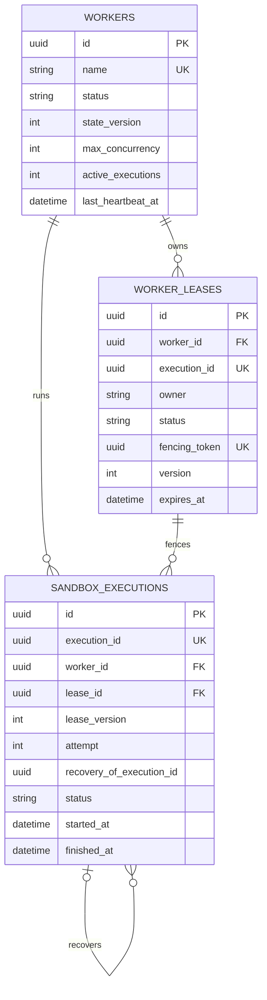

# Phase 18.1 Development Report

## 1. Phase 信息

- 项目：Cyber Agent Platform（CAP）
- 阶段：Phase 18.1
- 主题：Worker & Sandbox Production Consistency（Architect Review 修复）
- 前置结论：`❌ Phase 18 Not Passed`
- 本阶段边界：只修复 Architect Review 指出的 Critical/Major，不新增 Plugin、不新增业务能力、不进入 Phase 19。
- 当前状态：实现、专项、五领域回归、全量测试、静态检查、覆盖率、迁移静态验证及文档已完成；真实 PostgreSQL 在线升降级因本机 Docker/PostgreSQL 不可用而未声明通过。
- 提交动作：本报告生成后立即停止开发，等待 Architect Review。

## 2. 本阶段完成内容

1. 将 `workers`、`worker_leases`、`sandbox_executions` 确立为 Worker Control Plane 唯一 Source of Truth。
2. 将进程内 Worker 字典降级为可失效 Cache；Register、Heartbeat、State Change、Scheduling、Lease 和 Result Commit 均以数据库为权威。
3. 建立严格 Worker State Machine：`REGISTERED/ONLINE/BUSY/DRAINING/OFFLINE/UNHEALTHY/DEAD`。
4. 新增 `workers.state_version`，以条件更新实现乐观并发/CAS。
5. 将 Worker Lease 全量持久化，新增唯一 UUID `fencing_token`。
6. Renew、Release、Result Commit 强制校验 Lease ID、Owner、Fencing Token、Version、ACTIVE 状态和有效期。
7. 持久化全部 Sandbox Attempt：`RUNNING/SUCCEEDED/FAILED/TIMED_OUT/CANCELLED/RECOVERED`。
8. Retry 为每次 Attempt 创建独立记录，并通过 `recovery_of_execution_id` 关联失败与恢复历史。
9. Secret 缺失、Provider 错配、空值和 `.env` Reference 全部 fail closed；删除 ZAP API Key 空字符串回退。
10. Secret Resolve 成功和失败均写入事务审计，明文不进入数据库、日志或 Audit Payload。
11. Plugin Manifest 拆分 V1/V2：V1 保持 8 个正式 Manifest 兼容，V2 `extra="forbid"` 严格拒绝未知字段。
12. Sandbox Provider 显式声明 Network、Filesystem、Secret、Timeout、Container、VM、Snapshot Capability；不支持时执行前拒绝。
13. Worker、Lease、Sandbox、Secret 关键活动接入 Transactional Audit。
14. 新增迁移 `20260802_0017_worker_consistency.py`，只修改 Worker/Lease/Execution 控制面结构。
15. 新增 ADR-0039、ADR-0040、GitHub Architecture Reference Analysis、Architecture Compliance Report 和 Safety Case。
16. 扩充 Phase 18.1 安全负向测试，并修复测试发现的 SQLite Lease 时区比较缺陷。
17. 移除零引用且已被 `events/transactional.py` 替代的 `worker/audit.py`，旧文件移入 `_待删_回收区/worker-audit-obsolete-phase18-1.py`。

## 3. Tree 项目目录结构

```text
cyber-agent-platform/
├── backend/
│   ├── alembic/versions/
│   │   └── 20260802_0017_worker_consistency.py
│   ├── app/
│   │   ├── dependencies/services.py
│   │   ├── events/
│   │   │   ├── contracts.py
│   │   │   └── transactional.py
│   │   ├── models/worker.py
│   │   ├── repositories/worker.py
│   │   ├── runtime/plugin_manifest.py
│   │   ├── sandbox/
│   │   │   ├── policy.py
│   │   │   ├── profile.py
│   │   │   ├── runtime.py
│   │   │   └── secret.py
│   │   └── worker/
│   │       ├── contracts.py
│   │       ├── lease.py
│   │       ├── manager.py
│   │       ├── plugin_runtime.py
│   │       ├── registry.py
│   │       ├── runtime.py
│   │       ├── scheduler.py
│   │       └── state_machine.py
│   └── tests/
│       ├── test_phase_18_worker_sandbox.py
│       └── test_phase_18_1_worker_consistency.py
├── docs/
│   ├── adr/
│   │   ├── ADR-0039-database-worker-source-of-truth.md
│   │   └── ADR-0040-lease-fencing-token.md
│   ├── github-reference-analysis-phase-18-1.md
│   ├── architecture-compliance-phase-18-1.md
│   └── safety-case-phase-18-1.md
├── plugins/
│   ├── nuclei/manifest.yaml
│   ├── zap/manifest.yaml
│   ├── suricata/manifest.yaml
│   ├── zeek/manifest.yaml
│   ├── notification/synthetic/manifest.yaml
│   └── response/{synthetic,waf,firewall}/manifest.yaml
└── outputs/
    └── Phase 18.1 Development Report.md
```

## 4. 技术实现说明

### 4.1 Database Source of Truth

```text
API / Domain Runtime
        ↓
WorkerRegistry / WorkerLeaseManager / WorkerRuntime
        ↓
SQLAlchemy Repository
        ↓
workers / worker_leases / sandbox_executions
        ↓
Transactional Audit
```

- 所有写操作先持久化再更新 Cache。
- `require()`、`list()`、Scheduler 和 Health 从数据库读取。
- Cache 可随时清空，不能参与所有权或 Result Commit 判定。
- `state_version` 防止并发心跳或状态写覆盖新值。

### 4.2 Worker State Machine

合法转换为：

```text
REGISTERED → ONLINE / DEAD
ONLINE     → BUSY / DRAINING / OFFLINE / UNHEALTHY / DEAD
BUSY       → ONLINE / DRAINING / UNHEALTHY / DEAD
DRAINING   → OFFLINE / DEAD
OFFLINE    → REGISTERED / ONLINE / DEAD
UNHEALTHY  → ONLINE / DRAINING / OFFLINE / DEAD
DEAD       → REGISTERED
```

非法跳转抛出 `InvalidStateTransition`。Heartbeat 超并发、CAS 失败和 Worker 缺失均 fail closed。

### 4.3 Lease Fencing

每次 Acquire 生成不可复用 UUID Fencing Token。结果提交的接受条件为：

```text
Lease ID 匹配
AND Owner 匹配
AND Fencing Token 匹配
AND Version 匹配
AND Status == ACTIVE
AND expires_at > now
AND Sandbox Execution == RUNNING
AND Execution Lease ID/Version 匹配
```

任何条件失败均不更新结果。Renew 后旧 Version 立即失效；Release/Expire 后旧 Token 不可恢复使用。

### 4.4 Sandbox Execution Persistence

执行路径：

```text
Scheduler Select
→ Acquire Lease
→ Worker BUSY
→ Persist RUNNING Attempt
→ Sandbox Execute
→ Persist terminal status
→ Commit Result under Fencing validation
→ Release Lease
→ Worker ONLINE or DRAINING
```

Retry 不覆盖旧记录；成功恢复写 `RECOVERED`，并关联前一失败 Attempt。Timeout、Cancellation 和 Failure 均保存终态与 Audit。

### 4.5 Secret Fail Closed

- `SecretNotFound`：Reference 不存在；
- `SecretPolicyViolation`：Provider 不匹配、名称/值为空、引用 `.env`；
- `ResolvedSecret.value` 使用 `SecretStr`；
- Audit 只记录 Reference、Provider、Purpose、Version 和结果，不记录 Value；
- 测试环境显式注入 `zap-api-key`，生产环境缺失不回退为空字符串。

### 4.6 Manifest V1/V2

- V1：`extra="allow"`，保留历史业务元数据，8/8 正式 Plugin Manifest 通过 Loader。
- V2：`extra="forbid"`，未知字段拒绝；新增 Provider Capability Requirements。
- 共同一致性校验：Runtime Version、Secret Reference、Network、Filesystem 和 Working Directory 必须与 Sandbox Profile 一致。

### 4.7 Provider Capability

`SandboxProviderCapability` 显式声明：

```text
network / filesystem / secret / timeout / container / vm / snapshot
```

`MemorySandboxProvider.real_isolation = false`，只声明 `timeout=true`。Profile 请求 Provider 不具备的能力时抛出 `SandboxExecutionError`，不会以字段存在推定真实隔离。

## 5. 数据库设计

### 5.1 变更字段

#### `workers`

- `state_version INTEGER NOT NULL DEFAULT 1`

#### `worker_leases`

- `fencing_token UUID NOT NULL`
- 唯一索引 `ix_worker_leases_fencing_token`

#### `sandbox_executions`

- `lease_id UUID NULL`，FK → `worker_leases.id`，`ON DELETE RESTRICT`
- `lease_version INTEGER NULL`
- `attempt INTEGER NOT NULL DEFAULT 1`
- `recovery_of_execution_id UUID NULL`
- Lease 与 Recovery 查询索引

### 5.2 Mermaid ER 图



### 5.3 Migration

- Revision：`20260802_0017`
- Down Revision：`20260802_0016`
- Head：`20260802_0017 (head)`，单一 Head。
- Offline Upgrade SQL：完整链 `0001 → 0017` 生成成功。
- Offline Downgrade SQL：`0017 → 0016` 生成成功。
- 真实 PostgreSQL Online Upgrade/Downgrade：当前 Docker daemon 未运行且本机 PostgreSQL 端口不可用，因此不声明已验证。
- 未修改 Assessment、Detection、Response、Incident 业务表。

## 6. API 设计

本阶段不新增业务 API，保持 Phase 18 只读控制面接口：

```text
GET /workers
GET /workers/{worker_id}
GET /sandbox
GET /sandbox/{execution_id}
GET /health/workers
```

Worker 注册、Heartbeat、Lease、Result Commit、Secret Resolve 仍是内部受控接口，不扩大公共攻击面。

Worker 响应新增/保留一致性字段示例：

```json
{
  "id": "c352bbbf-9c1e-4e43-9524-3d1c3b0622aa",
  "name": "memory-worker",
  "runtime_version": "phase-18",
  "status": "ONLINE",
  "state_version": 7,
  "max_concurrency": 1024,
  "active_executions": 0
}
```

Sandbox Execution 内部持久化示例：

```json
{
  "execution_id": "72836348-0638-4fef-b5a0-69d72090bd27",
  "lease_id": "885538f0-a443-4fa8-ab95-11d17613b61f",
  "lease_version": 1,
  "attempt": 2,
  "recovery_of_execution_id": "55899428-fca9-467d-9300-868e28f9d84d",
  "status": "RECOVERED"
}
```

Fencing Token 不通过公共 Schema、API Response 或 Audit Payload 暴露。

## 7. 核心代码说明

### 7.1 Worker CAS

```python
update(Worker).where(
    Worker.id == worker_id,
    Worker.state_version == expected_version,
).values(state_version=expected_version + 1, ...)
```

### 7.2 Result Commit Fencing

```python
select(WorkerLease.id).where(
    WorkerLease.id == lease_id,
    WorkerLease.owner == owner,
    WorkerLease.status == "ACTIVE",
    WorkerLease.fencing_token == fencing_token,
    WorkerLease.version == expected_lease_version,
    WorkerLease.expires_at > now,
)
```

### 7.3 Secret Failure

```python
try:
    value = self._values[reference.name]
except KeyError as error:
    raise SecretNotFound("Secret reference was not found") from error
```

### 7.4 Provider Capability Enforcement

```python
if profile.secret_references and not capabilities.secret:
    raise SandboxExecutionError(
        "Sandbox provider does not support secret injection"
    )
```

## 8. Docker / 部署

- 未新增 Docker Image、Compose Service、Kubernetes Resource、Nomad Job 或真实远程 Worker。
- 当前 `MemorySandboxProvider` 与 API Process 同进程，不提供进程、容器、Kernel、网络或文件系统隔离。
- Docker daemon 当前不可连接，因此本轮无法启动 Compose PostgreSQL 做在线迁移演练。
- 部署时仍由 Backend 启动命令执行 `alembic upgrade head`；生产上线前必须在真实 PostgreSQL 临时实例执行 upgrade/downgrade smoke test。

## 9. 测试情况

### 9.1 专项测试

```text
Phase 18 + Phase 18.1：19 passed in 6.52s
```

覆盖：Source of Truth、Cache 失效、状态机、CAS、Fencing、过期 Result、全部 Execution 终态、Retry Recovery、Secret Fail Closed/Audit、8/8 Manifest、V2 Strict、Provider Capability、迁移 Head/范围和控制面 Audit。

### 9.2 五领域联合回归

```text
Assessment + Detection + Telemetry + Response + Notification
52 passed in 25.29s
```

### 9.3 全量后端回归

```text
250 passed in 122.17s
```

Windows/WorkBuddy 环境在输出 100% 后 pytest 清理进程未自动退出，任务被人工停止；Stdout 无 Failure、Error 或 Traceback。覆盖率采集运行也得到相同 `250 passed`。

### 9.4 覆盖率

项目既有口径：`backend/app` statement coverage，greenlet-aware。

```text
12909 statements / 644 missed / 95.0112%
coverage report --precision=4 --fail-under=95
Exit Code: 0
```

门禁 `>=95.0000%` 已通过。

### 9.5 静态、格式、编译和迁移

```text
Ruff: All checks passed
Black: 333 files unchanged
compileall: passed
Alembic: 20260802_0017 (head)
Offline upgrade SQL: passed
Offline downgrade SQL: passed
Manifest V1: 8/8 passed
Manifest V2 unknown field: rejected as expected
```

## 10. GitHub Architecture Reference Analysis

详见 `docs/github-reference-analysis-phase-18-1.md`。

- Kubernetes：Lease holder/renew/TTL/resourceVersion；
- etcd：Revision、Transaction/CAS、Lease Expiry/Revoke；
- Temporal：Server-side History、Worker Result、Heartbeat、Recovery；
- Nomad：Client/Allocation Status、Capability Placement、Task Events；
- Vault：Lease TTL、Renew、Revoke、Secret Audit。

CAP 只吸收一致性契约，不引入这些产品作为 Phase 18.1 依赖。

## 11. Architecture Compliance Report

详见 `docs/architecture-compliance-phase-18-1.md`。

实现级检查全部 PASS：Database SoT、Cache 限制、状态机、CAS、Fencing、Execution Persistence、Secret Fail Closed、Manifest V1/V2、Provider Capability、Transactional Audit、迁移范围、单 Head、专项/联合/全量/覆盖率/静态门禁。

唯一未声明 PASS 的环境项：真实 PostgreSQL Online Upgrade/Downgrade，原因是 Docker/PostgreSQL 服务不可用；Offline SQL 和迁移契约已通过。

## 12. Safety Case

详见 `docs/safety-case-phase-18-1.md`。

### 已证明

- Cache 丢失不影响数据库事实状态；
- 并发状态更新受到 `state_version` 保护；
- 旧 Lease Owner 无法用陈旧 Token/Version 提交结果；
- 每个 Attempt 的开始、失败、超时、取消、恢复和成功可持久化审计；
- Secret 缺失/错配不降级继续运行；
- Provider 无能力时执行前拒绝；
- Manifest V2 未知字段 fail closed。

### 未证明

- Memory Sandbox 的真实 OS/Kernel/Container/VM 隔离；
- 外部 Plugin 副作用 exactly-once；
- Worker mTLS/Attestation；
- Vault/KMS 级 Secret Rotation/Revoke；
- 当前环境真实 PostgreSQL 在线迁移。

结论：**Production Consistency Control-Plane Candidate**，不是 Production Isolation Certification。

## 13. Known Issues

1. `MemorySandboxProvider.real_isolation = false`，不能防御恶意 Plugin。
2. CPU/Memory/Network/Filesystem Profile 不由 Kernel 强制执行。
3. Worker Transport、mTLS、Identity Attestation、远程 Cancellation/Reaping 未实现。
4. Secret Provider 仍为 Memory Provider，不具备 Vault/KMS 轮换、撤销、短 TTL 和内存擦除。
5. Retry 外部副作用幂等仍由领域 Plugin 保证。
6. V1 为历史兼容保留 `extra="allow"`；严格未知字段只在 V2 生效。
7. 在线 PostgreSQL upgrade/downgrade 未在当前环境验证；必须在上线前补做。
8. Windows 测试进程在输出 100% 后偶发不退出，但完整结果无 Failure/Error；已独立读取 Coverage 数据并通过门禁。
9. 仓库整体仍处于 Git untracked 状态，不能依赖可信 Git diff 证明阶段修改范围。

## 14. 本阶段架构变化

- Worker Control Plane 从 Memory-authoritative 改为 Database-authoritative。
- 新增严格状态机和状态 CAS。
- Lease 从 TTL/Owner 语义提升为持久化 Fencing Contract。
- Sandbox 从结果摘要提升为全 Attempt Durable History。
- Secret 从兼容性空值回退改为严格 fail closed。
- Manifest 从单一宽松模型提升为 V1/V2 版本化边界。
- Provider 从名称抽象提升为显式 Capability Contract。
- Audit 从枚举/双轨状态提升为事务内控制面事件持久化。

## 15. 影响模块与 Breaking Change

### 影响模块

- `backend/app/worker/*`
- `backend/app/sandbox/*`
- `backend/app/repositories/worker.py`
- `backend/app/models/worker.py`
- `backend/app/runtime/plugin_manifest.py`
- `backend/app/events/*`
- `backend/app/dependencies/services.py`
- Worker/Lease/Execution Migration 与专项测试

### Breaking Change

- 内部 Worker/Lease API 改为异步数据库会话驱动；旧同步内存构造不再成立。
- Lease Renew/Release/Result Commit 调用方必须提供 Fencing Token 与 Expected Version。
- Secret 缺失不再返回空字符串，调用方必须处理启动失败或 Capability Degraded。
- Manifest V2 未知字段被拒绝。
- Database 新增控制面字段与索引，无业务 API Breaking Change。

## 16. 数据库与配置变更

### 数据库

- 新增迁移 `20260802_0017`；
- 仅修改 `workers`、`worker_leases`、`sandbox_executions`；
- 未修改 Assessment、Detection、Response、Incident 业务表。

### 配置

- 无新增业务配置；
- 测试环境显式注入 `zap-api-key`；
- 生产缺失 Secret 时保持 fail closed。

## 17. 风险分析与 Technical Debt

### 风险

- 最大风险仍是将 Synthetic Sandbox 误称为真实隔离；已通过 Capability 和 `real_isolation=false` 明确阻止。
- 在线迁移未演练可能隐藏 PostgreSQL 环境差异；上线前必须作为部署门禁。
- 非幂等外部动作 Retry 可能产生重复副作用；需未来引入 Idempotency Key/Outbox/Compensation。

### Technical Debt

1. 真实 Process/OCI/gVisor/Firecracker Provider；
2. Remote Worker Transport 与身份认证；
3. Lease/Worker Reconciliation 和更完整的冲突重试退避；
4. Vault/KMS Secret Provider；
5. Retry Backoff、Idempotency、Dead Letter；
6. Metrics、Tracing、不可篡改 Audit Sink；
7. PostgreSQL 在线迁移自动化测试环境。

## 18. 后续建议

- 本报告提交后不进入 Phase 19。
- Architect 应先审查全部 Critical/Major 是否闭环。
- 若在线 PostgreSQL 迁移被判为阻断项，应在可用 PostgreSQL 临时实例补跑 `upgrade head → downgrade 0016 → upgrade head`，然后仅提交补充证据。
- 只有 Architect 明确输出 `✅ Phase Passed` 并给出下一阶段 Prompt 后，Engineer 才可继续。

## 19. 交付物清单

### 代码

- Worker Registry/State Machine/Scheduler/Lease/Runtime/Manager/Plugin Runtime
- Sandbox Runtime/Policy/Profile/Secret
- Worker Model/Repository
- Versioned Plugin Manifest
- Transactional Audit
- App DI/Assembly

### 数据库

- `backend/alembic/versions/20260802_0017_worker_consistency.py`

### 测试

- `backend/tests/test_phase_18_worker_sandbox.py`
- `backend/tests/test_phase_18_1_worker_consistency.py`

### 架构文档

- `docs/adr/ADR-0039-database-worker-source-of-truth.md`
- `docs/adr/ADR-0040-lease-fencing-token.md`
- `docs/github-reference-analysis-phase-18-1.md`
- `docs/architecture-compliance-phase-18-1.md`
- `docs/safety-case-phase-18-1.md`

### 报告

- `outputs/Phase 18.1 Development Report.md`

## 20. Architect Review 准备说明

建议重点审查：

1. Database 是否已成为 Worker/Lease/Execution 唯一事实源；
2. `state_version` CAS 与状态机是否足够严格；
3. Fencing Token、Owner、Version、Expiry、Execution State 的事务校验是否能阻止陈旧 Result；
4. Retry/Timeout/Cancellation/Recovery 历史是否完整；
5. Secret fail closed 与 Audit 是否满足 Critical 修复；
6. V1 兼容和 V2 Strict 的版本策略是否可接受；
7. Provider Capability 是否阻止虚假隔离声明；
8. 19 项专项、52 项五领域、250 项全量、95.0112% 覆盖率是否满足门禁；
9. 真实 PostgreSQL Online Migration 环境阻塞是否必须补证；
10. 是否明确给出 `✅ Phase Passed` 或下一轮 Critical/Major 修复清单。

---

**Engineer 结论：Phase 18.1 的 Worker/Sandbox Production Consistency 修复已按边界完成；专项、五领域、全量、静态、单 Head、离线迁移和 95% 覆盖率门禁已通过。真实 PostgreSQL 在线升降级因当前环境不可用未作虚假声明。现停止开发，等待 Architect Review；未进入 Phase 19。**
